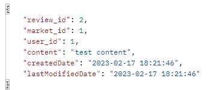

---
title: "[Spring Boot] JPA Auditing과 BaseTimeEntity로 Entity의 생성일자, 수정일자  자동화"
excerpt: "Entity의 생성일자, 수정일자를 자동으로 저장하는 방법을 알아보자."

categories:
  - Spring
tags:
  - [Spring Boot, JPA]

published: true

permalink: /spring/springboot-jpa-auditing-base-time-entity/

toc: true
toc_sticky: true

date: 2023-02-18
last_modified_at: 2023-02-18

--- 

프로젝트를 진행하다보니 매장에 대한 리뷰글의 생성일자, 수정일자를 저장해야 했다.<br>

구글링한 결과로 **Entity**를 생성할 때의 생성일자, 수정할 때의 수정일자를 자동으로 저장하는 `BaseTimeEntity` 클래스를 구현하여 해당 기능이 필요한 Entity에 상속받도록 하는 방법을 알게 되었다.<br><br>

## **JPA Auditing이란?**
<hr />

자바에서 ORM 기술인 JPA를 사용하여 도메인을 관계형 데이터베이스 테이블에 매핑할 때, 공통적으로 도메인들이 가지고 있는 필드나 컬럼들이 존재한다.<br>

대표적으로 생성일자, 수정일자, 식별자 같은 필드들이 있다.<br>
그런데 이 필드들이 도메인마다 공통으로 존재한다는 의미는 결국 코드가 **중복**된다는 말이다.<br>
이 중복으로 인한 번거로움을 해소해주기 위해 Spring Data JPA는 Auditing이라는 기능을 제공한다.<br>

Audit는 감독하고 검사하다는 뜻으로, 해당 데이터를 보고 있다가 생성 또는 수정이 발생하면 **자동**으로 값을 넣어주는 편리한 기능이다.<br>
도메인을 영속성 컨텍스트에 저장하거나 수정을 하는 경우, 매번 시간 데이터를 입력해 줘야 하는데 Audit을 이용하면 자동으로 시간을 매핑하여 DB의 테이블에 넣어줄 수 있다.<br><br>

## **BaseTimeEntity 구현**
<hr />

``` java
@Getter
@MappedSuperclass
@EntityListeners(AuditingEntityListener.class)
public abstract class BaseTimeEntity {
    @CreatedDate
    @Column(updatable = false = false)
    private LocalDateTime createdDate;

    @LastModifiedDate
    private LocalDateTime lastModifiedDate;
}
```

**BaseTimeEntity** 클래스는 Entity의 상위 클래스가 되어 Entity들의 생성 시간과, 수정 시간을 자동으로 관리하는 역할이다.<br>

* `@MappedSuperclass` : JPA Entity 클래스들이 **BaseTimeEntity**를 상속할 경우 필드들도 컬럼으로 인식하도록 한다.
* `@EntityListeners(AuditingEntityListener.class)` : **BaseTimeEntity** 클래스에 Auditing 기능을 포함시킨다.
* `@CreatedDate` : Entity가 최초로 생성되어 저장할 때 시간이 자동으로 저장된다.
* `@LastModifiedDate` : 조회한 Entity의 값을 변경할 때 시간이 자동으로 저장된다.

<br>

``` java
@Getter
@Entity
@NoArgsConstructor
public class Review extends BaseTimeEntity {
    @Id
    @GeneratedValue(strategy = GenerationType.IDENTITY)
    @Column(name = "review_id")
    private Long id;

    @Column(nullable = false, name = "market_id")
    private Long market_id;

    @Column(nullable = false, name = "user_id")
    private Long user_id;

    @Column(nullable = false)
    private String content;

    @Builder
    public Review(Long id, Long market_id, Long user_id, String content) {
        this.id = id;
        this.market_id = market_id;
        this.user_id = user_id;
        this.content = content;
    }
}
```
그 후 Entity 클래스인 Review가 **BaseTimeEntity**를 상속받도록 한다.<br>
<br>

``` java
@SpringBootApplication
@EnableJpaAuditing
public class JangbogoProjectApplication {

	public static void main(String[] args) {
		SpringApplication.run(JangbogoProjectApplication.class, args);
	}

	@Bean
	public LocaleResolver localeResolver() {
		SessionLocaleResolver localeResolver = new SessionLocaleResolver();
		localeResolver.setDefaultLocale(Locale.KOREA);
		return localeResolver;
	}
}
```
마지막으로 JPA Auditing 어노테이션들을 모두 활성화할 수 있도록 Apllication 클래스에 위와 같이 활성화 어노테이션인 `@EnableJpaAuditing`을 추가한다.<br><br>

## **결과**
<hr />

<br>

정상적으로 생성일과 수정일이 추가되었다.<br>

<hr />  
참고자료<br>
<a href="https://dkswnkk.tistory.com/542">https://dkswnkk.tistory.com/542</a><br>