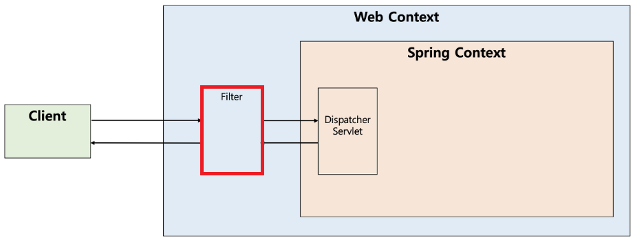
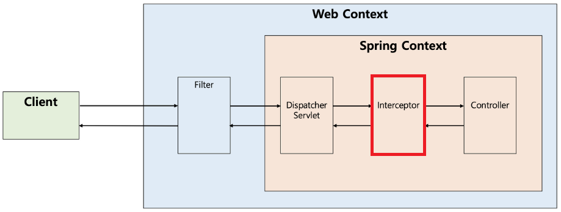

---
title: "[Spring] 필터(Filter)와 인터셉터(Interceptor)의 개념 및 차이"
excerpt: "필터(Filter)와 인터셉터(Interceptor)에 대해서 알아보자."

categories:
  - Spring
tags:
  - [Spring]

published: true

permalink: /spring/filter-interceptor/

toc: true
toc_sticky: true

date: 2023-02-21
last_modified_at: 2023-02-21

--- 

웹 개발을 하자보면 공통적으로 처리해야 할 작업들이 많다.<br>

예를 들어, 로그인 관련(세션체크) 처리, 권한 체크, XSS(Cross Site Script) 방어, pc와 모바일 웹의 분기 처리, 로그 등이 있다.<br>

공통 업무에 관련된 코드를 모든 페이지마다 작성 해야 한다면 중복된 코드가 많아지게 되고 프로젝트 단위가 커질수록 서버에 부하를 줄 수도 있으며, 소스 관리도 되지 않는다.

Spring은 공통적으로 여러 작업을 처리함으로써 중복된 코드를 제거할 수 있도록 많은 기능들을 지원하고 있다.<br>

**1. Filter**<br>
**2. Interceptor**<br>
**3. AOP**<br>

스프링에서 사용되는 위의 세 가지 기능은 모두 어떤 행동을 하기전에 먼저 실행하거나, 실행한 후에 추가적인 행동을 할 때 사용되는 기능들이다.<br>

필터(Filter)와 인터셉터(Interceptor)의 개념 및 차이점에 대해 알아보자.<br>
또한 간략하게 인터셉터(Interceptor)와 AOP에 대해서도 비교해보자.<br><br>

## **필터(Filter)**
<hr />

필터는 <span style="color:red">**Dispatcher Servlet에 요청되기 전/후에 url 패턴에 맞는 모든 요청에 대해 부가작업을 처리할 수 있는 기능을 제공**</span>한다.<br>

Dispatcher Servler은 스프링 컨테이너의 가장 앞단에 존재하는 Front Controller이므로, 필터는 <span style="color:red">**스프링 컨테이너가 아닌 톰캣과 같은 웹 컨테이너에 의해 관리**</span>가 되는 것이고, 스프링 범위 밖에서 처리되는 것이다.(스프링 빈으로 등록 가능)<br>

<br><br>

### **필터(Filter)의 메서드**

필터를 추가하기 위해서는 javax.servlet의 Filter 인터페이스를 구현(implements)해야 하며,  다음과 같은 3가지 메서드를 가지고 있다.<br>

``` java
public interface Filter {
    public default void init(FilterConfig filterConfig) throws ServletException {}
 
    public void doFilter(ServletRequest request, ServletResponse response,
            FilterChain chain) throws IOException, ServletException;
 
    public default void destroy() {}
}
```
<br>

<span style="font-size:110%">**`init()` :**</span><br>

<span style="color:red">**필터 객체를 초기화하고 서비스에 추가하기 위한 메서드**</span>이다.<br>
웹 컨테이너가 1회 `init()`을 호출하여 필터 객체를 초기화하면 이후 요청들은 `doFilter()`를 통해 처리된다.<br><br>

<span style="font-size:110%">**`doFilter()` :**</span><br>

url-pattern에 맞는 모든 <span style="color:red">**HTTP 요청이 디스패치 서블릿으로 전달되기 전에 웹 컨테이너에 의해 실행되는 메서드**</span>이다.<br>
doFilter의 파라미터로 FilterChain이 있는데, FilterChain의 doFilter를 통해 다음 대상으로 요청을 전달할 수 있게 된다.<br>
`chain.doFilter()` 메서드로 전, 후에 우리가 필요한 처리 과정을 넣어줌으로써 원하는 처리르 진행할 수 있다.<br><br>

<span style="font-size:110%">**`destory()` :**</span><br>

<span style="color:red">**필터 객체를 제거하고 사용하는 자원을 반환하기 위한 메서드**</span>이다.<br>
웹 컨테이너가 1회 `destory()`를 호출하여 필터 객체를 종료하면 이후에는 doFilter에 의해 처리되지 않는다.<br><br>

## **인터셉터(Interceptor)**
<hr />

인터셉터는 <span style="color:red">**Despatcher Servlet이 Controller를 호출하기 전/후에 인터셉터가 끼어들어 요청과 응답을 참조하거나 가공할 수 있는 기능을 제공**</span>한다.<br>

웹 컨테이너에서 동작하는 필터와 달리 <span style="color:red">**인터셉터는 스프링 컨텍스트에서 동작**</span>한다.<br>

디스패처 서블릿은 핸들러 매핑을 통해 적절한 컨트롤러를 찾도록 요청하는데, 그 결과로 실행 체인(HandlerExecutionChain)을 돌려준다.<br>
이 실행 체인은 1개 이상의 인터셉터가 등록되어 있다면 순차적으로 인터셉터들을 거쳐 실행되도록 하고, 인터셉터가 없다면 바로 컨트롤러를 실행한다.(실제로 Interceptor가 Controller로 요청을 위임하지는 않는다.)<br>

<br><br>

### **인터셉터(Interceptor)의 메서드**

인터셉터를 추가하기 위해서는 org.springframework.web.servlet의 HandlerInterceptor 인터페이스를 구현해야 하며, 다음과 같은 세 가지 메서드를 가지고 있다.<br>

``` java
public interface HandlerInterceptor {
    default boolean preHandle(HttpServletRequest request, HttpServletResponse response, Object handler)
        throws Exception {
        
        return true;
    }

    default void postHandle(HttpServletRequest request, HttpServletResponse response, Object handler,
        @Nullable ModelAndView modelAndView) throws Exception {
    }

    default void afterCompletion(HttpServletRequest request, HttpServletResponse response, Object handler,
        @Nullable Exception ex) throws Exception {
    }
}
```
<br>

<span style="font-size:110%">**`preHandle()` :**</span><br>

<span style="color:red">**Controller가 호출되기 전에 실행**</span>된다.<br>
컨트롤러 이전에 처리해야 하는 전처리 작업이나 요청 정보를 가공하거나 추가하는 경우에 사용할 수 있다.<br>

<span style="font-size:110%">**`postHandle()` :**</span><br>

<span style="color:red">**Controller가 호출된 후에 실행**</span>된다.(View 렌더링 전)<br>
컨트롤러 이후에 처리해야 하는 후처리 작업이 있을 때 사용할 수 있다.<br>
이 메서드는 컨트롤러가 반환하는 ModelAndView 타입의 정보가 제공되는데, 최근에는 JSON 형태로 데이터를 제공하는 RESTAPI 기반의 컨트롤러(@RestController)를 만들면서 자주 사용되지 않는다.<br>

<span style="font-size:110%">**`afterCompletion()` :**</span><br>

모든 뷰에서 최종 결과를 생성하는 일을 포함해 <span style="color:red">**모든 작업이 완료된 후에 실행**</span>된다.(View 렌더링 후)<br>
요청 처리 중에 사용한 리소스를 반환할 때 사용할 수 있다.<br><br>

### **인터셉터(Interceptor)와 AOP 비교**

인터셉터 대신에 컨트롤러들에 적용할 부가기능을 어드바이스로 만들어 AOP를 적용할 수도 있다.  <br>
하지만 다음과 같은 이유들로 컨트롤러의 호출 과정에 적용되는 부가기능들은 인터셉터를 사용하는 편이 낫다.<br>

1. 컨트롤러는 타입과 실행 메서드가 모두 제각각이라 포인트컷(적용할 메서드 선별)의 선별이 어렵다.
2. 컨트롤러는 파라미터나 리턴 값이 일정하지 않다.
3. AOP에서는 HttpServletRequest/Response 객체를 얻기 어렵지만 인터셉터에서는 파라미터로 넘어온다.

<br>

## **필터(Filter)오 인터셉터(Interceptor)의 차이 및 비교**
<hr />

### **Request/Response 객체 조작 가능 여부**

필터는 Request와 Response를 조작할 수 있지만 인터셉터는 조작할 수 없다.<br>
여기서 조작한다는 것은 내부 상태를 변경한다는 것이 아니라 다른 객체로 바꿔친다는 의미이다.<br>

필터가 다음 필터를 호출하기 위해서는 필터 체이닝(다음 필터 호출)을 해주어야 한다.<br>
이때 Request/Response 객체를 넘겨주므로 우리가 원하는 Request/Response 객체를 넣어줄 수 있다.
``` java
public MyFilter implements Filter {
    @Override
    public void doFilter(ServletRequest request, ServletResponse response, FilterChain chain) {
        // 개발자가 다른 request와 response를 넣어줄 수 있음
        chain.doFilter(request, response);       
    }
}
```
<br>

하지만 인터셉터의 처리 과정은 필터와 다르다.<br>
디스패처 서블릿이 여러 인터셉터 목록을 가지고 있고, for 문으로 순차적으로 실행시킨다.<br>
그리고 true를 반환하면 다음 인터셉터가 실행되거나 컨트롤러로 요청이 전달되며, false가 반환되면 요청이 중단된다. 그러므로 다른 Request/Response 객체를 넘겨줄 수 없다.<br>

``` java
public class MyInterceptor implements HandlerInterceptor {
    default boolean preHandle(HttpServletRequest request, HttpServletResponse response, Object handler) {
        // Request/Response를 교체할 수 없고 boolean 값만 반환할 수 있다.
        return true;
    }
}
```
<br>

### **필터(Filter)와 인터셉터(Interceptor)의 용도 및 예시**

**필터(Filter)의 용도 및 예시**<br>

* 공통된 보안 및 인증/인가 관련 작업
* 모든 요청에 대한 로깅 또는 검사
* 이미지/데이터 압축 및 문자열 인코딩
* Spring과 분리되어야 하는 기능

필터는 기본적으로 <span style="color:red">**스프링과 무관하게 전역적으로 처리해야 하는 작업들을 처리**</span>할 수 있다.<br>

필터는 인터셉터보다 앞단에서 동작하므로 전역적으로 해야하는 보안 검사(XSS 방어 등)를 하여 올바른 요청이 아닐 경우 차단을 할 수 있다.<br>

그러면 스프링 컨테이너까지 요청이 전달되지 못하고 차단되므로 안전성을 더욱 높일 수 있다.<br>

또한, 필터는 이미지나 데이터의 압축, 문자열 인코딩과 같이 <span style="color:red">**웹 어플리케이션에 전반적으로 사용되는 기능을 구현**</span>하기에 적당하다.<br>

대표적으로 필터(Filter)를 인증과 인가에 사용하는 도구로는 SpringSecurity가 있다. SpringSecurity의 특징 중 하나는 Spring MVC에 종속적이지 않다는 것인데, 이러한 이유로는 필터 기반으로 인증/인가 처리를 하기 때문이다.
<br><br>

**인터셉터(Interceptor)의 용도 및 예시**<br>

* 세부적인 보안 및 인증/인가 공통 작업
* API 호출에 대한 로깅 또는 검사
* Controller로 넘겨주는 정보(데이터)의 가공

인터셉터에서는 <span style="color:red">**클라이언트의 요청과 관련되어 전역적으로 처리해야 하는 작업들을 처리**</span>할 수 있다.<br>

대표적으로 세부적으로 적용해야 하는 인증이나 인가와 같이 클라이언트 요청과 관련된 작업 등이 있다.<br>
예를 들어, 특정 그룹의 사용자는 어떤 기능을 사용하지 못하는 경우가 있는데, 이러한 작업들은 컨트롤러로 넘어가기 전에 검사해야 하므로 인터셉터가 처리하기에 적합하다.<br>

또한 인터셉터는 필터와 다르게 HttpServletRequest나 HttpServletResponse 등과 같은 객체를 제공받으므로 객체 자체를 조작할 수는 없다. 대신 해당 객체가 내부적으로 갖는 값은 조작할 수 있으므로 <span style="color:red">**컨트롤러로 넘겨주기 위한 정보를 가공**</span>하기에 용이하다.<br>

예를 들어 JWT 토큰 정보를 파싱해서 컨트롤러에게 사용자의 정보를 제공하도록 가공할 수 있다.<br>
그 외에도 여러 목적으로 API 호출에 대한 정보들을 기록해야 하는 상황에 HttpServletRequest나 HttpServletResponse를 제공해주는 인터셉터는 클라이언트의 IP나 요청 정보들을 기록하기에 용이하다.<br><br>

<hr />  
참고자료<br>
<a href="https://mangkyu.tistory.com/173">https://mangkyu.tistory.com/173</a><br>
<a href="https://dev-coco.tistory.com/173">https://dev-coco.tistory.com/173</a><br>