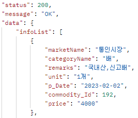

---
title: "[Spring Boot] API Response Format 구현"
excerpt: "API Response Format을 구현해보자."

categories:
  - Spring
tags:
  - [Spring Boot]

published: true

permalink: /spring/springboot-api-response-format/

toc: true
toc_sticky: true

date: 2023-02-23
last_modified_at: 2023-02-23

--- 

공통 응답 포맷을 구현하면 어떠한 응답도 공통 포맷 형태로 반환되기 때문에 전달받는 주체가 공통 포맷을 보고 정상 응답, 에러를 구분할 수 있다. <br><br>

## **응답 형식**
<hr />

응답은 크게 3가지 파트가 존재한다.<br>

`status` : 응답 상태 코드<br>
* HTTP 상태 코드를 반환한다.  

`message` : 응답 메세지<br>
* 성공하면 "Success", 실패하면 실패 원인을 문자열로 반환

`data` : 응답 결과<br>
* 응답에 실패할 경우, 데이터가 없는 응답을 반환

<br>

## **StatusCode**
<hr />

HTTP 상태 코드와 메세지를 담당하는 enum<br>
``` java
@Getter
@RequiredArgsConstructor
public enum StatusCode {
    OK(HttpStatus.OK.value(), "Success"),

    BAD_REQUEST(HttpStatus.BAD_REQUEST.value(), "Bad request"),

    NOT_FOUND(HttpStatus.NOT_FOUND.value(), "Requested resource is not found");

    private final Integer status;
    private final String message;
}
```
<br>

## **ResponseDTO**
<hr />

DataResponseDTO와 ErrorResponseDTO가 ResponseDTO를 상속받는다.<br>

``` java
@Getter
@RequiredArgsConstructor
public class ResponseDTO {
    private final Integer status;
    private final String message;

    public static ResponseDTO of(StatusCode statusCode) {
        return new ResponseDTO(statusCode.getStatus(), statusCode.getMessage());
    }
}
```
<br>

## **DataResponseDTO**
<hr />

``` java
@Getter
public class DataResponseDTO<T> extends ResponseDTO{
    private final T data;

    private DataResponseDTO(T data) {
        super(StatusCode.OK.getStatus(), StatusCode.OK.getMessage());
        this.data = data;
    }

    public static <T> DataResponseDTO<T> of(T data) {
        return new DataResponseDTO<>(data);
    }
}
```
<br>

<br><br>

다음에는 ErrorResponseDTO를 구현하여 에러 처리 방법을 구현할 생각이다!

<hr />  
참고자료<br>
<a href="https://velog.io/@leeeeeyeon/Spring-boot-Response-%ED%98%95%EC%8B%9D-%EB%A7%8C%EB%93%A4%EA%B8%B0">https://velog.io/@leeeeeyeon</a><br>