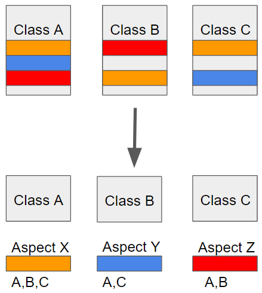

---
title: "[Spring] AOP의 개념과 Spring AOP"
excerpt: "AOP의 개념과 Spring AOP에 대해서 알아보자"

categories:
  - Spring
tags:
  - [Spring]

published: true

permalink: /spring/aop-and-spring-aop/

toc: true
toc_sticky: true

date: 2023-02-25
last_modified_at: 2023-02-25

--- 

## **AOP(Aspect Oriented Programming)란?**
<hr />

AOP는 Aspect Oriented Programming의 약자로 관점 지향 프로그래밍이라고 불린다.<br>
관점 지향은 어떤 로직을 기준으로 <span style="color:red">**핵심적인 관점(Core Concern), 부가적인 관점(Cross-Cutting Concern)**</span>으로 나누어서 보고 그 관점을 기준으로 모듈화 하겠다는 것이다.<br>

예를 들어, 핵심적인 관점은 비즈니스 로직이 될 수 있고, 부가적인 관점은 핵심 로직을 실행하기 위해 행해지는 DB 연결, 로깅, 파일 입출력 등이 될 수 있다.<br>

AOP이 없이 구현한다면 중복 코드가 발생할 소지가 있고, 코드의 변경이 필요하면 여러 코드에 종속적으로 변경이 필요할 것이며, 핵심적인 비즈니스 로직에 부가적인 로직이 추가되어 가독성과 효율성이 떨어지는 등의 문제가 발생할 수 있다.

<br>

위와 같이 흩어진 관심사를 <span style="color:red">**Aspect로 모듈화하고 핵심적인 비즈니스 로작에서 분리하여 재사용**</span>하겠다는 것이 AOP의 취지다.<br><br>

### **AOP 관련 용어**
* **Aspect** : 흩어진 관심사를 모듈화 한 것. 주로 부가기능을 모듈화한다.
* **Target** : **Aspect**를 적용하는 곳(클래스, 인터페이스, 메서드..)
* **Advice** : 실질적으로 어떤 일을 해야 할지에 대한 것, 실질적인 부가 기능을 담은 구현체
* **Joint Point** : **Advice**가 적용할 위치 혹은 끼어들 수 있는 지점. 메서드 진입, 생성자 호출, 필드에서 값을 꺼내올 때 등 다양한 시점에 적용가능
* **Point Cut** : **Joint Point**의 상세한 스펙을 정의한 것. "A란 메서드의 진입 시점에 호출할 것"처럼 구체적으로 **Advice**가 실행될 지점을 정할 수 있다.

<br>

### **AOP 적용 방법**

**1. 컴파일 타임 적용**<br>
* 컴파일 시점에 바이트 코드를 조작하여 AOP가 적용된 바이트 코드를 생성하는 방법

**2. 로드 타임 적용**<br>
* 컴파일한 뒤, 클래스를 로딩하는 시점에 클래스 정보를 변경하는 방법

**3. 런타임 적용**<br>
* <span style="color:red">**스프링 AOP가 주로 사용하는 방법**</span>
* A라는 클래스 타입의 Bean을 만들 때, A 타입의 Proxy Bean을 만들어 Proxy Bean이 Aspect 코드를 추가하여 동작하는 방법 
  
<br>

### **AOP의 장점**
* 부가적인 관점을 핵심 관점으로부터 분리시켜 핵심 로직을 깔끔하게 유지할 수 있다.
* 그에 따라 코드의 가독성, 유지보수성 등을 높일 수 있다.
* 각각의 모듈에 수정이 필요하면 다른 모듈의 수정 없이 해당 로직만 변경하면 된다.
* 공통 로직을 적용할 대상을 선택할 수 있다.

<br>

## **Spring AOP**
<hr />

Spring의 AOP는 내부적으로 다음과 같이 동작한다.<br>

1. **Dynamic Proxy** 객체의 생성 요청
2. **Point Cut**을 통해 부가 기능 대상 여부 확인
3. **Advice**로 부가 기능 적용
4. 실제 기능 처리

Spring AOP는 **Proxy**를 이용하였으며 자바의 기본 JDK와 Spring 컨테이너 외에는 특별한 기술이나 환경을 필요로 하지 않는다. 하지만 이러한 Proxy 방법은 반드시 Spring 컨테이너가 필요하며 부가 기능의 처리가 어려운 단점이 있다.<br><br>

## **Annotation 기반 AOP 구현**
<hr />

AOP 의존성을 추가하고 빌드했으면 AOP를 활성화하겠다는 `@EnableAspectJAutoProxy` 어노테이션을 추가해주어야 한다.<br>

``` java
@SpringBootApplication
@EnableAspectJAutoProxy
public class JangbogoProjectApplication {

	public static void main(String[] args) {
		SpringApplication.run(JangbogoProjectApplication.class, args);
	}
}
```
<br>

**어노테이션 기반의 AOP**로 실행 측정을 위한 **Aspect** 클래스를 구현해보자.<br>

어노테이션 기반으로 AOP를 적용하기 위해서는 AOP를 처리하기 위한 어노테이션을 다음과 같이 만들어주어야 한다.<br>

``` java
@Retention(RetentionPolicy.RUNTIME)
@Target({ElementType.TYPE, ElementType.METHOD})
public @interface ExecutionTimeChecker {
}
```
`@Target` 어노테이션은 해당 커스텀 어노테이션이 적용될 레벨을 의미한다.<br>
클래스 또는 메서드에 적용하고자 `TYPE`, `METHOD`를 추가했다.<br><br>

**Custom Annotation**

``` java
@Aspect
@Component
@Log4j2
public class ExecutionTimeAop {
    @Around("@within(backend.jangbogoProject.aop.ExecutionTimeChecker)")
    public Object calculateExecutionTime(ProceedingJoinPoint pjp) throws Throwable {
        // 해당 클래스 처리 전의 시간
        StopWatch sw = new StopWatch();
        sw.start();

        // 해당 클래스의 메소드 실행
        Object result = pjp.proceed();

        // 해당 클래스 처리 후의 시간
        sw.stop();
        long executionTime = sw.getTotalTimeMillis();

        String className = pjp.getTarget().getClass().getName();
        String methodName = pjp.getSignature().getName();
        String task = className + "." + methodName;

        log.debug("[ExecutionTime] " + task + "-->" + executionTime + "(ms)");

        return result;
    }
}
```

<br>

**적용**<br>

``` java
@RequiredArgsConstructor
@Transactional(readOnly = true)
public class CommodityService {
    private final CommodityRepository commodityRepository;

    @ExecutionTimeChecker
    public CommodityResponseDto.CommodityInfoList getCommodities(int gu_id, SearchRequestDTO searchRequestDTO){ ... }
}
```

<br>

**결과**<br>
```
[ExecutionTime] backend.jangbogoProject.service.CommodityService.getCommodities-->156(ms)
```

<hr />
참고자료<br>
<a href="https://mangkyu.tistory.com/121">https://mangkyu.tistory.com/121</a><br>