---
title: "[Spring Boot] Spring Security + OAuth2 소셜 로그인 구현 (1) - OAuth 2.0 로그인 구현 사전 설정"
excerpt: "본격적으로 OAuth2 소셜 로그인을 구현하기 전에 사전 설정을 해보자."

categories:
  - Spring
tags:
  - [Spring Boot, OAuth]

published: true

permalink: /spring/security-oauth2-login-setting/

toc: true
toc_sticky: true

date: 2023-02-26
last_modified_at: 2023-02-26

--- 

OAuth 2.0 로그인 구현 전에 <span style="color:red">**기능을 이용하고자 하는 Resource Server에 Application 사전 등록**</span>을 해줘야한다.<br>

가능하면 네이버/카카오/구글 로그인을 모두 구현할 예정이다.<br>
따라서, 네이버/카카오/구글 Resource Server에 프로젝트 서비스(Application)을 등록해보자.<br><br>

## **Naver에 Application 등록**
<hr />

<a href="https://developers.naver.com/main/">https://developers.naver.com/main/</a><br>

위의 네이버 개발자 센터 -> Application -> 애플리케이션 등록 탭으로 가서 등록할 수 있다.<br><br>

**1. 사용 API 설정**<br>

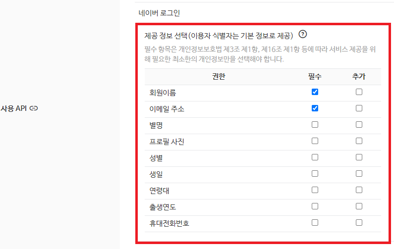<br>

사용할 API를 네이버 로그인으로 선택하고, **Scope**를 설정한다.<br><br>

**2. 로그인 오픈 API 서비스 환경 설정**<br>

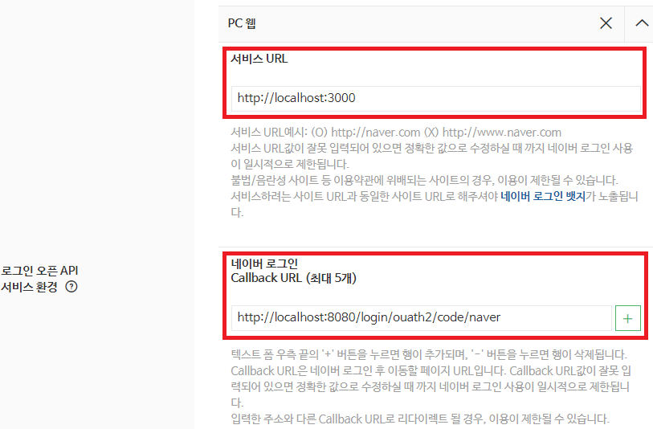<br>

서비스 환경으로 사용할 환경에 맞게 선택하고, 서비스 URL과 네이버 로그인 Callback URL을 입력한다.<br><br>

**3. 등록 완료(Client ID, Client Secret 발급)**<br>

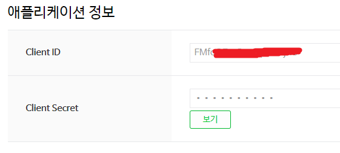<br>

등록이 완료되면, Client ID와 Client Secret을 발급받을 수 있다.<br>
이후에 ID, Secret을 스프링 설정 파일에 설정해줘야 한다.<br><br>

## **Kakao에 Application 등록**
<hr />

<a href="https://developers.kakao.com/">https://developers.kakao.com/</a><br>

위의 링크에서 Kakao developers -> 내 애플리케이션에서 등록할 수 있다.<br><br>

**1. 애플리케이션 추가**<br>

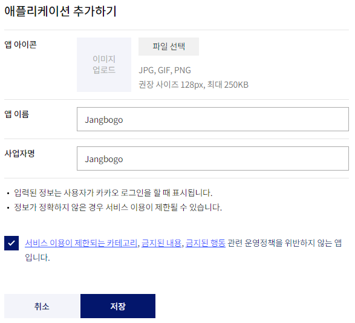<br><br>

**2. Client ID, Client Secret 발급**<br>

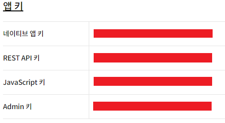<br>

REST API를 사용하므로, REST API 키가 Client ID이다.<br>

Client Secret은 애플리케이션에서 제품 설정 -> 보안 탭으로 가면 발급 받을 수 있다.<br>

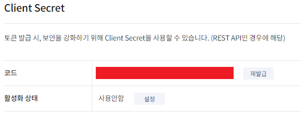<br><br>

**3. 플랫폼 (도메인) 등록**<br>

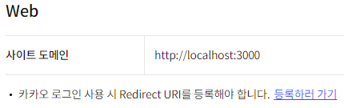<br>

사용할 플랫폼(Android, IOS, Web)에 맞게 도메인을 등록해준다.<br><br>

**4. Redirect URI 등록**<br>

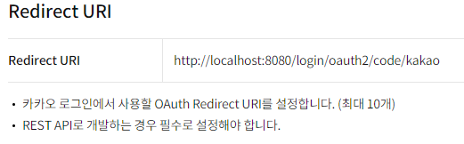<br><br>

**5. 동의항목 설정**<br>

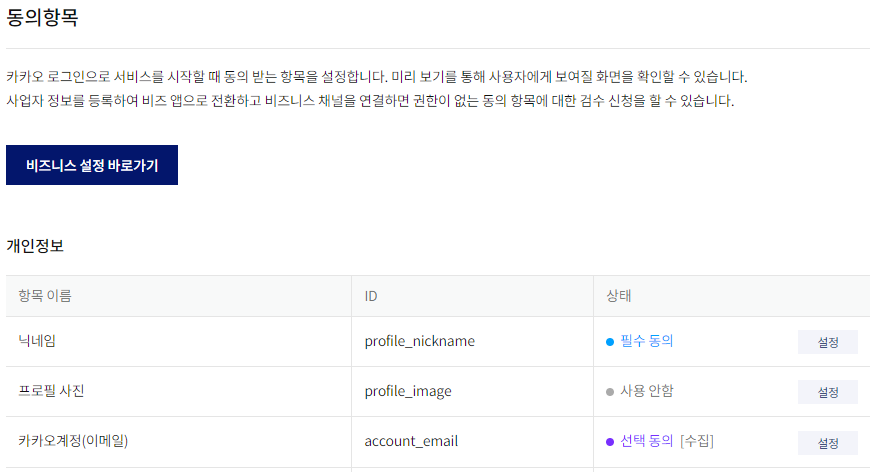<br>

프로젝트에 필요한 개인정보 항목을 설정한다.<br><br>

## **Google에 Application 등록**
<hr />

<a href="https://console.cloud.google.com/">https://console.cloud.google.com/</a><br>

위의 구글 클라우드 플랫폼에서 애플리케이션 등록을 진행할 수 있다.<br><br>

**1. 프로젝트 생성**<br>

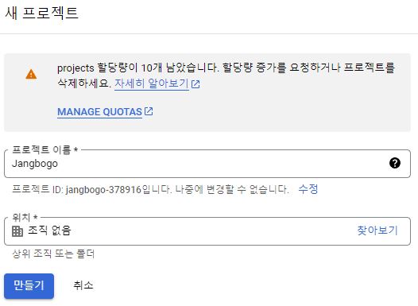<br>

구글 플랫폼 새 프로젝트 생성을 클릭하면, 프로젝트를 생성할 수 있다.<br><br>

**2. Application 등록**

<br>1. 왼쪽 탭 메뉴 -> API 및 서비스 -> 사용자 인증 정보 -> 사용자 인증 정보 만들기 -> OAuth 클라이언트 ID 클릭<br>

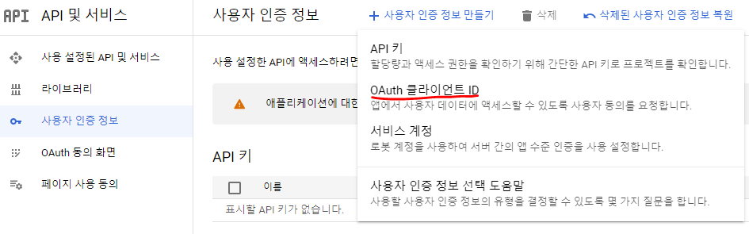

<br>2. 동의 화면 구성 -> User Type : 외부 -> 만들기<br>

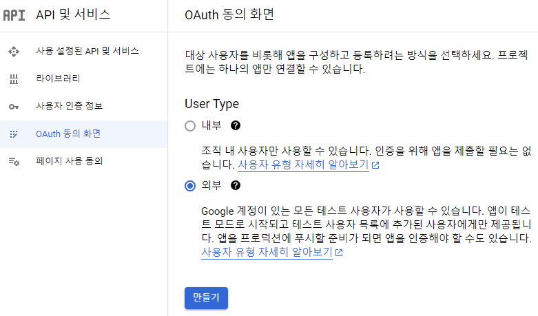

<br>3. 앱 정보(앱 이름, 사용자 지원 이메일) 입력 + 개발자 연락처 정보 입력 -> 저장 후 계속<br>

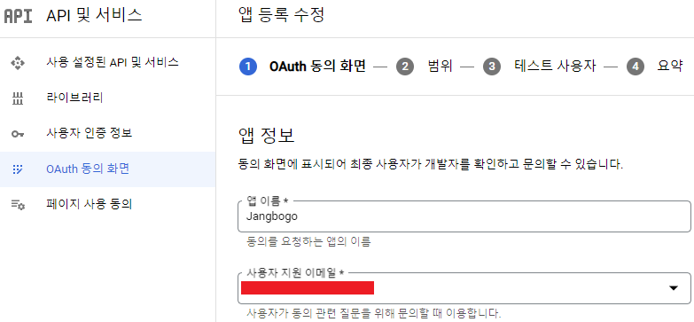

<br> 4. 범위 추가 또는 삭제 클릭 -> 범위는 기본값 `email`, `profile`, `openid` 선택  -> 저장 후 계속<br>

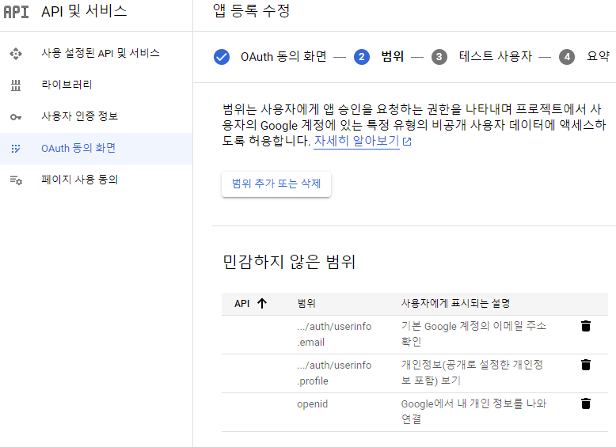<br><br>

**3. Application 설정**

<br>1. 사용자 인증 정보 -> 사용자 인증 정보 만들기 -> OAuth 클라이언트 ID 클릭<br>

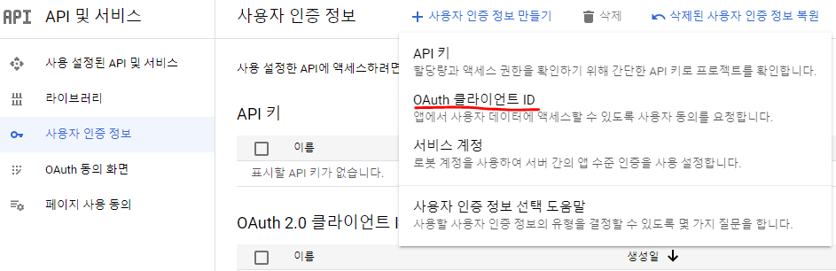<br>

<br>2.  애플리케이션 유형(웹 애플리케이션) 선택 -> 이름 입력 -> 승인된 리디렉션 URI 입력 -> 만들기<br>
승인된 리디렉션 URI는 앞서 네이버, 카카오 로그인과 마찬가지로 `http://localhost:8080/login/oauth2/code/google`로 설정<br>

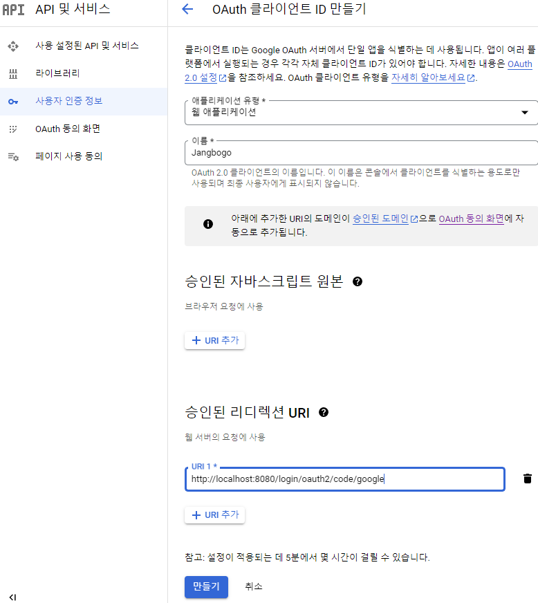<br>

<br>3. 클라이언트 ID, 클라이언트 Secret 발급<br>

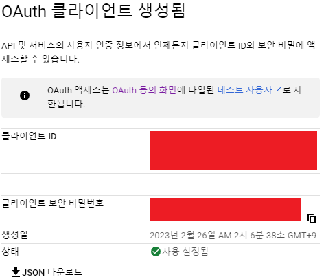<br><br>

## **application.yml 설정**
<br />

``` yaml
spring:
  security:
    oauth2.client:
      registration:
        naver:
          clientId: 네이버 클라이언트 ID
          clientSecret : 네이버 클라이언트 Secret
          clientAuthenticationMethod: post
          authorizationGrantType: authorization_code
          redirectUri: "http://localhost:8080/login/oauth2/code/naver"
          scope:
            - nickname
            - email
          clientName: Naver

        kakao:
          clientId: 카카오 클라이언트 ID
          clientSecret: 카카오 클라이언트 Secret
          clientAuthenticationMethod: post
          authorizationGrantType: authorization_code
          redirectUri: "http://localhost:8080/login/oauth2/code/kakao"
          scope:
            - profile_nickname
            - account_email
          clientName: Kakao

        google:
          clientId: 구글 클라이언트 ID
          clientSecret: 구글 클라이언트 Secret
          scope:
            - profile
            - email

      # Provider 설정
      provider:
        naver:
          authorizationUri: https://nid.naver.com/oauth2.0/authorize
          tokenUri: https://nid.naver.com/oauth2.0/token
          userInfoUri: https://openapi.naver.com/v1/nid/me
          userNameAttribute: response

        kakao:
          authorization-uri: https://kauth.kakao.com/oauth/authorize
          token-uri: https://kauth.kakao.com/oauth/token
          user-info-uri: https://kapi.kakao.com/v2/user/me
          user-name-attribute: id
```
<br>

`spring.security.oauth2.client.registration`에 OAuth 로그인을 할 google, naver, kakao의 정보들을 입력해주면 된다.<br>

이때, 앞서 Application 등록 시 발급받은 클라이언트 ID와 클라이언트 Secret을 사용한다.<br>

코드를 보면 google과 달리 naver와 kakao는 `spring.security.oauth2.client.provider.(kakao/naver)`로 provider 정보를 직접 설정해줬다.<br>

google은 provider 정보를 직접 설정하지 않아도 되는데, 이는 스프링에서 구글, 깃허브, 페이스북, 옥타는 Provider 정보를 내부에서 제공하기 때문이다.<br>

스프링에서는 Naver, Kakao의 Provider 정보는 제공하지 않기 때문에, 설정 파일에서 위와 같이 개발자가 직접 설정해 줘야 한다.<br><br>

크게 설정한 부분을 요약해보면, **registration** 부분과 **provider** 부분으로 나뉜다.<br>

**registration**<br>
OAuth 로그인 시 설정한 Application의 정보를 사용하여 AccessToken을 Authorization Server에게 발급받을 때 사용<br>

**provider**<br>
AccessToken을 Authorization Server에게 발급 받은 후, 해당 AccessToken으로 Resource Server의 API를 사용할 때 provider 부분의 정보를 사용하여 API 호출<br><br>

**Google의 scope의 기본값 = openid, profile, email인데, openid를 제외한 이유**<br>

openid를 포함하게 되면, Open Id Provider로 인식이 되기 때문에, openid가 없는 네이버, 카카오 같은 서비스와 다르게 OAuth2Service를 구현해야 한다.<br>

따라서, 하나의 OAuth2Service로 OAuth 로그인을 구현하기 위해 google scope에 openid를 제외해서, Open Id Provider로 인식되지 않도록 했다.

<hr />
참고자료<br>
<a href="https://ksh-coding.tistory.com/63">https://ksh-coding.tistory.com/63</a><br>