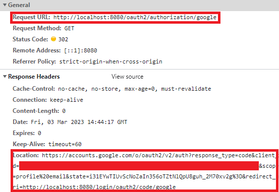
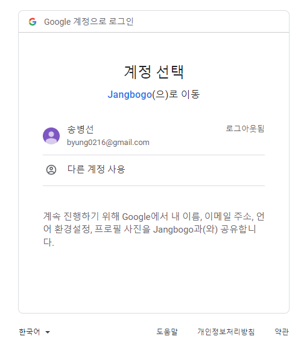
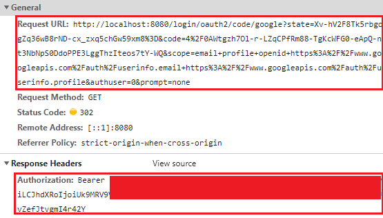

---
title: "[Spring Boot] Spring Security + OAuth2 소셜 로그인 구현 (4) - OAuth2 Login 동작 테스트"
excerpt: "OAuth2 Login 기능이 문제없이 동작하는지 테스트해보자."

categories:
  - Spring
tags:
  - [Spring Boot, OAuth]

published: true

permalink: /spring/security-oauth2-login-test/

toc: true
toc_sticky: true

date: 2023-03-04
last_modified_at: 2023-03-04

--- 

마지막으로 OAuth2를 이용하여 실제 DB에 회원 가입, 로그인이 되는지 테스트를 해보자.<br><br>

## **OAuth2 로그인 예시**
<hr />

OAuth2 로그인을 위해 로그인 페이지에 아래 코드를 추가했다.<br>

``` html
<a href="/oauth2/authorization/kakao">Kakao Login</a><br>
<a href="/oauth2/authorization/google">Google Login</a><br>
<a href="/oauth2/authorization/naver">Naver Login</a><br>
```

링크를 클릭하면 **"/oauth2/authorization/SocialType" URL로 요청을 보내도록 했다.**<br>

해당 링크로 요청을 보내면, 302 redirect로 소셜 타입별로 리다이렉트로 이동하여 로그인을 처리한다.<br>

<br>

개발자 도구에서 Network 탭을 확인해봤을 때, 아래와 같이 Redirect 되고 있음을 알 수 있다.<br><br>

<span style="font-size:110%">**1. Google Login 클릭**</span><br>

로그인 버튼을 클릭하여 `http://localhost:8080/oauth2/authorization/google`으로 요청을 보낸다.<br><br>

<span style="font-size:110%">**2. Google Login 화면**</span><br>

<br>

**1번에서 요청을 보내면 Redirect 되어 위와 같이 구글 서버에서 구글 로그인 화면을 내려준다.**<br><br>

<span style="font-size:110%">**3. Google 로그인 완료**</span><br>

OAuth2 로그인을 성공 하면, `localhost:8080`으로 Redirect 된다.<br><br>

<span style="font-size:110%">**4. 로그인 시 구글 인증 서버에서 보내준 AccessToken으로 요청 테스트**</span><br>

로그인 과정을 Network 탭에서 살펴보면,

<br>

위의 이미지처럼 입력한 구글 계정이 올바른지 확인 후 받은 **Authorization Code**를 요청 URI에 담아 보내면, 구글 인증 서버에서 **Authorization Code를 검증한 후 Response에 AccessToken을 보내준다.**<br>

그러면, 프론트에서 해당 AccessToken을 저장한 후 요청 시 보내주면 된다.

<hr />
참고자료<br>
<a href="https://ksh-coding.tistory.com/71">https://ksh-coding.tistory.com/71</a><br>
