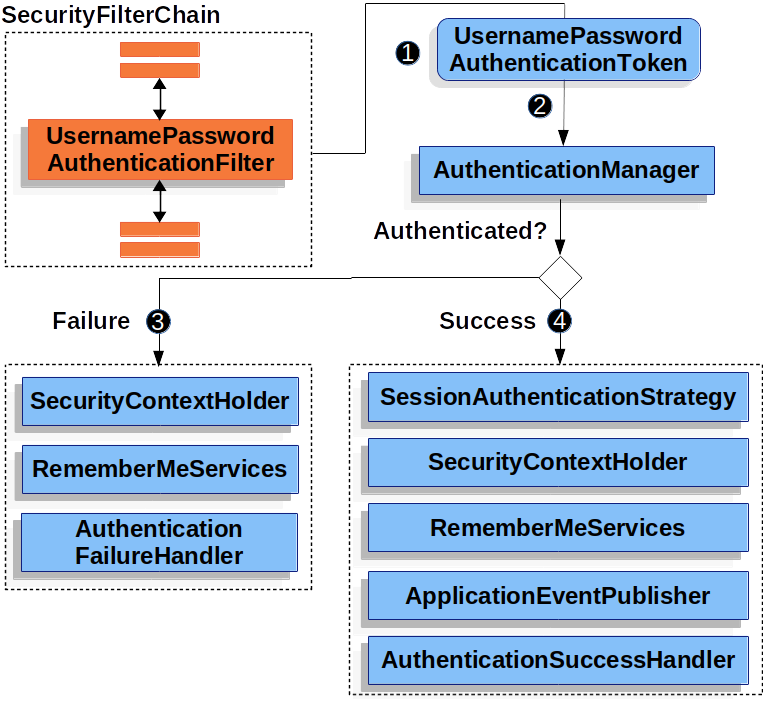

---
title: "[Spring] UsernamePasswordAuthenticationToken과 OAuth2AuthenticationToken"
excerpt: "UsernamePasswordAuthenticationToken과 OAuth2AuthenticationToken에 대해서 알아보자"

categories:
  - Spring
tags:
  - [Spring Security, OAuth]

published: true

permalink: /spring/security-usernamePasswordAuthenticationToken-oauth2AuthenticationToken/

toc: true
toc_sticky: true

date: 2023-03-05
last_modified_at: 2023-03-05

--- 

현재 개발하고 있는 프로젝트에서 자체 로그인과 소셜 로그인 기능들을 구현하는 도중에 자체 로그인에서 사용하는 **UsernamePasswordAuthenticationToken**, 소셜 로그인에서 사용하는 **OAuth2AuthenticationToken**에 대해 궁금하여 알아보게 되었다.<br><br>

## **AbstractAuthenticationToken**
<hr />

**AbstractAuthenticationToken** 추상 클래스는 `Authentication`, `CredentialsContainer` 인터페이스들을 구현한다.<br>

**Authentication**의 기본 클래스이다.

``` java
public abstract class AbstractAuthenticationToken implements Authentication, CredentialsContainer {

	private final Collection<GrantedAuthority> authorities;

	private Object details;

	private boolean authenticated = false;

	public AbstractAuthenticationToken(Collection<? extends GrantedAuthority> authorities) {
		if (authorities == null) {
			this.authorities = AuthorityUtils.NO_AUTHORITIES;
			return;
		}
		for (GrantedAuthority a : authorities) {
			Assert.notNull(a, "Authorities collection cannot contain any null elements");
		}
		this.authorities = Collections.unmodifiableList(new ArrayList<>(authorities));
	}
}
```

<br><br>

## **UsernamePasswordAuthenticationFilter**
<hr />

**UsernamePasswordAuthenticationFilter**란 Form based Authentication 방식으로 인증할 때 Id, Password 데이터를 파싱하여 인증 요청을 위임하는 필터이다.<br>

유저가 로그인 페이지에서 Login을 시도할 때 보내지는 요청에서 **아이디(username)와 패스워드(password)** 데이터를 가져온 후 인증을 위한 토큰(**UsernamePasswordAuthenticationToken**)을 생성 후 인증을 AuthenticationManager에 위임하는 역할을 한다.<br>

이때 사용되는 UsernamePasswordAuthenticationFilter의 코드를 보면 아래와 같다.<br>

``` java
@Override
public Authentication attemptAuthentication(HttpServletRequest request, HttpServletResponse response)
		throws AuthenticationException {
	if (this.postOnly && !request.getMethod().equals("POST")) {
		throw new AuthenticationServiceException("Authentication method not supported: " + request.getMethod());
	}
	String username = obtainUsername(request);
	username = (username != null) ? username.trim() : "";
	String password = obtainPassword(request);
	password = (password != null) ? password : "";
	UsernamePasswordAuthenticationToken authRequest = UsernamePasswordAuthenticationToken.unauthenticated(username,
			password);
	// Allow subclasses to set the "details" property
	setDetails(request, authRequest);
	return this.getAuthenticationManager().authenticate(authRequest);
}
```
request 안에서 username, password 파라미터를 가져와서 **UsernamePasswordAuthenticationToken**을 생성한 후 **AuthenticationManager**을 구현한 객체에 인증을 위임한다.<br>

**UsernamePasswordAuthenticationToken**의 로직을 그림으로 나타내면 아래와 같은 형태로 로직이 흘러간다.<br>



<br><br>

## **UsernamePasswordAuthenticationToken**
<hr />

**UsernamePasswordAuthenticationToken**은 Authentication을 implements한 **AbstractAuthenticationToken**의 하위 클래스다.<br>

User의 Id가 **Principal** 역할을 하고, Password가 **Credential**의 역할을 한다.<br>
UsernamePasswordAuthenticationToken의 첫 번째 생성자는 인증 전의 객체를 생성하고, 두 번째 생성자는 인증이 완료된 객체를 생성한다.<br>

``` java
public class UsernamePasswordAuthenticationToken extends AbstractAuthenticationToken {
    // 주로 사용자의 ID에 해당함
    private final Object principal;
    // 주로 사용자의 PW에 해당함
    private Object credentials;
    
    // 인증 완료 전의 객체 생성
    public UsernamePasswordAuthenticationToken(Object principal, Object credentials) {
		super(null);
		this.principal = principal;
		this.credentials = credentials;
		setAuthenticated(false);
	}
    
    // 인증 완료 후의 객체 생성
    public UsernamePasswordAuthenticationToken(Object principal, Object credentials,
			Collection<? extends GrantedAuthority> authorities) {
		super(authorities);
		this.principal = principal;
		this.credentials = credentials;
		super.setAuthenticated(true); // must use super, as we override
	}
}
```

<br><br>

## **OAuth2LoginAuthenticationFilter**
<hr />

위에서 설명한 **UsernamePasswordAuthenticationFilter** 필터가 일반적인 아이디와 패스워드를 이용한 인증을 담당하는 필터다.<br>

만약, 아이디와 패스워드가 아닌 **OAuth2를 이용한 인증**을 하려고 할 때는 어떻게 동작할까?<br>
OAuth2 로그인을 사용한다면, **UsernamePasswordAuthenticationFilter** 대신 **OAuth2LoginAuthenticationFilter**가 호출된다.<br>

두 필터의 상위 클래스는 **AbstractAuthenticationProcessingFilter**이다.<br>
Spring Security는 **AbstractAuthenticationProcessingFilter**를 호출하고, 로그인 방식에 따라 구현체인 **UsernamePasswordAuthenticationFilter**와 **OAuth2LoginAuthenticationFilter**가 동작하는 방식이다.<br><br>

먼저 registrationId를 통해 `ClientRegistration` 객체를 가져온다.

``` java
String registrationId = authorizationRequest.getAttribu(OAuth2ParameterNames.REGISTRATION_ID);
ClientRegistration clientRegistration = this.clientRegistrationRepository.findByRegistrationId(registrationId);
```
<br>

그 후, OAuth2 Server의 Access Token을 얻기 위한 Authorization Code(아이디, 비밀번호를 입력시 생성된다. HttpServletRequest에 이미 담겨있는 정보)를 `OAuth2AuthorizationResponse` 객체로 만들고, `OAuth2AuthorizationResponse`를 통해 Access Token을 가져온다.<br>

``` java
OAuth2AuthorizationResponse authorizationResponse = OAuth2AuthorizationResponseUtils.convert(params, redirectUri);

Object authenticationDetails = this.authenticationDetailsSource.buildDetails(request);

OAuth2LoginAuthenticationToken authenticationRequest = new OAuth2LoginAuthenticationToken(clientRegistration, new OAuth2AuthorizationExchange(authorizationRequest, authorizationResponse));
authenticationRequest.setDetails(authenticationDetails);

OAuth2LoginAuthenticationToken authenticationResult = (OAuth2LoginAuthenticationToken) this.getAuthenticationManager().authenticate(authenticationRequest);
```
<br>

가져온 Access Token으로 **OAuth2AuthenticationToken**을 생성해 반환한다.

``` java
OAuth2AuthenticationToken oauth2Authentication = this.authenticationResultConverter
				.convert(authenticationResult);

Assert.notNull(oauth2Authentication, "authentication result cannot be null");

oauth2Authentication.setDetails(authenticationDetails);

OAuth2AuthorizedClient authorizedClient = new OAuth2AuthorizedClient(
				authenticationResult.getClientRegistration(), oauth2Authentication.getName(),
				authenticationResult.getAccessToken(), authenticationResult.getRefreshToken());

this.authorizedClientRepository.saveAuthorizedClient(authorizedClient, oauth2Authentication, request, response);
return oauth2Authentication;
```

<br><br>

## **OAuth2AuthenticationToken**
<hr />

**OAuth2AuthenticationToken**은 Access Token을 포함한 소셜 로그인의 정보를 제공해주는 객체이다.<br>


``` java
public class OAuth2AuthenticationToken extends AbstractAuthenticationToken {

	private static final long serialVersionUID = SpringSecurityCoreVersion.SERIAL_VERSION_UID;

	private final OAuth2User principal;

	private final String authorizedClientRegistrationId;

	public OAuth2AuthenticationToken(OAuth2User principal, Collection<? extends GrantedAuthority> authorities,
			String authorizedClientRegistrationId) {
		super(authorities);
		Assert.notNull(principal, "principal cannot be null");
		Assert.hasText(authorizedClientRegistrationId, "authorizedClientRegistrationId cannot be empty");
		this.principal = principal;
		this.authorizedClientRegistrationId = authorizedClientRegistrationId;
		this.setAuthenticated(true);
	}
}
```

**OAuth2User** 타입 객체의 **Principal**과 **authorizedClientRegistrationId**를 필드로 가진다.

<br>

<hr />
참고자료<br>
<a href="https://letsmakemyselfprogrammer.tistory.com/40">https://letsmakemyselfprogrammer.tistory.com/40</a><br>
<a href="https://jeong-pro.tistory.com/205">https://jeong-pro.tistory.com/205</a><br>
