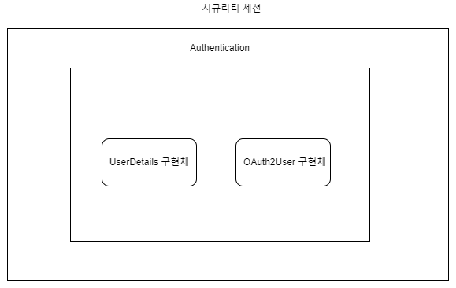

---
title: "[Spring] Authentication 객체가 가질수 있는 2가지 타입"
excerpt: "Authentication 객체가 가질수 있는 2가지 타입에 대해서 알아보자"

categories:
  - Spring
tags:
  - [Spring Security, OAuth]

published: true

permalink: /spring/security-two-types-of-authentication/

toc: true
toc_sticky: true

date: 2023-03-10
last_modified_at: 2023-03-10

--- 

## **Authentication 객체가 가질수 있는 2가지 타입**
<hr />

인증 정보를 담는 <span style="color:red">**Authentication**</span>은 **UserDeatils** 또는 **OAuth2User** 구현체를 가질 수 있다.<br>

**UserDetails**는 일반 로그인 유저의 인증 정보를 담고, **OAuth2User**는 OAuth2 로그인 유저의 인증 정보를 담는다.<br>

<br>

하지만 구현하고 있는 서비스에서 두 가지 로그인 방식을 둘 다 사용한다면 발생할 문제가 있다.<br>

로그인 방법마다 인증 정보를 담는 객체의 타입이 다르다면, 컨트롤러의 메서드마다 두 구현체를 각각 파라미터로 받아야 한다.<br>

이 문제를 해결하기 위해 **UserDeatils**와 **OAuth2User** 구현체들을 `implements`한 **PrincipalDetails**를 구현하면 된다.<br><br>

## **PrincipalDetails**
<hr />

``` java
@Getter
public class PrincipalDetails implements UserDetails, OAuth2User {

    private User user;
    private Map<String, Object> attributes;

    // 일반 로그인
    public PrincipalDetails(User user){
        this.user = user;
    }

    // OAuth 로그인
    public PrincipalDetails(User user, Map<String, Object> attributes){
        this.user = user;
        this.attributes = attributes;
    }

    @Override
    public Collection<? extends GrantedAuthority> getAuthorities() {
        Collection<GrantedAuthority> authorities = new ArrayList<>();
        for(String authority : user.getAuthority().split(",")){
            authorities.add(new SimpleGrantedAuthority(authority));
        }
        return authorities;
    }

    @Override
    public String getPassword() {
        return user.getPassword();
    }

    @Override
    public String getUsername() {
        return user.getEmail();
    }

    @Override
    public boolean isAccountNonExpired() {
        return true;
    }

    @Override
    public boolean isAccountNonLocked() {
        return true;
    }

    @Override
    public boolean isCredentialsNonExpired() {
        return true;
    }

    @Override
    public boolean isEnabled() {
        return true;
    }

    @Override
    public String getName() {
        return user.getEmail();
    }

    @Override
    public Map<String, Object> getAttributes() {
        return attributes;
    }
}
```

로그인 후에 로그인한 사용자의 정보가 필요할 때 꺼내써야 되는데 로그인된 방식에 따른 메서드를 따로 만들어 **UserDetails**와 **OAuth2User** 구현체를 각각 파라미터로 받아 사용해야하는 불편함이 존재한다.<br>

그래서 이 문제를 **UserDetails**와 **OAuth2User**를 포함하는 **PrincipalDetails** 클래스를 구현하여 Authentication 객체에 넣으면 일반 로그인을 하든 OAuth2 로그인을 하든 필요할 때마다 로그인 사용자의 정보를 꺼내 쓸 수 있다.<br>

``` java
// 일반 로그인
public PrincipalDetails(User user){
    this.user = user;
}

// OAuth 로그인
public PrincipalDetails(User user, Map<String, Object> attributes){
    this.user = user;
    this.attributes = attributes;
}
```

로그인 타입에 따라 생성자를 구현한 뒤 로그인할 때 각 타입에 맞는 생성자로 **PrincipalDetails** 객체를 생성하여 리턴하면 Security Session 정보로 들어간다.<br><br>

## **@AuthenticationPrincipal**
<hr />

Spring Security는 Security Context에 인증된 Authentication 객체를 넣어두고 현재 스레드 내에서 공유되도록 관리한다.<br>

인증 이후 편의적으로 현재 인증된 세션 유저를 가져오기 위해 `@AuthenticationPrincipal` 어노테이션을 통하여 **UserDetails**나 **OAuth2User** 인터페이스를 구현한 유저 객체를 주입할 때 사용하는 편이다.<br><br>

### **@AuthenticationPrincipal의 동작 방식**<br>

@AuthenticationPrincipal의 동작 방식을 알기 위해서는 **HandlerMethodArgumentResolver**와 **AuthenticationPrincipalArgumentResolver**에 대해 알아야 한다.<br><br>

**HandlerMethodArgumentResolver**<br>

<span style="color:red">**HandlerMethodArgumentResolver**</span>는 컨트롤러 메서드에서 특정 조건에 맞는 파라미터가 있을 때 원하는 값을 바인딩해주는 인터페이스다.<br>

스프링에서는 Controller에서 `@RequestBody` 어노테이션을 사용해 Request의 Body 값을 받아올 때, `@PathVariable` 어노테이션을 사용해 Request의 Path Parameter 값을 받아올 때 **HandlerMethodArgumentResolver**를 사용해서 값을 받아온다.<br><br>

**AuthenticationPrincipalArgumentResolver**<br>

Spring Security에서 **HandlerMethodArgumentResolver**을 구현한 구현체로 `@AuthenticationPrincipal` 어노테이션이 실제로 사용되는 부분이다.<br><br>

Spring Security를 활용하는 경우, **AuthenticationPrincipalArgumentResolver** 클래스를 활용하여 resolveArgument 메서드를 구현하고 Security Context에 저장된 인증 객체를 기반으로 Authentication 객체를 꺼내오게 된다. <br>

아래는 실제 구현 메서드 부분이다.<br>

``` java
@Override
public Object resolveArgument(MethodParameter parameter, ModelAndViewContainer mavContainer,
        NativeWebRequest webRequest, WebDataBinderFactory binderFactory) {
            
    Authentication authentication = SecurityContextHolder.getContext().getAuthentication();

    if (authentication == null) {
        return null;
    }

    Object principal = authentication.getPrincipal();

    AuthenticationPrincipal annotation = findMethodAnnotation(AuthenticationPrincipal.class, parameter);

    String expressionToParse = annotation.expression();
    if (StringUtils.hasLength(expressionToParse)) {
        StandardEvaluationContext context = new StandardEvaluationContext();
        context.setRootObject(principal);
        context.setVariable("this", principal);
        context.setBeanResolver(this.beanResolver);

        Expression expression = this.parser.parseExpression(expressionToParse);
        principal = expression.getValue(context);
    }

    if (principal != null && !ClassUtils.isAssignable(parameter.getParameterType(), principal.getClass())) {
        if (annotation.errorOnInvalidType()) {
            throw new ClassCastException(principal + " is not assignable to " + parameter.getParameterType());
        }
        return null;
    }
    return principal;
}
```

<br>

**1. Security Context에서 꺼내온 Authentication 객체를 기반으로 한다.**<br>

``` java 
Authentication authentication = SecurityContextHolder.getContext().getAuthentication();
```

<br>

**2. 인증 객체에서 Principal을 꺼낸다.**<br>

``` java
Object principal = authentication.getPrincipal();
```

<br>

**3. 해당 어노테이션이 붙은 파라미터가 존재하는지 찾는다.**<br>

``` java
AuthenticationPrincipal annotation = findMethodAnnotation(AuthenticationPrincipal.class, parameter);
```

<br>

**4. 해당 Principal을 리턴한다.**<br>

``` java
return principal;
```

<br>

컨트롤러의 파라미터마다 해당 **resolveArgument** 메서드가 실행되고 다음 1 ~ 3의 과정을 거쳐 파라미터에 주입하게 된다.<br>

이는 현재 스레드에 Security Context에 저장된 Authentication 객체가 존재하는지에 따라 실행되므로 존재하지 않는다면 구현 메서드 내용과 같이 null로 바인딩 된다.<br>

해당 부분의 return 문이 도달하는 데에는 Security Context에 인증 정보가 저장되었다는 전제하이고, 이는 곧 사용자는 로그인하였다는 뜻이다. 또한 개발자가 `@AuthenticationPrincipal` 어노테이션을 활용하여 인증 주체의 ID를 주입한다는 개발 내용이 있었다는 것이다.<br>

<hr />
참고자료<br>
<a href="https://sas-study.tistory.com/410">https://sas-study.tistory.com/410</a><br>
