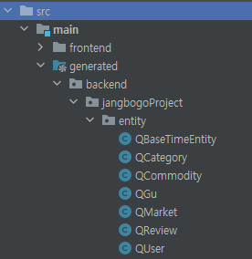
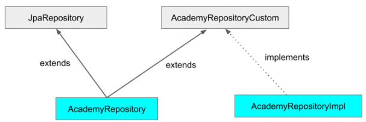
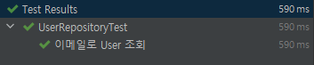

---
title: "[Spring Boot] Querydsl에 대해 (2) - Querydsl 적용 및 테스트"
excerpt: "Spring Boot 프로젝트에 Querydsl를 적용 및 테스트 해보자"

categories:
  - Spring
tags:
  - [Spring Boot, Querydsl]

published: true

permalink: /spring/querydsl-apply-and-test/

toc: true
toc_sticky: true

date: 2023-04-08
last_modified_at: 2023-04-08

--- 

## **build.gradle에 Querydsl 세팅하기**
<hr />

build.gradle에 QuertDSL 관련 코드를 세팅해줘야 한다.<br>

추가해야할 전체 코드는 다음과 같다.<br>

``` gradle
dependencies {
	... 
	implementation 'com.querydsl:querydsl-jpa'
	implementation 'com.querydsl:querydsl-apt'

	annotationProcessor "com.querydsl:querydsl-apt:${dependencyManagement.importedProperties['querydsl.version']}:jpa"
	annotationProcessor 'jakarta.persistence:jakarta.persistence-api'
	annotationProcessor 'jakarta.annotation:jakarta.annotation-api'
}

def querydslSrcDir = 'src/main/generated'
sourceSets {
  main {
    java {
      srcDirs += [ querydslSrcDir ]
    }
  }
}

compileJava {
    options.compilerArgs << '-Aquerydsl.generatedAnnotationClass=javax.annotation.Generated'
}

tasks.withType(JavaCompile) {
	options.generatedSourceOutputDirectory = file(querydslSrcDir)
}

clean {
  delete file(querydslSrcDir)
}
```

코드들이 각각 무슨 역할을 하는지 자세하게 알아보자.

<br>

### **dependencies**

``` gradle
implementation 'com.querydsl:querydsl-jpa'
implementation 'com.querydsl:querydsl-apt'

annotationProcessor "com.querydsl:querydsl-apt:${dependencyManagement.importedProperties['querydsl.version']}:jpa"
annotationProcessor 'jakarta.persistence:jakarta.persistence-api'
annotationProcessor 'jakarta.annotation:jakarta.annotation-api'
```

`implementation 'com.querydsl:querydsl-jpa'`<br>
* Querydsl을 사용하기 위한 라이브러리
* QuerydslRepositorySupport, QuerydslPredicateExecutor 등 Querydsl 내부 클래스는 사용 가능하지만, 실제로 쿼리를 위해 사용되는 QClass는 생성되지 않는다.

<br>

`implementation 'com.querydsl:querydsl-apt'`<br>
* QClass를 생성하기 위한 라이브러리

<br>

`annotationProcessor "com.querydsl:querydsl-apt:${dependencyManagement.importedProperties['querydsl.version']}:jpa"`<br>
* Querydsl JPA의 경우에는 Q 클래스를 활용해서 동작하는데 `@Entity` 어노테이션을 선언한 클래스를 탐색하고, Q 클래스를 생성한다.

<br>

`annotationProcessor 'jakarta.persistence:jakarta.persistence-api'`<br>
`annotationProcessor 'jakarta.annotation:jakarta.annotation-api'`

* 이클립스 재단으로 자바가 이관되면서 java -> jakarta로 이름이 변경되었다.
* Q 파일을 찾지 못해서 발생하는 오류인 **java.lang.NoClassDefFoundError (javax.annotation.Entity / javax.annotation.Generated)** 에러 발생 대응을 위한 코드이다.


<br><br>

### **sourceSets**

``` gradle
def querydslSrcDir = 'src/main/generated'
sourceSets {
  main {
    java {
      srcDirs += [ querydslSrcDir ]
    }
  }
}
```

gradle build 시 QClass도 함께 빌드 하기 위해서 sourceSets에 해당 위치를 추가해 준다.

<br><br>

### **compileJava**

``` gradle
compileJava {
    options.compilerArgs << '-Aquerydsl.generatedAnnotationClass=javax.annotation.Generated'
}
```

해당 내용을 명시해주지 않으면 Q 파일 내 Generated를 import 할 때 자바 9에만 있는 **import javax.annotation.processing.Generated**로 import 해준다.<br>

그렇기 때문에 다른 버전에서도 사용할 수 있도록 **java.annotation.Generated**로 import 하도록 설정하는 코드다. 

<br><br>

### **tasks.withType**

``` gradle
tasks.withType(JavaCompile) {
	options.generatedSourceOutputDirectory = file(querydslSrcDir)
}
```

**annotationProcessorGeneratedSourcesDirectory**를 사용할 수도 있는데,
Gradle 공식 문서에 해당 기능은 deprecated 되었고, 추후 major version에선 삭제할 것이라고 소개하고 있기 때문에 **generatedSourceOutputDirectory**를 사용한다.<br>

generatedSourceOutputDirectory는 annotation processors에서 생성한 소스 파일을 저장할 디렉토리를 지정 해준다.<br>

이 코드를 통해 위에서 선언한 querydslSrcDir 변수의 src/main/generated에다가 annotation processors가 만든 QClass들을 저장해준다.

<br><br>

### **clean**

``` gradle
clean {
	// clean 실행 시 생성된 QClass 삭제
	delete file(querydslSrcDir)
}
```

build clean 시에 생성되었던 QClass 를 모두 삭제 (querydslSrcDir = src/main/generated)

<br><br>

### **실행하기**

만들어진 QClass 삭제하기 : `Gradle > build > clean`<br>

QClass 만들기 : `Gradle > build > compileJava`<br>

`src > main > generated` 내에 QClass가 만들어졌으면 Querydsl 설정이 정상적으로 된 것이다.



<br><br>

## **Querydsl 사용하기**
<hr />

### **QuerydslConfig**

``` java
@Configuration
public class QuerydslConfig {
    @PersistenceContext
    private EntityManager entityManager;

    @Bean
    public JPAQueryFactory jpaQueryFactory(){
        return new JPAQueryFactory(entityManager);
    }
}
```

`@PersistenceContext`<br>
* EntityManager를 빈으로 주입할 때 사용하는 어노테이션
* 빈으로 주입 받을 때 EntityManager의 경우 `@Autowired`가 아니라 해당 어노테이션으로 주입 받는다.

JPAQueryFactory를 빈으로 등록해서 프로젝트 전역에서 사용할 수 있도록 한다.

<br><br>

### **JPAQueryFactory 사용하기**

Spring에서 Querydsl 사용하는 방법에는 총 3가지 방법이 있다.<br>
* Spring Data Jpa Custom Repository
* QueryRepositorySupport
* JPAQueryFactory

나는 **Spring Data Jpa Custom Repository** 방법으로 구현했다.
<br>

다른 두 가지 방법은 Spring JPA 기능과 Querydsl 사용하기 위해서 각각 파일을 만들어서 사용하기 때문이다.<br>

Spring에서 Querydsl과 JpaRepository를 함께 사용하려면 각 역할 별 파일을 두 개 만들어주거나, 하나의 파일이 두 개의 의존성을 가져야 한다.<br>

해당 방식을 통해서 CustomRepository를 JpaRepository 상속 클래스에서 함께 상속 받아 사용할 수 있다.<br>

구현된 Repository 구조는 아래와 같다.<br>

<br>

Repository(interface)가 JpaRepository(interface), CustomRepository(interface)를 다중 상속 받고,<br>
CustomRepository 인터페이스에 선언되어 있는 메서드에 대한 구현은 RepositoryImpl에서 한다.<br>

그리고 사용자는 Repository 인터페이스를 DI 받아서 사용한다.<br>


**근데, RepositoryImpl은 Repository를 직접적으로 구현하지 않는데 어떻게 Repository에서 사용 가능할까?**<br>
사용자 정의 구현 클래스인 경우 JPA가 파일 명이 `Repository interface 이름 + Impl`인 클래스를 찾아서 interface에 JpaRepository를 Injection할 때 Impl 객체를 삽입해주기 때문이다.<br>
그렇기 때문에 <span style="color:red">**반드시 구현체 클래스 명이 interfac + impl**</span> 이여야 한다.

<br>

**UserRepositoryCustom Class**<br>
``` java
public interface UserRepositoryCustom {
    User findByEmail(String email);

    Long deleteByEmail(String email);
}
```

<br>

**UserRepositoryImpl Class**<br>
``` java
@RequiredArgsConstructor
@Repository
public class UserRepositoryImpl implements UserRepositoryCustom{

    private final JPAQueryFactory queryFactory;

    @Override
    public User findByEmail(String email){
        return queryFactory.selectFrom(user)
                .where(user.email.eq(email))
                .fetchOne();
    }

    @Override
    public Long deleteByEmail(String email) {
        return queryFactory.delete(user)
                .where(user.email.eq(email))
                .execute();
    }
}
```

<br>

**UserRepository Interface**<br>
``` java
public interface UserRepository extends JpaRepository<User, Long>, UserRepositoryCustom {
}
```

<br><br>

## **테스트**
<hr />

``` java
@DataJpaTest
@AutoConfigureTestDatabase(replace = AutoConfigureTestDatabase.Replace.NONE)
public class UserRepositoryTest {

    @Autowired
    private EntityManager em;

    @Autowired
    private UserRepository userRepository;

    private User user;

    @BeforeEach
    private void init(){
        user = getUser();
        em.persist(user);
    }

    @Test
    @DisplayName("이메일로 User 조회")
    public void findByEmail(){

        // when
        User user1 = userRepository.findByEmail(user.getEmail());

        // then
        assertThat(user1.getEmail()).isEqualTo(user.getEmail());
    }
}
```
<br>

이대로 테스트를 진행하면 아래 에러가 발생한다.<br>

``` 
Parameter 0 of constructor in backend.jangbogoProject.repository.UserRepositoryImpl required a bean of type 'com.querydsl.jpa.impl.JPAQueryFactory' that could not be found.
```

이유는 UserRepositoryImpl 클래스에서 사용하는 **JPAQueryFactory가 persistenceLayer가 아니어서 빈등록이 되지 않아 발생하는 문제**인데, 이때 테스트 시 특정 부분의 빈만 등록해주는 방법이 있다.

<br>

### **@TestConfiguration**

``` java
@TestConfiguration
public class TestConfig {

    @PersistenceContext
    private EntityManager entityManager;

    @Bean
    public JPAQueryFactory jpaQueryFactory() {
        return new JPAQueryFactory(entityManager);
    }
}
```

테스트에서만 사용할 용도의 `@TestConfiguration` 어노테이션을 이용해 JPAQueryFactory를 Bean으로 등록한다.

<br>

``` java
@DataJpaTest
@AutoConfigureTestDatabase(replace = AutoConfigureTestDatabase.Replace.NONE)
@Import(TestConfig.class)
public class UserRepositoryTest {

    @Autowired
    private EntityManager em;
    @Autowired
    private JPAQueryFactory queryFactory;
    
    ...
}
```

이후 `@Import` 어노테이션을 사용해 해당 테스트용 빈을 주입해주면, JPAQueryFactory에 대한 빈도 생성되므로 정상적으로 테스트가 가능하다.<br>

<br>

<hr />
참고자료<br>
<a href="https://velog.io/@soyeon207/QueryDSL-Spring-Boot-%EC%97%90%EC%84%9C-QueryDSL-JPA-%EC%82%AC%EC%9A%A9%ED%95%98%EA%B8%B0">https://velog.io/@soyeon207/QueryDSL-Spring-Boot</a><br>
<a href="https://jyami.tistory.com/124">https://jyami.tistory.com/124</a><br>