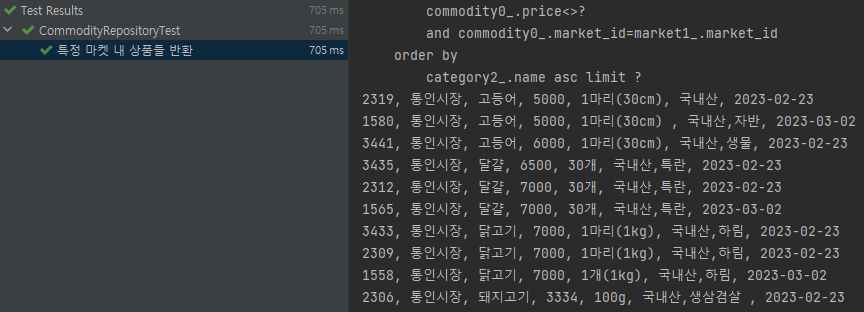
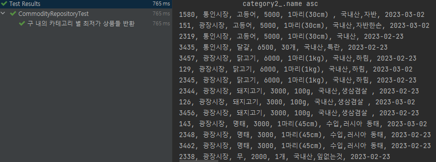

---
title: "[Spring Boot] Querydsl에 대해 (3) - Querydsl로 Repository 기능 구현 및 테스트"
excerpt: "Querydsl로 Repository 기능 구현 및 테스트 해보자"

categories:
  - Spring
tags:
  - [Spring Boot, Querydsl]

published: true

permalink: /spring/querydsl-implement-and-test/

toc: true
toc_sticky: true

date: 2023-04-11
last_modified_at: 2023-04-11

--- 

저번 포스팅에서는 Spring Boot에서 Querydsl을 적용하는 방법과 간단한 기능을 테스트해 보았다.<br>

이번에는 프로젝트에 구현되어 있는 JPQL로 작성한 Query들을 Querydsl 방식으로 재구현하고 테스트해보자.

<br><br>

## **Querydsl로 재구현할 기능**
<hr />

현재 진행하고 있는 JangbogoProject는 **서울 열린 데이터 광장**에서 제공하는 **서울시 생필품 농수축산물 가격 정보** 공공데이터를 사용해 서울시 각각의 구에 존재하는 <span style="color:red">**시장 및 대형 마트의 농수축산물 가격 정보를 제공하는 서비스**</span>다.
<br>

이번 포스팅에서는 2가지의 기능만 Querydsl로 재구현해 볼 것이다.

<br>

### **findByMarket**

첫 번째로 특정 시장 이나 대형 마트에서 판매하고 있는 상품들을 반환하는 기능인 `findByMarket()` 메서드를 구현해보자.

<br>

**로직**<br>
1. 파라미터로 넘어온 시장/대형 마트의 PK 값으로 market 테이블에서 해당 매장의 정보를 가져온다.
2. 상품(commodity)의 market_id와 파라미터 값이 같다면 상품의 정보와 해당 매장의 이름도 같이 반환한다. 

<br>

**기존 JPQL로 구현한 쿼리**

``` java
@Query(value = "SELECT c1.commodity_id, m.name AS marketName, c1.category_id, c2.name AS categoryName, " +
            "c1.unit, c1.price, c1.remarks, c1.p_date " +
            "FROM commodity c1 " +
            "INNER JOIN market m ON m.market_id = ?1 " +
            "INNER JOIN category c2 ON c1.category_id = c2.category_id " +
            "WHERE c1.price > 0  AND c1.market_id = m.market_id " +
            "ORDER BY categoryName " +
            "LIMIT ?2, ?3", nativeQuery = true)
List<CommodityInfoProjection> findByMarket(int market_id, int startIndex, int recordSize);
```

<br>

**Querydsl로 구현한 쿼리**

``` java
@Override
public List<CommodityResponseDto.Info> findByMarket(int market_id, int startIndex, int recordSize) {
    return queryFactory
            .select(Projections.constructor(CommodityResponseDto.Info.class,
                commodity.id,
                market.name.as("marketName"),
                commodity.category_id,
                category.name.as("categoryName"),
                commodity.A_UNIT,
                commodity.A_PRICE,
                commodity.ADD_COL,
                commodity.P_DATE
            ))
            .from(commodity)
            .join(market)
                .on(market.id.eq(market_id))
            .join(category)
                .on(category.id.eq(commodity.category_id))
            .where(commodity.A_PRICE.ne("0")
                .and(commodity.M_SEQ.eq(market.id)))
            .orderBy(category.name.asc())
            .offset(startIndex)
            .limit(recordSize)
            .fetch();
}
```

<br>

**테스트**<br>

``` java
@Test
@DisplayName("특정 마켓 내 상품들 반환")
public void findByMarket(){
    // given
    int market_id = 1;
    int startIndex = 0;
    int recordSize = 10;

    // when
    List<CommodityResponseDto.Info> commodityList = commodityRepository.findByMarket(market_id, startIndex, recordSize);

    // then
    for (int i = 0; i < commodityList.size(); i++) {
        CommodityResponseDto.Info info = commodityList.get(i);
        System.out.println(info.toString());
    }
}
```

<br>

<br><br>

### **getLowestPriceCommodities**

해당 메서드는 Jangbogo 서비스의 핵심 기능으로 설정한 구 내의 상품들에 대해 카테고리 별로 최저가 상품들을 반환해준다.

<br>

**로직**<br>
1. 설정한 구 내의 시장/대형 마트 정보를 가져온다.
2. 가져온 매장들의 상품들에서 카테고리 별로 최저값 가격을 가져온다.
3. commodity의 market_id가 위에서 가져온 매장들 중에 하나라면 commodity의 가격과 카테고리 별 최저값과 비교한 뒤 일치하면 해당 commodity를 가져온다.

<br>

**기존 JPQL로 구현한 쿼리**

``` java
@Query(value =
          "SELECT c1.commodity_id, c1.market_name AS marketName, c1.category_id, cate.name AS categoryName, c1.price, c1.unit, c1.remarks, c1.p_date\n" +
          "FROM (\n" +
          "\tSELECT c.commodity_id, m.name AS market_name, c.category_id, c.price, c.unit, c.remarks, c.p_date\n" +
          "    FROM commodity c\n" +
          "    INNER JOIN market m ON m.gu_id = ?1\n" +
          "    WHERE c.market_id = m.market_id\n" +
          ") c1\n" +
          "INNER JOIN category cate ON cate.category_id = c1.category_id\n" +
          "INNER JOIN(\n" +
          "\tSELECT c2.commodity_id, c2.market_id, c2.category_id, MIN(price) AS price, c2.unit, c2.remarks, c2.p_date\n" +
          "    FROM commodity c2\n" +
          "\tINNER JOIN market m ON m.gu_id = ?1\n" +
          "\tWHERE c2.market_id = m.market_id AND c2.price > 0\n" +
          "    GROUP BY c2.category_id\n" +
          ") c3 ON c1.price = c3.price AND c1.category_id = c3.category_id " +
          "", nativeQuery = true)
  List<CommodityInfoProjection> getLowestPriceCommodities(int gu_id);
```

저 쿼리는 내가 작성했지만 너무 지저분한 쿼리라고 생각이 든다.<br>
나중에 DB를 더욱 공부한다면 더 좋은 방법으로 깔끔하게 구현하고 싶지만 일단은 빠르게 구현하기 위해 조금만 변형시켜 Querydsl로 구현했다.

<br>


**Querydsl로 구현한 쿼리**

``` java
@Override
public List<CommodityResponseDto.Info> getLowestPriceCommodities(int gu_id) {

    List<Integer> marketIds = queryFactory
            .select(market.id)
            .from(market)
            .where(market.gu_id.eq(gu_id))
            .fetch();

    System.out.println(marketIds.size());

    List<Tuple> commodityIds = queryFactory
            .select(commodity.category_id, commodity.A_PRICE.min())
            .from(commodity)
            .where(commodity.M_SEQ.in(marketIds)
                    .and(commodity.A_PRICE.ne("0")))
            .groupBy(commodity.category_id)
            .fetch();

    BooleanBuilder builder = new BooleanBuilder();
    for (int i = 0; i < commodityIds.size(); i++) {
        builder.or(commodity.category_id.eq(commodityIds.get(i).get(commodity.category_id)).and(commodity.A_PRICE.eq(commodityIds.get(i).get(1, String.class))));
    }

    return queryFactory
            .select(Projections.constructor(CommodityResponseDto.Info.class,
                    commodity.id,
                    market.name.as("marketName"),
                    commodity.category_id,
                    category.name.as("categoryName"),
                    commodity.A_UNIT,
                    commodity.A_PRICE,
                    commodity.ADD_COL,
                    commodity.P_DATE
            ))
            .from(commodity)
            .join(market)
                    .on(market.id.in(marketIds))
            .join(category)
                    .on(category.id.eq(commodity.category_id))
            .where(market.id.eq(commodity.M_SEQ)
                    .and(builder))
            .orderBy(category.name.asc())
            .fetch();
}
```

Querydsl에서는 from과 join에 서브 쿼리 사용이 불가능하다.<br>

따라서 기존 쿼리를 분해하여, 총 3번의 쿼리를 호출하는 방식으로 구현했다.<br>
쿼리의 결과를 다음 쿼리의 파라미터로 넣어주어 원하는 결과를 얻을 수 있었다.
<br>
<br>

<br>

이번에 Querydsl을 사용하여 구현해보면서 나에게는 JPQL 보다는 Querydsl를 사용했을 때의 장점들이 마음에 들었다.<br>
앞으로 복잡한 쿼리가 아니라면 Querydsl을 사용할 것 같다.<br>

