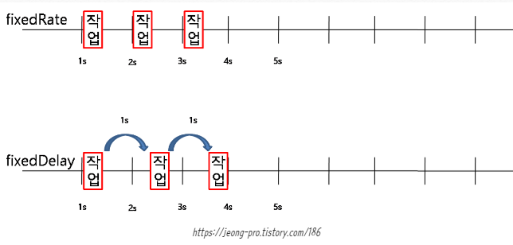

---
title: "[Spring Boot] @Scheduled를 사용한 Spring Scheduler"
excerpt: "@Scheduled를 사용하여 Spring Scheduler에 대해 알아보자."

categories:
  - Spring
tags:
  - [Spring Boot]

published: true

permalink: /spring/scheduled-and-spring-scheduler/

toc: true
toc_sticky: true

date: 2023-04-21
last_modified_at: 2023-04-21

--- 

## **Spring Scheduler**
<hr />

**일정한 시간 간격 또는 일정한 시각에 특정 로직을 실행**하기 위해서 사용하는 것을 Scheduler라고 한다.<br>

Scheduler는 Spring에서 Spring Scheduler와 Spring Quartz라는 2가지 방식으로 제공되는데 사용하기 쉬운 Spring Scheduler를 적용해서 공공데이터를 받아 DB에 파싱하는 로직을 일정 주기로 실행 시켜 데이터를 최신화 시켰다.
<br>

Spring Scheduler는 Spring Boot Starter에 기존적인 의존성으로 제공되기 때문에 별도의 추가적인 의존성이 필요하지 않다.<br>
사용하기 위해서는 다음과 같이 Application Class에 `@EnableScheduling` 어노테이션을 붙여주면 된다.
<br>

``` java
@SpringBootApplication
@EnableScheduling
public class JangbogoProjectApplication {

	public static void main(String[] args) {
		SpringApplication.run(JangbogoProjectApplication.class, args);
	}
}
```

<br>

### **@Scheduled 적용 필수 조건**

* `@Component(@Service 등)` 즉, 스프링 빈에 등록된 클래스여야 한다.
* cron 표현식, fixedDelay, fixedRate와 같은 실행 주기를 설정하는 옵션을 필수로 한 가지는 적용해야 하낟.
* `@Scheduled`를 통해 수행되는 메서드는 void return type을 가져야 하고, 파라미터를 가질 수 없다.
``` java
@Service
@RequiredArgsConstructor
public class CommodityService {

    // 매달 수요일 오전 6시에 실행
    @Scheduled(cron = "0 0 6 ? * 3")
    @Transactional
    public void getCommodityData(){
      ...
    }
}
```

<br>

### **@Scheduled 속성**
**fixedDelay** : milliseconds 단위로, **이전 Task의 종료 시점**으로부터 설정한 시간만큼 지난 후 Task를 실행한다.<br>

``` java
@Scheduled(fixedDelay = 1000)
public void run() { ... }
```
<br>

**fixedDelayString** : fixedDelay와 동일한데 문자열로 값을 표현하겠다는 의미다.<br>

``` java
@Scheduled(fixedDelayString = "1000")
public void run() { ... }
```
<br>

**fixedRate** : milliseconds 단위로, **이전 Task의 시작 시점**으로부터 설정한 시간만큼 지난 후 Task를 실행한다.<br>

``` java
@Scheduled(fixedRate = "1000")
public void run() { ... }
```
<br>

**fixedRateString** : fixedRate와 동일한데 문자열로 값을 표현하겠다는 의미다.<br>

``` java
@Scheduled(fixedRateString = "1000")
public void run() { ... }
```

<br>

<br>

**fixedRate**는 작업 수행시간과 상관없이 일정 주기마다 메소드를 호출하는 것이고,<br>
**fixedDelay**는  작업을 마친 후부터 주기 타이머가 돌아 메소드를 호출하는 것이다.

<br>

**initialDelay** : 스케줄러에서 메소드가 등록되자마자 수행하는 것이 아닌 **초기 지연시간을 설정**하는 것이다.<br>

``` java
@Scheduled(fixedRate = 5000, initialDelay = 3000)
public void run() { ... }
```
위와 같이 사용하면 3초의 대기시간(initialDelay) 후에 5초(fixedRate)마다 실행한다.

<br>

**initialDelay** : 스케줄러에서 메소드가 등록되자마자 수행하는 것이 아닌 **초기 지연시간을 설정**하는 것이다.<br>

``` java
@Scheduled(fixedRate = 5000, initialDelay = 3000)
public void run() { ... }
```

**initialDelayString** : 위와 마찬가지로 문자열로 값을 표현하겠다는 의미이다.<br>

``` java
@Scheduled(fixedRate = 5000, initialDelayString = "3000")
public void run() { ... }
```

**cron** : cron 표현식을 사용하여 작업을 예약한다.<br>

``` java
@Scheduled(cron = "* * * * * *")
public void run() { ... }
```

첫 번쨰 *부터<br>
초(0-59)<br>
분(0-59)<br>
시간(0-23)<br>
일(1-31)<br>
월(1-12)<br>
요일(0-6) (0: 일, 1: 월, 2:화, 3:수, 4:목, 5:금, 6:토)<br>

**cron 표현식**<br>
* `*` : 모든 조건(매시, 매일, 매주처럼 사용)을 의미

* `?` : 설정값 없음(날짜와 요일에만 사용 가능)

* `-` : 범위를 지정할 때

* `,` : 여러 값을 지정할 때

* `/` : 증분값, 즉 초기값과 증가치 설정에 사용 (예 - 0/2 : 0분 부터 매 2분)

* `L`: 마지막 - 지정할 수 있는 범위의 마지막 값 설정 시 사용(날짜와 요일에만 사용 가능)

* `W` : 가장 가까운 평일을 설정할 때 (예 - 10W : 10일과 가장 가까운 평일)

* `#` : 몇째주의 무슨 요일을 표현 (예 - 3#2 : 2번째주 수요일)

<hr />
참고자료<br>
<a href="https://dev-coco.tistory.com/176">https://dev-coco.tistory.com/176</a><br>
<a href="https://sabarada.tistory.com/113">https://sabarada.tistory.com/113</a><br>