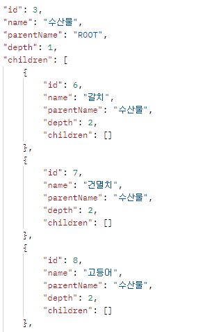
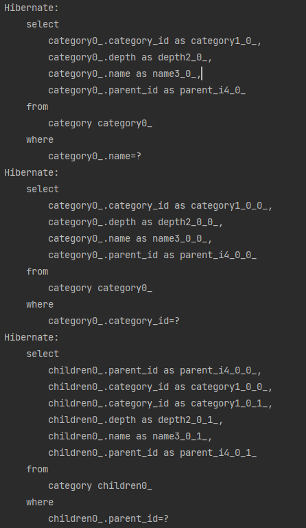
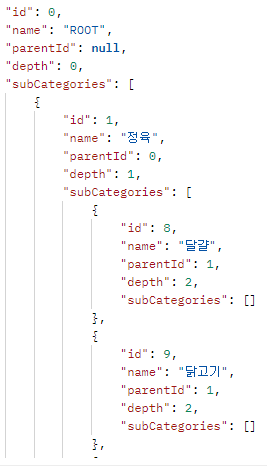
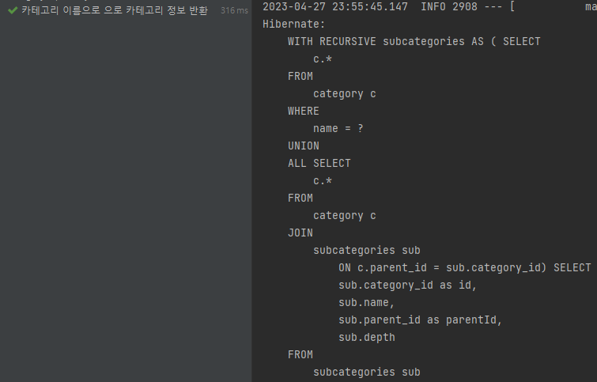
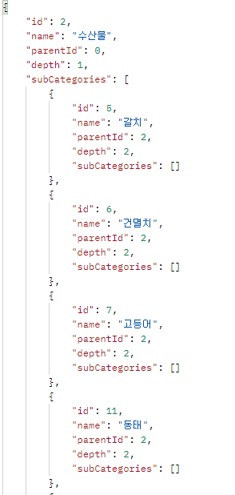

---
title: "[Spring Boot] 무한 카테고리 N + 1 문제 해결"
excerpt: "무한 카테고리 N + 1 문제를 해결해보자."

categories:
  - Spring
tags:
  - [Spring Boot]

published: true

permalink: /spring/infinite-depth-n+1/

toc: true
toc_sticky: true

date: 2023-04-27
last_modified_at: 2023-04-27

--- 

## **카테고리 테이블 구조**
<hr />

카테고리 테이블은 자기 자신과 상위 카테고리, 하위 카테고리들을 참조하는 형태의 계층 구조를 가지고 있다.
<br>



<br>


### **Category 클래스**
``` java
public class Category {
@Id
@GeneratedValue(strategy = GenerationType.IDENTITY)
@Column(name = "category_id")
private Long id;

@Column(name = "name")
private String name;

@ManyToOne(fetch = FetchType.LAZY)
@JoinColumn(name = "parent_id")
private Category parent;

@Column(name = "depth")
private int depth;

@OneToMany(mappedBy = "parent")
private List<Category> children = new ArrayList<>();
}
```

`Category`는 자기 자신을 `Self Join`을 하고 있다.

<br>

### **N + 1 문제**

``` java
@Override
public Category findByName(String name) {
    return queryFactory
            .select(category)
            .from(category)
            .where(toEq(category.name, name))
            .fetchOne();
}
```
위의 로직은 `N + 1` 문제가 발생하는 로직이다.<br>

현재 카테고리의 depth가 2까지 밖에 없지만 만약 100개라면 100번 이상의 쿼리가 실행 되는 안좋은 상황이 발생한다.<br>


<br><br>

## **해결 방법**
<hr />

기존 방법은 양방향 연관 관계로 구현했다.<br>
해결 방법으로 객체를 참조하는 것이 아니라  `parentId`를 통하여 부모 카테고리의 `subCategoies`에 추가하는 방식으로 구현했다.<br>

``` java
public class Category {
    @Id
    @GeneratedValue(strategy = GenerationType.IDENTITY)
    @Column(name = "category_id")
    private Long id;

    private String name;

    @Column(name = "parent_id")
    private Long parentId;

    private int depth;
}

public class CategoryResponseDto {
    private Long id;
    private String name;
    private Long parentId;
    private int depth;
    private List<CategoryResponseDto> subCategories = new ArrayList<>();

    @Builder
    public CategoryResponseDto(Long id, String name, Long parentId, int depth) {
        this.id = id;
        this.name = name;
        this.parentId = parentId;
        this.depth = depth;
    }
}
```

<br>

### **목표 반환 형태로 가공**

`createCategoryRoot()`<br>

``` java
public CategoryResponseDto createCategoryRoot(){
        Map<Long, List<CategoryResponseDto>> groupingByParent = categoryRepository.findAll().stream()
                .map(c -> new CategoryResponseDto(c.getId(), c.getName(), c.getParentId(), c.getDepth()))
                .collect(Collectors.groupingBy(p -> p.getParentId()));

        CategoryResponseDto rootCategoryDto = new CategoryResponseDto(0l, "ROOT", null, 0);
        addSubCategories(rootCategoryDto, groupingByParent);

        return rootCategoryDto;
}
```

<br>

`addSubCategories()`<br>


``` java
 private void addSubCategories(CategoryResponseDto parent, Map<Long, List<CategoryResponseDto>> groupingByParentId){
        // parentId로 subCategories를 찾는다.
        List<CategoryResponseDto> subCategories = groupingByParentId.get(parent.getId());

        if(subCategories == null)
            return;

        // subCategories 세팅
        parent.setSubCategories(subCategories);

        // 재귀적으로 subCategories들에 대해서도 로직 수행
        subCategories.stream()
                .forEach(s ->{
                    addSubCategories(s, groupingByParentId);
                });

        // category의 하위 카테고리를 set하고, 다시 그 하위 카테고리에 차하위 카테고리를 set하는 식으로 동작
}
```

<br>

`createCategoryRoot()` 메서드를 통해 subCategories가 만들어지는 과정을 알아보자.<br>

1. Root는 최상위 카테고리이기 때문에 모든 카테고리들을 `findAll()` 메서드를 통해 가져온다.
2. 조회환 결과를 CategoryResponseDto로 변환한다.
3. `groupingBy(p -> p.getParentId())`를 통해 parentId를 기준으로 grouping한다.
4. Root는 자힌의 하위 카테고리들을 List로 가지며, Root의 하위 카테고리들은 그 하위의 카테고리들을 리스트로 가지는 형태로 만들어야 한다.
   1. parentId로 subCategories를 찾는다.
   2. parentCategory의 subCategories를 세팅한다.
   3. 재귀적으로 subCategories들에 대해서도 메서드를 수행한다.

결과적으로 카테고리의 하위 카테고리를 set하고, 다시 그 하위 카테고리의 하위 카테고리를 set 하는 방식으로 동작한다.

<br>

**결과**<br>


<br>

### **특정 카테고리 반환**


RootCategory는 최상위 카테고리이기 때문에 `findAll()` 메서드를 통해 모든 카테고리의 정보를 가져와서 가공하면 된다.<br>

하지만 특정 카테고리를 반환할 때는 특정 카테고리를 부모 카테고리로 설정하고 **해당 카테고리를 부모 카테고리로 갖는 하위 카테고리들만 반환**되어야 한다.<br>

``` java
public List<CategoryResponseDto> findSubCategoriesByName(String name) {

    String sql = "WITH RECURSIVE subcategories AS (" +
            " SELECT c.*" +
            " FROM category c" +
            " WHERE name = :name" +
            " UNION ALL" +
            " SELECT c.*" +
            " FROM category c" +
            " JOIN subcategories sub" +
            " ON c.parent_id = sub.category_id" +
            ")" +
            " SELECT sub.category_id as id, sub.name, sub.parent_id as parentId, sub.depth" +
            " FROM subcategories sub";

    Query q = em.createNativeQuery(sql).setParameter("name", name);
    List<Object[]> resultList = q.getResultList();
    List<CategoryResponseDto> subCategories = resultList.stream()
            .map(child -> new CategoryResponseDto(
                    ((Integer) child[0]).longValue(),
                    (String) child[1],
                    ((Integer) child[2]).longValue(),
                    (Integer) child[3]
            )).collect(Collectors.toList());

    return subCategories;
```

`Recursive Query`를 통해 특정 카테고리를 부모로 가지는 하위 카테고리들을 찾아 반환 후 CategoryResponseDto로 변환한다. 

<br>

``` java
public CategoryResponseDto findSubCategoriesByName(String name){

    List<CategoryResponseDto> categories = categoryRepository.findSubCategoriesByName(name);
    // 상위 카테고리를 List에서 꺼내온 후 제거
    CategoryResponseDto parentCategory = categories.get(0);
    categories.remove(0);

    Map<Long, List<CategoryResponseDto>> groupingByParent = categories.stream()
            .collect(Collectors.groupingBy(p -> p.getParentId()));

    addSubCategories(parentCategory, groupingByParent);
    return parentCategory;
}
```

반환된 카테고리들에서 찾는 카테고리를 리스트에서 꺼내 parentCategory로 할당한 후 `addSubCategories`를 통해 하위 카테고리들을 설정해준다.

<br>

**결과**<br>


<br>


<br>

이러면 N + 1 문제도 해결되었고 속도도 빨라진 것을 확인할 수 있다.<br>

<hr />
참고자료<br>
<a href="https://galid1.tistory.com/774">https://galid1.tistory.com/774/</a><br>