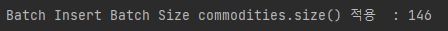
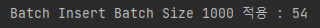

---
title: "[Spring Boot] Batch Insert로 최적화해보기"
excerpt: "Batch Insert로 최적화해보자."

categories:
  - Spring
tags:
  - [Spring Boot, Spring Batch]

published: true

permalink: /spring/batch-insert-optimization/

toc: true
toc_sticky: true

date: 2023-04-30
last_modified_at: 2023-04-30

--- 

공공데이터를 활용하는 프로젝트를 배포한 후 일주일에 한 번 공공데이터를 최신화하는 기능을 구현했다.<br>

하지만 약 5000개의 품목 정보를 등록하는데 등록할 때마다 느리다는 느낌을 받았다.<br>
그래서 데이터 삽입 속도의 최적화에 관심이 생겨 찾아보게 되었고 그 결과 Spring Batch를 이용하는 방식으로 도전하게 되었다.

<br><br>

## **잦은 save() 함수 호출의 문제점**
<hr />

처음에 공공데이터를 삽입한 방법은 데이터를 파싱하고 일일히 JPA의 `save()` 메서드를 통해 반복문으로 일일히 삽입하는 방법으로 구현했다.<br>

``` java
@Transactional
@Override
public <S extends T> S save(S entity) {

  Assert.notNull(entity, "Entity must not be null.");

  if (entityInformation.isNew(entity)) {
    em.persist(entity);
    return entity;
  } else {
    return em.merge(entity);
  }
}
```

위의 코드는 JPA `save()` 함수 소스코드인데 `@Transactional`이 선언되어있는 것을 볼 수 있다.<br>
함수가 호출될 때 트랜잭션이 시작되고, DB에 데이터가 정상적으로 삽입이 완료되면 트랜잭션이 종료 된다.<br>

5000개의 데이터를 삽입하면 5000번의 `save()`함수가 호출 되고 이는 5000번의 트랜잭션이 시작됐다가 종료된다는 뜻이다.<br>

즉, `save()` 함수를 호출할 때마다 트랜잭션이 실행되기 때문에 이에 대한 오버헤드로 삽입 속도가 굉장히 느려지게 되는 것이다.<br>

<br><br>

## **Batch Insert란?**

Batch Insert는 여러 개의 SQL Statement를 하나의 구문으로 처리할 수 있다.<br>
정확히는 Jdbc Batch 기능이며, Hibernate에서 위 기능일 이용해서 처리하는 것이다.

<br>


``` sql
INSERT INTO table (col1, col2) VALUES (val1, val11);
INSERT INTO table (col1, col2) VALUES (val2, val22);
INSERT INTO table (col1, col2) VALUES (val3, val33);
```

위 로직의 경우는 개별 Insert이다.<br>

``` sql
INSERT INTO table (col1, col2) VALUES
(val1, val11),
(val2, val22),
(val3, val33);
```

위 로직의 경우가 Batch Insert이다.
<br>

보통 쿼리를 던지고 응답을 받은 후에야 다음 쿼리를 전달하기 때문에 개별 Insert의 경우 지연이 많이 발생하지만 하나의 트랜잭션에 묶이는 Batch Insert의 경우는 하나의 쿼리문으로 수행하기 때문에 성능이 월등히 좋다.

<br><br>

## **GenerationType.IDENTITY는 Batch Insert 불가능**
<hr />

``` java
@Entity
@NoArgsConstructor
@Getter
public class Commodity {
    @Id
    @GeneratedValue(strategy = GenerationType.IDENTITY)
    @Column(name = "commodity_id")
    private Long id;
}
```

JPA + MySQL을 사용할 경우 일반적으로 IDENTITY 방법을 사용하여 auto_increment으로 PK 값을 자동 증가시켜 생성하는 방식을 사용한다.<br>

IDENTITY 방법을 사용하면 save 로직을 수행할 때 ID 값을 명시하지 않고 저장한다.<br>
IDENTITY를 사용하는 경우 쿼리가 수행된 이후에 값을 얻을 수 있기 때문에 데이터를 한꺼번에 보내는 Batch Insert를 사용할 수 없다.<br>

<br><br>

## **JdbcTemplate를 사용하여 Batch Insert 적용하기**
<hr />

JdbcTemplate에는 Batch를 지원하는 batchUpdate() 메서드를 지원한다.<br>

먼저 사전에 MySQL에서 Bulk Insert를 사용하기 위해서 DB-URL에 아래와 같이 `rewriteBatchedStatements=true` 파라미터를 추가해야 한다.<br>

``` yml
spring:
  datasource:
    username: root
    url: jdbc:mysql://localhost:3306/jangbogo?serverTimezone=UTC&characterEncoding=UTF-8&rewriteBatchedStatements=true
    password: password
```

rewriteBatchedStatements를 true로 설정하지 않으면 Insert 쿼리가 단건으로 여러 번 수행한다.

<br>

### **코드**

Jdbc Template을 사용하면 MySQL의 IDENTITY 전략을 사용하더라도 아래와 같은 코드로 Batch Insert 쿼리를 사용할 수 있다.
``` java
@Entity
@NoArgsConstructor
@Getter
public class Commodity {
    @Id
    @GeneratedValue(strategy = GenerationType.IDENTITY)
    @Column(name = "commodity_id")
    private Long id;
    @Column(nullable = false, name = "market_id")
    private Long M_SEQ;
    @Column(nullable = false, name = "category_id")
    private Long category_id;
    @Column(nullable = false, name = "unit")
    private String A_UNIT;
    @Column(nullable = false, name = "price")
    private String A_PRICE;
    @Column(name = "remarks")
    private String ADD_COL;
    @Column(nullable = false)
    private String P_DATE;

    @Builder
    public Commodity(Long m_SEQ, Long category_id, String a_UNIT, String a_PRICE, String add_COL, String p_DATE) {
        M_SEQ = m_SEQ;
        this.category_id = category_id;
        A_UNIT = a_UNIT;
        A_PRICE = a_PRICE;
        ADD_COL = add_COL;
        P_DATE = p_DATE;
    }
}
```

``` java
@Repository
@RequiredArgsConstructor
public class CommodityBulkRepository {

    private final JdbcTemplate jdbcTemplate;

    public void saveAll(List<Commodity> commodities){
        String sql = "INSERT INTO commodity (market_id, category_id, unit, price, remarks, p_date) " +
                "VALUES(?, ?, ?, ?, ?, ?)";

        jdbcTemplate.batchUpdate(sql,
                new BatchPreparedStatementSetter() {
                    @Override
                    public void setValues(PreparedStatement ps, int i) throws SQLException {
                        Commodity commodity = commodities.get(i);
                        ps.setLong(1, commodity.getM_SEQ());
                        ps.setLong(2, commodity.getCategory_id());
                        ps.setString(3, commodity.getA_PRICE());
                        ps.setString(4, commodity.getA_PRICE());
                        ps.setString(5, commodity.getADD_COL());
                        ps.setString(6, commodity.getP_DATE());
                    }

                    @Override
                    public int getBatchSize() {
                        return commodities.size();
                    }
                }
        );
    }
}
```

<br><br>

## **속도 비교**
<hr />

약 3000개의 데이터 기준으로 테스트 해보았다.<br>

**1. JPA의 saveAll() 메서드**<br>


<br>

**2. Jdbc Templete Batch Insert 적용**<br>


<br>

**3. Jdbc Templete Batch Insert, Batch Size 1000 적용**<br>


<br>

약 3000개의 데이터를 삽입하는데 위와 같은 속도 차이가 나왔다.<br>
1번과 3번의 속도 차이가 약 23배로 기존에 saveAll 메서드로 데이터를 삽입했을 때보다 데이터 속도를 크게 개선되었다.<br>

데이터 3000개에도 엄청난 속도 차이를 보여주는 데이터가 더 많아진다면 Batch Insert를 필수로 사용해야 된다고 생각한다.<br>

프로젝트를 진행하면서 성능에 대한 최적화는 처음 구현해 보았는데 매우 유익했던 시간이였다.

<hr />
참고자료<br>
<a href="https://dkswnkk.tistory.com/682">https://dkswnkk.tistory.com/682</a><br>