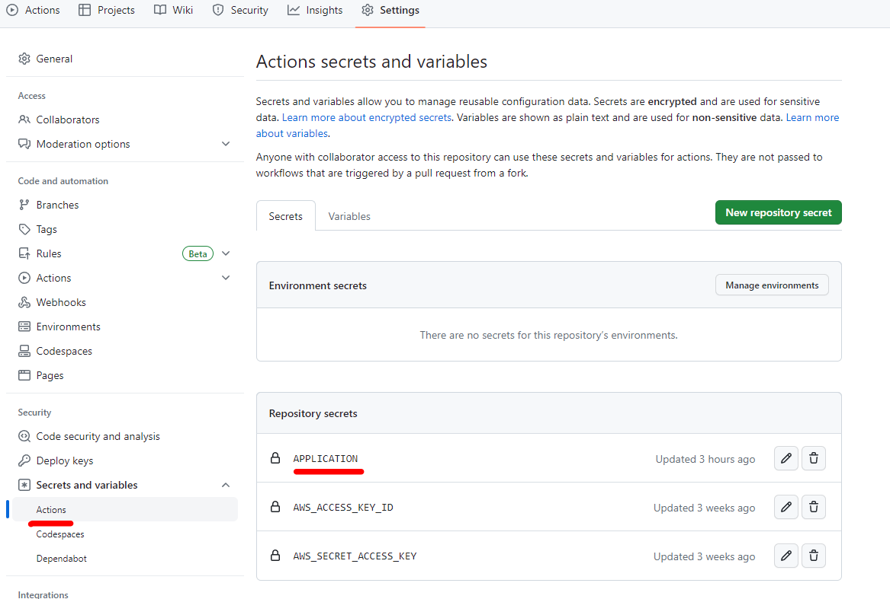
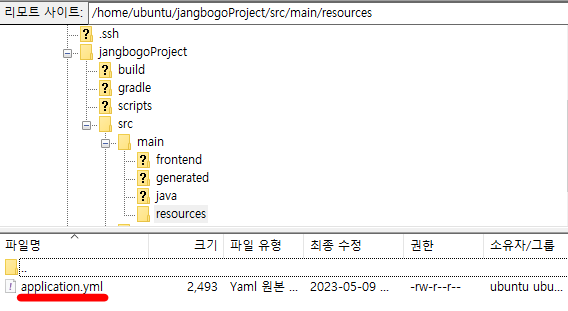

---
title: "[Spring Boot] Github Actions로 application.yml 파일을 생성해서 배포하기"
excerpt: "Github Actions로 application.yml 파일을 생성해서 배포해보자."

categories:
  - Spring
tags:
  - [Spring Boot]

published: true

permalink: /spring/create-and-deploy-application.yml-with-github-actions/

toc: true
toc_sticky: true

date: 2023-05-10
last_modified_at: 2023-05-10

--- 

기존에는 application.yml 설정 파일도 같이 Github에 Push 되어 application.yml 설정 파일에 있는 중요 정보들을 그대로 노출된 상태였다.<br>

이번에는 application.yml 파일을 Github에 노출하지 않으면서  암호화하여 노출시키지 않는 방법에 대해 알아보자.

<br><br>

## **Github Actions로 application.yml 파일을 생성하기**
<hr />

현재 JangbogoProject의 CI/CD 흐름은 아래와 같다.<br>

1. 개발자가 로컬 환경에서 Github에 push한다.
2. push한 내용은 Github Actions에 의해 빌드되고 AWS S3에 배포된다.
3. 배포된 내용은 AWS CodeDeploy를 통해 EC2 서버에 옮겨지고 빌드 파일을 통해 애플리케이션이 실행된다.

<br>

Github Actions를 통해 빌드 파일에 Yml 파일을 추가해보자.<br>

사용하는 Github Repository로 이동하여 **Settings - Secrets - Actions**로 이동한다.<br>

<br>

**New repository secret** 버튼을 클릭하여 **APPLICATION** 이름의 secret를 생성하고 application.yml 내용을 복사하여 작성했다.

<br>

다음은 workflows 파일인 deploy.yml에서 빌드 전에 application.yml 파일을 생성하고 방금 생성한 **APPLICATION** secret의 내용을 추가해주면 된다.<br>

``` yml
// 중략
jobs:
  deploy:
    name: Deploy
    runs-on: ubuntu-latest
    environment: production

    steps:
    
    # (3) application.yml 생성
    - uses: actions/checkout@v3
    - run: |
        mkdir -p ./src/main/resources 
        cd ./src/main/resources
        touch ./application.yml
        echo "${{ secrets.APPLICATION }}" > ./application.yml
        cat application.yml
// 중략
```

yml 파일을 생성하는 명령어 흐름은 아래와 같다.<br>

1. **./src/main/resources** 경로로 이동한다.
2. **touch** 명령어로 0 byte application.yml 파일을 생성한다.
3. **APPLICATION** secret의 값을 추가한다.

<br>

정상적으로 생성된다!
