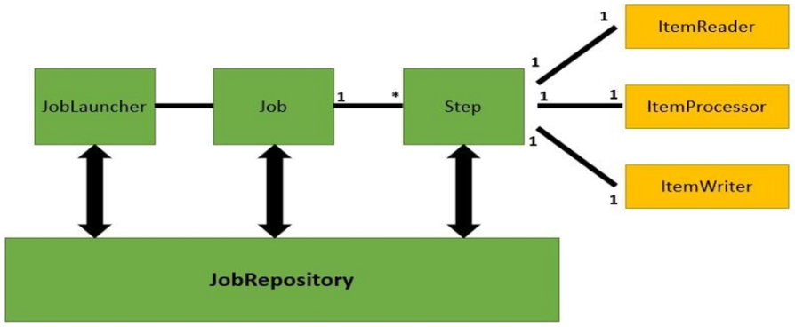
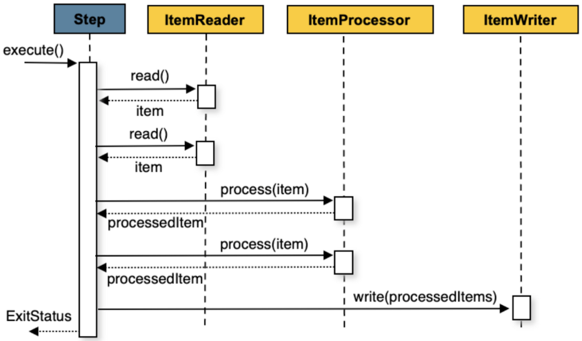

---
title: "[Spring Batch] Spring Batch란?"
excerpt: "Spring Batch에 대해 알아보자."

categories:
  - Spring
tags:
  - [Spring Batch]

published: true

permalink: /spring/spring-batch/

toc: true
toc_sticky: true

date: 2023-06-08
last_modified_at: 2023-06-10

--- 

TodoList 프로젝트 momodo를 개발할 때, Spring Batch를 이용해야 하는 기능이 존재해서 Batch에 대해 알아보게 되었다.

  

## **배치 애플리케이션**

배치 애플리케이션은 **개발자가 정의한 작업을 한 번에 일괄 처리하는 애플리케이션**이다. 

배치는 보통 아래와 같은 경우 많이 사용한다. 
* 대용량의 데이터를 복잡한 작업으로 처리해야 하는 경우
  * 매출 데이터를 이용한 일매출 집계
* 정해진 시간에 스케쥴러를 통해 자동화된 작업이 필요한 경우
  * 정해진 시간에 구독을 신청한 회원에게 일괄적으로 메일 전송

**배치 애플리케이션이 필요한 상황**
* 일정 주기로 실행해야 할 때
* 실시간 처리가 어려운 대량의 데이터를 처리해야 할 때

이런 작업을 하나의 애플리케이션에서 수행하면 성능 저하를 유발할 수 있으니 배치 애플리케이션을 구현한다. 

내가 맡은 기능 중에서, 일별 Todo 데이터를 이용한 통계 계산, push 알람 기능들이 Spring Batch를 활용해 구현해야하는 기능에 속한다.

 

### **배치 애플리케이션의 조건**
* 대용량 데이터 : 대량의 데이터를 가져오거나, 전달하거나, 계산하는 등의 처리를 할 수 있어야 한다.
* 자동화 : 심각한 문제 해결을 제외하고는 **사용자 개입 없이 실행**되어야 한다.
* 견고성 : 잘못된 데이터를 충돌/중단 없이 처리할 수 있어야 한다.
* 신뢰성 : 무엇이 잘못되었는지를 추적할 수 있어야 한다.(로깅, 알림)
* 성능 : **지정한 시간 안에 처리를 완료**하거나 동시에 실행되는 **다른 애플리케이션을 방해하지 않도록 수행**되어야 한다.

 

### **배치와 스케줄러의 차이**
Spring Batch와 Quartz의 차이, 배치와 스케줄러의 차이는 무엇일까? 

스케줄링이란 **지정한 시간에 지정한 동작을 수행**하는 것을 말한다. Batch와 같이 대용량 데이터 배치 처리에 대한 기능을 지원하지 않는다. 반대로 Batch 역시 Quartz의 다양한 스케줄 기능을 지원하지 않아서 보통은 Batch + Quartz를 조합해서 사용한다.

  

## **Spring Batch Architecture**

 

### **JobRepository**
* JobRepository는 배치 작업 중의 정보를 저장하는 역할을 한다.
* 어떠한 Job이 언제 수행되었고, 언제 끝났으며, 몇 번이 실행되었고 실행에 대한 결과가 어떤지 등의 배치 작업의 수행과 관련된 모든 meta date가 저장되어 있다.

 

### **Job**
* Job은 배치 처리 과정을 하나의 단위로 만들어 표현한 객체이고, 여러 Step 인스턴스를 포함하는 컨테이너이다.
* 하나의 Job은 여러 개의 Step으로 구성될 수 있다.

 

### **JobLauncher**
* Job.execute을 호출하여 Job을 실행하는 역할을 담당한다.
* Job의 재실행 가능 여부 검증, 잡의 실행 방법, 파라미터 유효성 검증 등을 수행한다.

 

### **JobInstance**
* JobInstance는 Job이 실행될 때 만들어지는 고유한 객체로 Job name + JobParameter의 해쉬 값을 더해서 만들어진다.
* JobInstance가 있으면 기존 JobInstance를 반환(재실행), 없으면 새로 만들어 반환한다.
* Job과 JobInstance는 1:M 관계다.

**동작 방식** 
1. JobLauncher는 Job name + Job Parameter로 Job을 실행한다.
2. Job이 실행되면 JObRepository를 통해 Job name + JobParameter에 해당되는 Job Instance를 DB에서 확인한다.
3. DB에 Job Instance가 존재하면 반환, 없으면 새로 생성하여 반환한다.

 

### **JobParameter**
* JobInstance를 생성하는데 필요한 파라미터
* 하나의 Job을 여러 개의 JobInstance로 구분하는데 사용된다.
* JobParameter와 JobInstance는 1:1 관계다.

 

### **JobExecution**
* JobInstance가 실행될 때 마다 만들어지는 객체로 JobInstance의 실행 정보를 저장하고 있다.
* JobExecution의 실행 상태가 COMPLETED면 JobInstance는 정상 종료, FAIELD면 비정상 종료로, 해당 JobInstance는 재실행 가능하다.
  
 

### **JobLocator**
* 등록된 Job을 Job의 이름으로 찾아 반환하는 인터페이스

 

### **Step**
* Step은 Job을 구성하는 하나의 단계로, 실제 배치가 실행되는 처리를 정의하고 컨트롤하는데 필요한 모든 정보를 가지고 있는 도메인 객체이다.
* Step은 Tasklet, Chunk 기반으로 2가지가 있다.

 

### **Tasklet**
* Step 중지될 때까지 execute 메서드가 계속 반복해서 수행하고, 수행할 때마다 독립적인 트랜잭션이 얻어진다. 초기화, 알림 전송과 같은 Job에서 일반적으로 사용된다.
* 임의의 Step을 실행할 때 읽기/처리/쓰기를 하나의 작업으로 처리한다.
* Job 구성 클래스 외부에 tasklet 클래스를 만들어서 참조하는 방식

 

### **Chunk**
* 한 번에 하나씩 데이터(row)를 읽어 Chunk라는 덩어리를 만든 뒤, Chunk 단위로 트랜잭션을 수행한다.
* Chunk 단위로 트랜잭션을 수행하기 때문에 실패할 경우엔 해당 Chunk 만큼만 롤백 되고, 이전에 커밋된 트랜잭션 범위까지는 반영 된다.
* Reader, Writer는 필수이며 Processor는 선택적으로 사용된다. 즉, 데이터 읽기, 가공, 저장의 순으로 처리된다.
* 일괄 데이터 변경이나 어떤 데이터 변화를 주는 작업에 사용하면 좋다.

**Chunk Processing** 
 

Spring Batch 프레임워크를 이용하기 때문에 JobLauncher와 JobRepository 구현은 하지 않아도 된다.

참고자료 
<a href="https://devbksheen.tistory.com/284">https://devbksheen.tistory.com/284</a> 
<a href="https://ojt90902.tistory.com/781">https://ojt90902.tistory.com/781</a> 