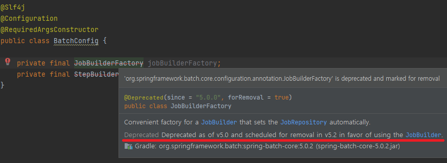
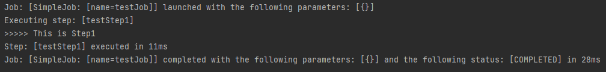
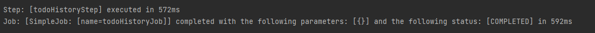

---
title: "[Spring Batch] Spring Batch 활용하여 Batch 기능 구현해보기"
excerpt: "Spring Batch 활용하여 Batch 기능을 구현해보자."

categories:
  - Spring
tags:
  - [Spring Batch]

published: true

permalink: /spring/use-spring-batch/

toc: true
toc_sticky: true

date: 2023-06-11
last_modified_at: 2023-06-11

--- 

이전 <a href="https://sbsun.github.io/spring/spring-batch/">포스팅</a>에서 Spring Batch에 대해 알아보았는데, 이번에는 직접 Spring Batch를 활용해서 Batch 기능을 구현해보자.

<br><br>

## **Spring Batch 세팅하기**
<hr />

### **1. Spring Batch Dependenciy 추가**

``` gradle
dependencies {
    ...
    implementation 'org.springframework.boot:spring-boot-starter-batch'	
    testImplementation 'org.springframework.batch:spring-batch-test'
    ...
}
```

<br>

### **Spring Boot 3.~ 버전**

Job 설정은 Spring Boot 버전에 따라 다르다.<br>

현재 진행하고 있는 프로젝트의 Spring Boot 버전은 `3.1.0`이기 때문에 `3.x` 버전 기준으로 구현해보겠다.

<a href="https://github.com/spring-projects/spring-boot/wiki/Spring-Boot-3.0-Migration-Guide#spring-batch-changes">Spring Boot 3.0 Migration Guide</a>를 살펴보면 @EnableBatchProcessing 사용 시 Spring Batch 기본 설정이 백오프된다고 설명된다.


``` java
@EnableBatchProcessing
@SpringBootApplication
public class MomodoServApplication {

	public static void main(String[] args) {
		SpringApplication.run(MomodoServApplication.class, args);
	}
}
```

`2.x` 버전에서는 아래 코드 처럼 Application에 @EnableBatchProcessing 어노테이션을 통해서 Spring Batch 기능을 활성화 시켜주어야 했지만, `3.x` 버전을 사용하므로 추가하지 않는다.
<br>

Spring Batch에서 모든 Job은 @Configuration을 등록해서 사용해야 하기 때문에 Config를 구현한다.<br>

<br>

하지만 위 사진을 보면 batch 5.0 버전 이상에서는 JobBuilderFactory와 StepBuilderFactory 빈을 더 이상 사용하지 않고 JobBuilder와 StepBuilder를 사용한다고 되어 있다.<br>

``` java
@Slf4j
@Configuration
public class BatchConfig {

    @Bean
    public Job testJob1(JobRepository jobRepository, Step testStep1) {
        return new JobBuilder("testJob", jobRepository)
                .start(testStep1)
                .build();
    }

    @Bean
    public Step testStep1(JobRepository jobRepository, Tasklet testTasklet, PlatformTransactionManager platformTransactionManager){
        return new StepBuilder("testStep1", jobRepository)
                .tasklet(testTasklet, platformTransactionManager).build();
    }

    @Bean
    public Tasklet testTasklet(){
        return ((contribution, chunkContext) -> {
            log.info(">>>>> This is Step1");
            return RepeatStatus.FINISHED;
        });
    }
}
```

JobBuilderFactory와 StepBuilderFactory 빈을 더 이상 사용하지 않고 JobBuilder와 StepBuilder를 사용하여 구현한다.<br>

<br>

실행해보니 잘 동작한다!<br>

`2.x` 버전과 `3.x` 버전의 달라진 점에 대해서 알아보았으니 본격적으로 기능을 구현해보자.

<br><br>

## **구현하기**
<hr />

Spring Batch를 사용하여 구현할 기능은 전날의 Todo 데이터들을 조회하여 수치를 계산하고, 계산한 통계 데이터를 저장하는 기능이다.<br>

날짜가 바뀌면 전날의 Todo 데이터들로 계산한 TodoHistory(통계 데이터)를 제공해야 하기 때문에, 날짜가 바뀌는 오전 12시 01분에 해당 기능을 실행하게 구현해보겠다.

<br>

### **Tasklet 구현**
Step 구현 방식은 Chunk와 Tasklet 중에 Tasklet 방식을 선택했다.<br>
Chunk 방식은 대량의 데이터를 대상으로 일괄 데이터 변경이나 데이터 변화를 주는 작업에 사용하면 좋다.<br>
하지만 내가 구현하려는 기능은 여러개의 데이터를 조회하여 계산한 하나의 통계 데이터만 저장하면 되기 때문에 Chunk가 아닌 Tasklet 방식을 사용했다.<br>

tasklet은 그냥 일반적인 Component라고 생각하면 된다. 개발자가 이 step에서 하고 싶은 내용을 자유롭게 만들 수 있다.

``` java
@FunctionalInterface
public interface Tasklet {

	@Nullable
	RepeatStatus execute(StepContribution contribution, ChunkContext chunkContext) throws Exception;
}
```

tasklet를 사용하려면 Tasklet 인터페이스를 구현하여 step의 tasklet으로 등록하면 된다.
그리고 실행할 내용을 `execute` 메서드 내에 넣으면 된다. 
<br>

그런데 나는 `execute` 전에 계산할 Todo 데이터들을 조회하고 싶었다. 이를 위해서는 `StepExecutionListener`를 함께 구현하면 된다.<br>

**전체 코드**
``` java
public class TodoHistoryTasklet implements Tasklet, StepExecutionListener {

    @Autowired
    private TodoRepository todoRepository;
    @Autowired
    private TodoHistoryService todoHistoryService;

    private List<TodoResponseDto.Info> todos;

    @Override
    public void beforeStep(StepExecution stepExecution) {
        LocalDate dueDate = LocalDate.now().minusDays(1);
        todos = todoRepository.findAllByDueDate(dueDate);
    }

    @Override
    public RepeatStatus execute(StepContribution contribution, ChunkContext chunkContext) throws Exception {
        if(todos.isEmpty()){
            return RepeatStatus.FINISHED;
        }

        Long count = (long)todos.size();
        Long completedCount = 0L;

        for(TodoResponseDto.Info t : todos){
            if(t.isCompleted())
                completedCount += 1;
        }

        TodoHistoryRequestDto.Create create = TodoHistoryRequestDto.Create.builder()
                .memberId(1L)
                .count(count)
                .completedCount(completedCount)
                .dueDate(LocalDate.now())
                .build();

        todoHistoryService.create(create);

        return RepeatStatus.FINISHED;
    }

    @Override
    public ExitStatus afterStep(StepExecution stepExecution) {
        return ExitStatus.COMPLETED;
    }
}
```

**1. 인터페이스**<br>

``` java
public class TodoHistoryTasklet implements Tasklet, StepExecutionListener {
}
```
Tasklet을 상속받아 `execute` 메서드를 구현하여 Step에 등록할 수 있고, StepExecutionListener를 상속받아 `beforeStep`과 `afterStep`을 구현해서 Step 전후에 원하는 기능을 추가할 수 있다.

<br>

**2. 필드**<br>

``` java
@Autowired
private TodoRepository todoRepository;
@Autowired
private TodoHistoryService todoHistoryService;

private List<TodoResponseDto.Info> todos;
```

기능 구현에 필요한 repository, service와 `beforeStep`에서 조회한 todo들의 정보를 가지고 있는 변수를 선언

<br>

**3. beforeStep**<br>

``` java
@Override
public void beforeStep(StepExecution stepExecution) {
    LocalDate dueDate = LocalDate.now().minusDays(1);
    todos = todoRepository.findAllByDueDate(dueDate);
}
```

날짜가 바뀐 후에 기능이 실행되기 때문에, 어제 날짜를 기준으로 Todo들의 정보를 조회한다.

<br>

**4. execute**<br>

``` java
@Override
public RepeatStatus execute(StepContribution contribution, ChunkContext chunkContext) throws Exception {
    if(todos.isEmpty()){
        return RepeatStatus.FINISHED;
    }

    Long count = (long)todos.size();
    Long completedCount = 0L;

    for(TodoResponseDto.Info t : todos){
        if(t.isCompleted())
            completedCount += 1;
    }

    TodoHistoryRequestDto.Create create = TodoHistoryRequestDto.Create.builder()
            .memberId(1L)
            .count(count)
            .completedCount(completedCount)
            .dueDate(todos.get(0).getDueDate())
            .build();

    todoHistoryService.create(create);

    return RepeatStatus.FINISHED;
}
```

조회한 날짜의 Todo들이 존재하지 않으면 Tasklet을 종료시킨다.<br>
존재하면 계산한 데이터를 `create` 메서드를 통해 DB에 저장한다. 

<br>

### **Config 구현**

**전체 코드**<br>

``` java
@Slf4j
@Configuration
@RequiredArgsConstructor
public class TodoHistoryBatchConfig {

    @Bean
    public Tasklet todoHistoryTasklet(){
        return new TodoHistoryTasklet();
    }

    @Bean
    public Job todoHistoryJob(JobRepository jobRepository, Step todoHistoryStep) {
        return new JobBuilder("todoHistoryJob", jobRepository)
                .start(todoHistoryStep)
                .build();
    }

    @Bean
    public Step todoHistoryStep(JobRepository jobRepository, TodoHistoryTasklet todoHistoryTasklet
            , PlatformTransactionManager platformTransactionManager){
        return new StepBuilder("todoHistoryStep", jobRepository)
                .tasklet(todoHistoryTasklet, platformTransactionManager)
                .build();
    }
}
```

만든 Tasklet을 Bean으로 설정해주고 Step에서 해당 Tasklet으로 설정해주면 끝이다.<br>

<br>

다음에는 Quartz를 사용해서 Scheduler를 적용해보겠다.
<hr />
참고자료<br>
<a href="https://juneyr.dev/2019-07-24/spring-batch-tasklet">https://juneyr.dev/2019-07-24/spring-batch-tasklet</a><br>