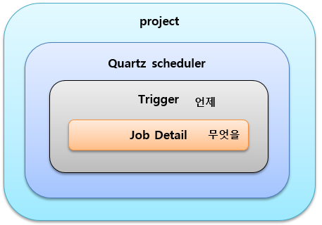
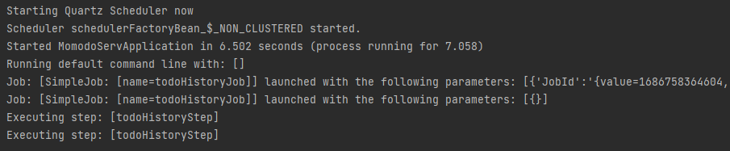
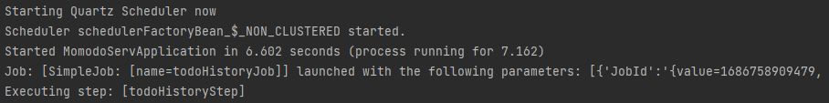

---
title: "[Spring Batch] Spring Batch + Quartz를 활용하여 배치 스케줄링 구현"
excerpt: "Spring Batch와 Quartz를 활용하여 배치 스케줄링을 구현해보자."

categories:
  - Spring
tags:
  - [Spring Batch]

published: true

permalink: /spring/use-spring-batch-and-quartz/

toc: true
toc_sticky: true

date: 2023-06-14
last_modified_at: 2023-06-15

--- 

이전 <a href="https://sbsun.github.io/spring/use-spring-batch/">포스팅</a>에서 Spring Batch를 활용하여 내가 원하는 기능을 Tasklet 방식으로 구현해봤다.<br>

이번에는 구현한 Tasklet을 Quartz를 활용하여 특정 시간에 실행되도록 구현해보겠다.

<br><br>

## **Quartz란?**
<hr />

Quartz는 Terracotta에서 개발된 **Job Scheduling 라이브러리**이다. 이를 사용하면 특정 시간에 작업을 실행하거나, 특정 간격으로 작업을 수행할 수 있다.<br>

<br>

대략적인 구조는 이러하다. 스케줄러의 특성상 언제(Trigger)와 무엇을(Job Detail)로 구성되어 있다. 

<br>

### **1. Quartz의 기능**

* 작업 예약 및 주기 설정 기능을 제공한다.
* 작업 실행, 중단, 재개, 삭제 기능을 제공한다.
* 동시에 여러 작업 실행 기능을 제공한다.
* 작업 실행 결과 처리 기능을 제공한다.
* 다양한 트리거(trigger)를 지원한다.

<br>

### **2. Quartz 클래스 및 인터페이스**


* **Job** : 실행할 작업에 대한 정보를 포함하는 클래스
* **JobDetail** : Job 클래스의 인스턴스와 Job 실행에 필요한 추가 정보를 포함하는 클래스
* **JobDataMap** : Job과 관련된 데이터를 저장하고 있는 Map 자료구조로, 특정 Job 인스턴스의 상태 정보를 담고 있다. 작업에 필요한 데이터를 외부에서 담아주거나 내부적으로 작업 실행간 stateful하게 데이터를 유지하는 용도로 활용된다.
* **Trigger** : Job 실행을 스케줄링하기 위한 클래스
* **Scheduler** : Job 실행과 Trigger 스케줄링을 관리하는 인터페이스
* **SchedulerFactory** : Scheduler 인스턴스를 생성하고 구성하기 위한 인터페이스

<br>

### **3. Trigger**

Trigger는 **Job을 실행시키는 조건을 정의**하는 인터페이스다.<br>
이를 통해 Job을 특정 시간에 실행하거나 주기적으로 실행하도록 설정할 수 있다.

<br>

**SimpleTrigger**<br>
특정 시간에 한 번 실행하거나 주기적으로 실행할 수 있다.<br>
예를 들어, "매일 9시에 실행" 또는 "10초마다 실행"과 같이 작업을 예약할 수 있다.<br>

**속성**<br>
* **repeatCount** : 작업이 실행될 횟수를 지정한다. 0이 입력되면 작업이 무한히 실행된다.
* **repeatInterval** : 작업이 실행되는 간격을 지정한다.

**사용 예시**

``` java
// Job이 시작 시간(startTime)부터 10초 간격으로 5번 실행된다.

SimpleTrigger trigger = newTrigger()
    .withIdentity("trigger1", "group1")
    .startAt(startTime)
    .withSchedule(simpleSchedule()
        .withIntervalInSeconds(10)
        .withRepeatCount(5))
    .build();
```

<br>

**CronTrigger**<br>
Cron 표현식을 사용하여 분, 시, 일, 월, 요일 등의 필드를 사용하여 작업을 예약할 수 있다.<br>
예를 들어, "월요일부터 금요일까지, 매일 오후 3시에 실행"과 같이 작업을 예약할 수 있다.<br>

**속성**<br>
* **cronExpression** : Cron 표현식을 나타내는 문자열로, 이 표현식은 CronTrigger가 실행될 시간을 정의한다.
* **timeZone** : CronTrigger가 실행될 때 사용할 시간대를 나타내는 문자열로, 이 속성을 설정하지 않으면 기본값으로 서버의 시간대가 사용된다.

**사용 예시**<br>

``` java
// 매주 월요일 오전 10시에 실행된다.

CronTrigger cronTrigger = TriggerBuilder.newTrigger()
    .withIdentity("myTrigger", "group1")
    .withSchedule(CronScheduleBuilder.cronSchedule("0 0 10 ? * MON"))
    .build();
```

### **4. Scheduler**

Scheduler는 **Job과 Trigger를 연결하고 Job을 실행**키는 역할을 수행하는 인터페이스다.<br>

**메서드**<br>

* `scheduleJob(JobDetail jobDetail, Trigger trigger)`
  * JobDetail과 Trigger를 사용하여 Job을 스케줄링한다.
* `scheduleJob(Trigger trigger)`
  * JobDetail 없이 Trigger만 사용하여 Job을 스케줄링한다.
* `pauseJob(JobKey jobKey)`
  * 지정된 Job을 일시 정지한다.
* `resumeJob(JobKey jobKey)`
  * 지정된 Job을 다시 시작한다.

<br>

### **5. Quartz의 실행 단계**

**1. 스케줄러 초기화**<br>
Quartz 스케줄러는 시작되면 먼저 스케줄러를 초기화한다. 이 초기화 과정에서는 스케줄러에 대한 설정을 로드하고, 자바 애플리케이션 컨텍스트와 연결한다.<br>

**2. 작업 스케줄링**<br>
사용자가 등록한 작업을 실행할 시간을 계산하여 스케줄링 테이블에 등록한다.<br>

**3. 작업 실행**<br>
스케줄링 된 작업이 실행된다. Quartz 스케줄러는 스케줄링 된 작업을 실행하기 위해 스레드 풀을 사용한다.<br>

**4. 작업 완료**<br>
작업이 완료되면 Quartz 스케줄러는 작업이 완료되었다는 신호를 받고, 스케줄링 테이블에서 작업을 제거한다.<br>

**5. 스케줄러 종료**<br>
애플리케이션 종료 시점에 스케줄러를 종료한다. 이 과정에서는 스케줄링 된 작업을 모두 제거하고, 스레드 풀을 종료한다.

<br><br>

## **구현**
<hr />

### **QuartzJobBean**
QuartzJobBean의 `executeInternal` 추상 메서드를 구현하여 Job에서 수행될 로직을 작성한다.<br>

**전체 코드**<br>

``` java
public class TodoHistoryQuartzJob extends QuartzJobBean {

    private String jobName;
    private JobLauncher jobLauncher;
    private JobLocator jobLocator;

    public void setJobName(String jobName) {
        this.jobName = jobName;
    }

    public void setJobLauncher(JobLauncher jobLauncher) {
        this.jobLauncher = jobLauncher;
    }

    public void setJobLocator(JobLocator jobLocator) {
        this.jobLocator = jobLocator;
    }

    @Override
    protected void executeInternal(JobExecutionContext context) throws JobExecutionException {

        try{
            Job job = jobLocator.getJob(jobName);
            JobParameters params = new JobParametersBuilder()
                    .addString("JobId", String.valueOf(System.currentTimeMillis()))
                    .toJobParameters();

            jobLauncher.run(job, params);
        }
        catch (Exception e){
            e.printStackTrace();
        }
    }
}
```
<br>

**필드**<br>
``` java
private String jobName;
private JobLauncher jobLauncher;
private JobLocator jobLocator;

public void setJobName(String jobName) {
    this.jobName = jobName;
}

public void setJobLauncher(JobLauncher jobLauncher) {
    this.jobLauncher = jobLauncher;
}

public void setJobLocator(JobLocator jobLocator) {
    this.jobLocator = jobLocator;
}
```

Job 실행에 필요한 필드들을 추가한다.<br>
* jobName : 실행할 Job의 이름
* jobLauncher : Job을 실행하는 역할
* jobLocator : Bean으로 등록된 Job을 Job의 이름으로 찾아 반환한다.

Set 메서드들은 **QuartzConfig**에서 JobDetail을 생성할 때, 자동으로 호출되어 JobDataMap에 저장되어 있는 값이 할당되는 것 같다.

<br>

**executeInternal**

``` java
@Override
protected void executeInternal(JobExecutionContext context) throws JobExecutionException {

    try{
        Job job = jobLocator.getJob(jobName);
        JobParameters params = new JobParametersBuilder()
                .addString("JobId", String.valueOf(System.currentTimeMillis()))
                .toJobParameters();

        jobLauncher.run(job, params);
    }
    catch (Exception e){
        e.printStackTrace();
    }
}
```
JobLocator의 `getJob` 메서드로 jobName에 해당하는 등록된 Job을 찾아 반환한다.<br>
JobParameters도 생성하여 JobLauncher의 `run` 메서드를 호출해주면 Job이 실행된다.

<br>

### **QuartzConfig**

**전체 코드**
``` java
@Configuration
public class QuartzConfig {

    @Autowired
    private JobLauncher jobLauncher;

    @Autowired
    private JobLocator jobLocator;

    @Bean
    public JobRegistryBeanPostProcessor jobRegistryBeanPostProcessor(JobRegistry jobRegistry){
        JobRegistryBeanPostProcessor jobRegistryBeanPostProcessor = new JobRegistryBeanPostProcessor();
        jobRegistryBeanPostProcessor.setJobRegistry(jobRegistry);

        return  jobRegistryBeanPostProcessor;
    }

    @Bean
    public JobDetail todoHistoryJobDetail(){
        // Set Job Data Map
        JobDataMap jobDataMap = new JobDataMap();
        jobDataMap.put("jobName", "todoHistoryJob");
        jobDataMap.put("jobLauncher", jobLauncher);
        jobDataMap.put("jobLocator", jobLocator);

        return JobBuilder.newJob(TodoHistoryQuartzJob.class)
                .withIdentity("todoHistoryJob")
                .setJobData(jobDataMap)
                .storeDurably()
                .build();
    }

    @Bean
    public Trigger todoHistoryJobTrigger(){
        SimpleScheduleBuilder scheduleBuilder = SimpleScheduleBuilder
                .simpleSchedule()
                .withIntervalInSeconds(10)
                .repeatForever();

        return TriggerBuilder
                .newTrigger()
                .forJob(todoHistoryJobDetail())
                .withIdentity("todoHistoryJobTrigger")
                .withSchedule(scheduleBuilder)
                .build();
    }

    @Bean
    public SchedulerFactoryBean schedulerFactoryBean(){
        SchedulerFactoryBean scheduler = new SchedulerFactoryBean();
        scheduler.setTriggers(todoHistoryJobTrigger());
        scheduler.setJobDetails(todoHistoryJobDetail());

        return scheduler;
    }
}
```

<br>

**JobRegistryBeanPostProcessor**

``` java
@Bean
public JobRegistryBeanPostProcessor jobRegistryBeanPostProcessor(JobRegistry jobRegistry){
    JobRegistryBeanPostProcessor jobRegistryBeanPostProcessor = new JobRegistryBeanPostProcessor();
    jobRegistryBeanPostProcessor.setJobRegistry(jobRegistry);

    return  jobRegistryBeanPostProcessor;
}
```

Job 등록은 스프링 컨테이너가 시작할 때, **JobRegistryBeanPostProcessor**에 의해서 자동으로 **JobRegistry**에 Job을 등록시켜준다.

<br>

**JobDeatil 생성**
``` java
@Bean
public JobDetail todoHistoryJobDetail(){
    // Set Job Data Map
    JobDataMap jobDataMap = new JobDataMap();
    jobDataMap.put("jobName", "todoHistoryJob");
    jobDataMap.put("jobLauncher", jobLauncher);
    jobDataMap.put("jobLocator", jobLocator);

    return JobBuilder.newJob(TodoHistoryQuartzJob.class)
            .withIdentity("todoHistoryJob")
            .setJobData(jobDataMap)
            .storeDurably()
            .build();
}
```

**JobDataMap**을 생성하여 구현한 **TodoHistoryQuartzJob**을 실행하는데 필요한 데이터들을 추가한다.<br>

스케줄러에서 수행할 작업인 Job과 Job을 실행할 때 필요한 데이터들을 가진 JobDataMap을 `JobBuilder.newJob()`을 이용해 **JobDeatil**을 생성한다.

<br>

**Trigger 생성**

``` java
@Bean
public Trigger todoHistoryJobTrigger(){
    SimpleScheduleBuilder scheduleBuilder = SimpleScheduleBuilder
            .simpleSchedule()
            .withIntervalInSeconds(10)
            .repeatForever();

    return TriggerBuilder
            .newTrigger()
            .forJob(todoHistoryJobDetail())
            .withIdentity("todoHistoryJobTrigger")
            .withSchedule(scheduleBuilder)
            .build();
}
```
위에서 생성한 **todoHistoryJobDetail**을 10초 마다 주기적으로 실행되게 하도록 한다.

<br>

**SchedulerFactoryBean**

``` java
@Bean
public SchedulerFactoryBean schedulerFactoryBean(){
    SchedulerFactoryBean scheduler = new SchedulerFactoryBean();
    scheduler.setTriggers(todoHistoryJobTrigger());
    scheduler.setJobDetails(todoHistoryJobDetail());

    return scheduler;
}
```

원래는 **Scheduler** 객체를 **SchedulerFactory**를 통해서 생성하고 직접 시작시켜줘야 하지만 **SchedulerFactoryBean**을 통해서 자동으로 시작된 상태로 생성할 수 있다.<br>

생성한 JobDetail과 Trigger로 설정한다.

<br>

### **시작할 때, Job이 두 번 실행되는 문제**

테스트를 위해 실행해봤는데, 아래 사진과 같이 **todoHistoryJob**이 두 번 실행되는 것을 볼 수 있다.
<br>

두 번 실행하는 이유는 **JobLauncherCommandLineRunner**때문이다.<br>

**JobLauncherCommandLineRunner**는 JobLauncher를 사용해 Job을 실행한다. Spring Boot가 ApplicationContext 내에 구성된 모든 CommandLineRunner를 실행할 때, 클래스 패스에 `spring-boot-starter-batch`가 존재한다면 JobLauncherCommandLineRunner 컨텍스트 내에서 찾아낸 모든 잡을 실행한다.<br>

즉, Spring Boot와 Spring Batch가 함께 사용될 때 JobLauncherCommandLineRunner를 통해 등록된 모든 Job들을 한 번 실행한다는 것이다.<br>

이를 해결하기 위해서는 **application.properties** 파일 내에서 `spring.batch.job.enabled=false`로 설정해주면 된다. 기본값은 true이다.<br>

<br>

실행해보면 정상적으로 Job이 한 번 실행된다.

<hr />
참고자료<br>
<a href="https://adjh54.tistory.com/170">https://adjh54.tistory.com/170</a><br>
<a href="https://devfunny.tistory.com/487">https://devfunny.tistory.com/487</a><br>