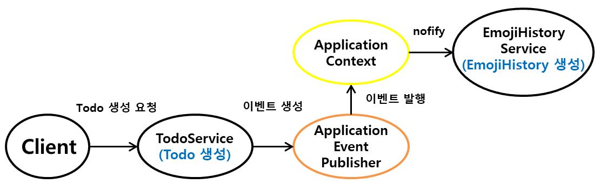

---
title: "[Spring Boot] Spring Event를 사용하여 Service 간의 의존성 제거하기"
excerpt: "Spring Event를 사용하여 Service 간의 의존성을 제거해보자."

categories:
  - Spring
tags:
  - [Spring Boot]

published: true

permalink: /spring/remove-dependencies-between-services/

toc: true
toc_sticky: true

date: 2023-06-19
last_modified_at: 2023-06-19

--- 

TodoList 프로젝트 momodo를 개발하는 도중에 아래와 같이 하나의 Service에서 다른 Service에 대한 의존성을 주입 받아 사용하게 되었다.<br>

``` java
@Service
@RequiredArgsConstructor
public class TodoService {

    private final TodoRepository todoRepository;
    private final EmojiHistoryService emojiHistoryService;

    @Transactional
    public void createTodo(TodoRequestDto.Create request){
        Todo createTodo = request.toEntity();

        todoRepository.save(createTodo);

        emojiHistoryService.create(createTodo.getMemberId(), createTodo.getEmoji());
    }
}
```

Todo를 생성하는 기능은 Todo를 생성한 뒤, Todo를 생성할 때 사용한 이모지를 저장한다.<br>
**Todo 생성**과 **사용한 이모지 데이터 저장** 기능이 각각의 서비스(TodoService, EmojiHistoryService)에 구현되어 있어서 Todo 생성을 처리하는 **TodoService**에서 **EmojiHistoryService**에 대한 의존성을 주입받아 사용하게 된다.<br> 

지금 구현하고 있는 기능은 **EmojiHistoryService**에만 의존성이 있지만 나중에 복잡한 도메인을 개발하게 되면 도메인 사이의 강한 의존성 생길 수 있다. 이러한 의존성 문제를 스프링 이벤트를 통해 의존성을 줄일 수 있다고 한다.

<br><br> 

## **스프링 이벤트 구성 요소 및 동작 구현**
<hr />

Spring Event란 스프링 프레임워크를 사용할 때, 내부에서 데이터를 전달하는 방법 중 하나이다. 이를 사용하면 각각의 코드의 관심사를 분리할 수 있다.<br>

<br>

Spring Event는 **Event Class**와 이벤트를 발생시키는 **Event Publisher** 그리고 이벤트를 받아들이는 **Event Listener** 3가지 요소로 나눠진다.

<br>

### **Event Class**

``` java
public class TodoCreatedEvent {

    private Long memberId;
    private String emoji;

    public TodoCreatedEvent(Long memberId, String emoji){
        this.memberId = memberId;
        this.emoji = emoji;
    }

    public Long getMemberId() {
        return memberId;
    }

    public String getEmoji() {
        return emoji;
    }
}
```

**Event Class**는 이벤트를 처리하는데 필요한 데이터를 가지고 있으며, 기존에는 **ApplicationEvent** 클래스를 확장하여 사용했지만 스프링 프레임워크 4.2 버전부터는 확장할 필요가 없어졌다.

<br>

### **Event Publisher**

``` java
@Service
@RequiredArgsConstructor
public class TodoService {

    private final TodoRepository todoRepository;
    private final ApplicationEventPublisher publisher;

    @Transactional
    public void createTodo(TodoRequestDto.Create request){
        Todo createTodo = request.toEntity();

        todoRepository.save(createTodo);

        publisher.publishEvent(new TodoCreatedEvent(request.getMemberId(), request.getEmoji()));
    }
}
```

**Event Publisher**는 **ApplicationEventPublisher**를 주입받아 **publishEvent()** 메서드를 통해 생성된 이벤트 객체를 넣어주면 된다.

<br>

### **Event Listener**

``` java
// 이벤트 리스너를 사용하여 핵심 로직과 부가 로직을 분리
@Component
@RequiredArgsConstructor
public class TodoCreateEventListener {

    private final EmojiHistoryService emojiHistoryService;

    @EventListener
    public void createEmojiHistory(TodoCreatedEvent event){
        emojiHistoryService.create(event.getMemberId(), event.getEmoji());
    }
}
```

TodoService에서 ApplicationEventPublisher에게 이벤트를 생성하여 넘겨주고, publisher가 이벤트를 발행하면 **ApplicationContext**가 빈으로 등록된 **Listener를 notify**한다.

<br>

핵심은 스프링이 Event를 발생시키고 이를 처리하는 로직(Listener)들 사이에 데이터(Event)를 전달해주는 역할을 해줌으로써 개발자가 각각 분리된 코드를 작성할 수 있다는 것이다.<br>

이를 통해서 Todo를 생성하는 로직은 유지하고, 이 이벤트가 발생했을 때 **추가적으로 처리해야하는 부가적인 코드들은 Listener를 통해서 처리**할 수 있기 때문에 하나의 Service 클래스 안에 코드가 계속적으로 증가하는 문제를 해결할 수 있었다.

<hr />
참고자료<br>
<a href="https://findstar.pe.kr/2022/09/17/points-to-consider-when-using-the-Spring-Events-feature/">https://findstar.pe.kr/2022/09/17/points-to-consider-when-using-the-Spring-Events-feature/</a><br>