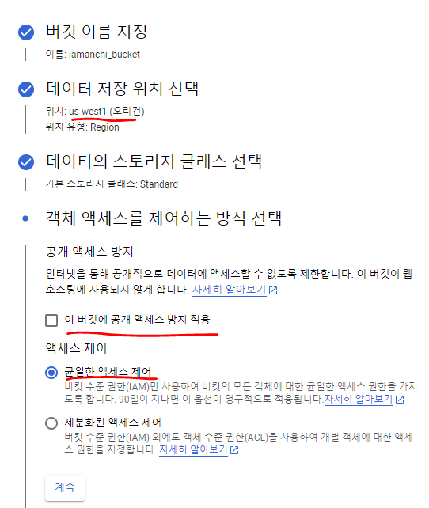

---
title: "[Spring Boot] Google Cloud Storage로 이미지 파일 업로드"
excerpt: "Google Cloud Storage를 사용하여 이미지 파일을 업로드 해보자."

categories:
  - Spring
tags:
  - [Spring Boot]

published: true

permalink: /spring/gcs-use-image-upload/

toc: true
toc_sticky: true

date: 2023-06-27
last_modified_at: 2023-06-27

--- 

테오의 스프린트 15기에 BE 파트로 참여하고 있는데 이미지 파일을 Storage에 저장하고 꺼내쓰는 기능이 필요하여 구현해보기로 했다.
<br>

API로 이미지를 등록할 수 있도록 하는게 목표다!

<br><br>

## **Google Cloud Storage Bucket 생성**
<hr />
Cloud Storage란 Google Cloud에 어떤 형식의 파일이든 버킷이라는 컨테이너에 저장하게 해주는 서비스다.<br>
AWS S3도 대표적인 Storage Service이지만 팀원 모두 AWS의 프리 티어가 만료되었기 때문에 GCS를 사용하기로 했다.

<br>

### **1. 버킷 만들기**
<a href="https://cloud.google.com/?hl=ko">콘솔</a>에서 버킷으로 이동후 상단에 만들기 버튼을 클릭하여 버킷을 생성한다.<br> 


<br>


<br>

버킷에 직접 이미지 업로드 해보기.<br>

<br>

파일 업로드 버튼으로 이미지를 업로드 후, 파일 이름을 클릭하면 **인증된 URL**이 나오는데 URL을 접속하면 업로드했던 이미지가 출력된다.<br>


<br>

### **2. 공개 엑세스 적용**
위의 이미지는 공객 엑세스가 아니기 때문에 다른 구글 계정에서는 해당 URL로 이미지를 볼 수 없다.<br>
URL만 가지고 이미지를 띄어줄 수 있게 하기 위해서 공개 엑세스를 적용했다.<br>

<br>

이제 버킷의 모든 객체들은 공개된 상태로 변경되었기 때문에 누구나 URL에 접속하면 업로드한 이미지를 볼 수 있다.

<br>

### **3. 접근 권한 허용, key 파일 생성**
SpringBoot에서 GCS를 사용하려면 key를 만들어 storage에 접근할 수 있도록 해줘야 한다.<br>

IAM 및 관리자 - 서비스 계정으로 이동한다.<br>
<br>

저장소 개체 관리자, 저장소 관리자 역할을 추가하여 서비스 계정을 생성한다.<br>
<br>

키 탭으로 이동해 키를 생성하여 SpringBoot 프로젝트의 resources 폴더 내로 옮겨준다.<br>


<br><br>

## **SpringBoot에서 이미지 업로드**
<hr />

### **1. 의존성 추가**

``` gradle
implementation group: 'org.springframework.cloud', name: 'spring-cloud-gcp-starter', version: '1.2.8.RELEASE'
implementation group: 'org.springframework.cloud', name: 'spring-cloud-gcp-storage', version: '1.2.8.RELEASE'
```

<br>

### **2. Storage 의존성 부여**
위에서 만든 json key file을 resources 폴더에 넣고, application.yml에 아래 코드를 추가한다.<br>

``` java
@Configuration
public class GoogleCloudStorageConfig {

    @Value("${GCS_KEY}")
    private String key;
    @Value("${GCS_PROJECT_ID}") 
    private String projectId;

    @Bean
    public Storage storage() throws IOException {

        ClassPathResource resource = new ClassPathResource(key + ".json");
        GoogleCredentials credentials = GoogleCredentials.fromStream(resource.getInputStream());

        return StorageOptions.newBuilder()
                .setProjectId(projectId)
                .setCredentials(credentials)
                .build()
                .getService();
    }
}
```

<br>

### **3. 이미지 업로드 코드**

**Controller**<br>
``` java
@PutMapping
public ResponseEntity<Void> updateImage(@RequestPart HobbyRequestDto.UpdateImage requestDto
        , @RequestPart(value = "image", required = false) MultipartFile image) throws IOException {
    hobbyService.updateImage(requestDto, image);
    return new ResponseEntity(HttpStatus.OK);
}
```

취미 데이터의 이미지 컬럼을 수정할 수 있는 API인데, 여기에서 **MultipartFile** 인터페이스를 사용하여  파일을 업로드 할 수 있다.<br>


<br>


**Service**<br>
``` java
@Transactional
public void updateImage(HobbyRequestDto.UpdateImage requestDto, MultipartFile image) throws IOException {

    if(!existsByName(requestDto.getName())){
        throw new IllegalArgumentException("존재하지 않는 취미입니다.");
    }

    String uuid = UUID.randomUUID().toString(); // Google Cloud Storage에 저장될 파일 이름
    String ext = image.getContentType(); // 파일의 형식 ex) JPG, PNG

    // Storage에 이미지 업로드
    BlobInfo blobInfo = storage.create(
            BlobInfo.newBuilder(bucketName, uuid)
                    .setContentType(ext)
                    .build(),
            image.getInputStream()
    );

    hobbyRepository.updateImage(requestDto.getName(), uuid);
}
```

UUID를 통하여 고유한 식별자를 파일의 이름으로 설정하여 Storage에 저장하고 DB에도 UUID 값만 저장한다.<br>

<br>

고유한 식별자 값으로 이미지들을 저장한 모습을 볼 수 있다!

<br>

### **이미지 URL 반환**
결국 클라이언트에게 저장했던 이미지를 보내줄 때는 String 값으로 `https://storage.googleapis.com/버킷이름/UUID값`을 보내주면 된다.<br>

위에서 아무나 URL을 통해서 이미지를 볼 수 있게 설정해 놓았기 때문에, 요구하는 이미지의 UUID 값을 DB에서 꺼내 URL을 만들어 반환하면 된다!

<hr />
참고자료<br>
<a href="https://choo.oopy.io/35bffd94-7a41-4cfa-812c-b8aaf148604a">https://choo.oopy.io/35bffd94-7a41-4cfa-812c-b8aaf148604a</a><br>