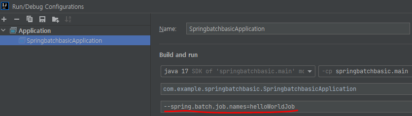
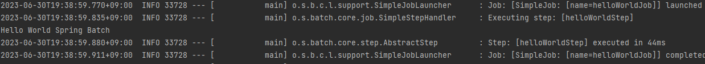
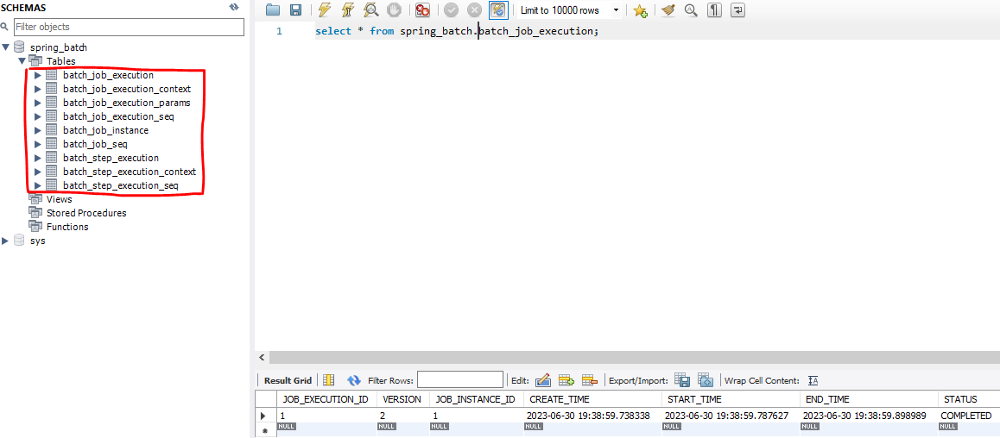
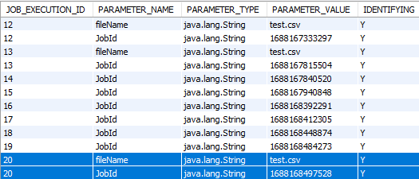
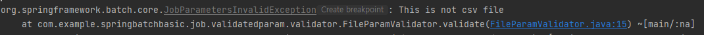
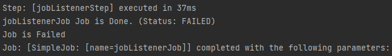

---
title: "[Spring Batch] Spring Batch 입문(1)"
excerpt: "Spring Batch를 실습을 통해 경험하고 알아보자."

categories:
  - Spring
tags:
  - [Spring Boot, Spring Batch]

published: true

permalink: /spring/batch-basic-first/

toc: true
toc_sticky: true

date: 2023-07-01
last_modified_at: 2023-07-01

--- 

현재 개발하고 있는 Todo 서비스인 momodo에서 Spring Batch 기능을 사용해야해서 인프런의 <a href="https://www.inflearn.com/course/%EC%98%88%EC%A0%9C%EB%A1%9C-%EB%B0%B0%EC%9A%B0%EB%8A%94-%ED%95%B5%EC%8B%AC-%EC%8A%A4%ED%94%84%EB%A7%81-%EB%B0%B0%EC%B9%98/dashboard">스프링 배치 입문</a> 강의를 수강하고 있다.<br>

기존에 Spring Batch와 Quartz 스케줄러를 이용하여 기능을 구현해 본 포스트를 작성한 적이 있는데, 생각해 보면 Spring Batch에 대해 자세히 이해하지 않은 채로 급히 구현한 것 같아 아쉬움이 있었다.<br>

그래서 해당 강의를 통해 Spring Batch에 대해 기본적인 동작 방식과 사용 방법을 익힌 뒤에 다시 한번 구현해 볼 예정이다.<br>

강의에서는 Spring Boot 2.x 버전, Spring Batch 4.x 버전이지만 momodo 프로젝트에서는 3.x를 사용하고 있어서 Spring Batch 5.0 버전을 사용한다.

<br><br>

## **Spring Batch 5.0 Changes**
<hr />

**1. @EnableBatchProcessing 은 더 이상 권장되지 않는다.**<br>

이전에는 `@EnableBatchProcessing` 어노테이션을 통해서 스프링 배치의 스프링 부트 자동설정을 활성화할 수 있었지만, 이제는 스프링 부트의 자동설정을 사용하기 위해서는 제거해야 한다.<br>
`@EnableBatchProcessing` 명시하는 방법 또는 `DefaultBatchConfiguration`을 상속하여 활성화되는 빈은 이제 스프링 부트의 자동설정을 밀어내고(back-off), 애플리케이션의 설정을 커스텀하는 용도로 사용된다.<br>

따라서 `@EnableBatchProcessing`이나 `DefaultBatchConfiguration`을 사용하면 `spring.batch.jdbc.initialize-schema` 등의 스프링 부터 설정이 동작하지 않는다. 또한 부트를 실행시킬 때, Job이 자동으로 실행되지 않으므로 Runner의 구현이 필요하다.

<br>

**2. 다중 Job 실행은 더 이상 지원되지 않는다.**<br>

지금까지는 여러개의 Job이 있었다면 한꺼번에 실행할 수 있었다. 하지만 이제 단일 Job을 감지하면 부트가 실행될 때 Job을 실행시킨다.<br>

만약 여러 개의 Job이 context에 존재한다면, 부트를 실행할 때 `spring.batch.job.name`을 통해 실행시킬 Job을 명시해줘야 한다. 물론 `@EnableBatchProcessing`이나 `DefaultBatchConfiguration`을 사용하면 부트를 실행시킬 때, Job이 자동으로 실행되지 않는다.

<br><br>

## **프로젝트 세팅**
<hr />

### **application.yml**

``` yml
spring:
  batch:
    jdbc:
      initialize-schema: ALWAYS
  datasource:
    url: jdbc:mysql://127.0.0.1:3306/spring_batch
    driver-class-name: com.mysql.cj.jdbc.Driver
    username: root
    password: ${DB_PASSWORD}
  jpa:
    show-sql: true
```

<br>

### **dependencies**

``` gradle
dependencies {
	implementation 'org.springframework.boot:spring-boot-starter-batch'
	implementation 'org.springframework.boot:spring-boot-starter-data-jpa'
	implementation 'org.springframework.boot:spring-boot-starter-jdbc'
	compileOnly 'org.projectlombok:lombok'
	runtimeOnly 'com.mysql:mysql-connector-j'
	annotationProcessor 'org.springframework.boot:spring-boot-configuration-processor'
	annotationProcessor 'org.projectlombok:lombok'
	testImplementation 'org.springframework.boot:spring-boot-starter-test'
	testImplementation 'org.springframework.batch:spring-batch-test'
}
```

<br><br>

## **스프링 배치 구조 익히기**
<hr />

"Hello World"를 출력하기 위한 Job을 만들어보자.<br>

Job 내에는 Step이 존재한다.<br>

``` java
@Bean
public Job helloWorldJob(JobRepository jobRepository, PlatformTransactionManager platformTransactionManager){
    return new JobBuilder("helloWorldJob", jobRepository)
            .incrementer(new RunIdIncrementer()) // Job을 실행할 때 Id를 부여하는데, Sequence를 순차적으로 부여할 수 있도록 설정
            .start(helloWorldStep(jobRepository, platformTransactionManager))
            .build();
}
```

<br>

Step 하위에는 ItemReader, ItemProcessor, ItemWriter가 존재하는데 데이터를 읽고 수정하고, 저장할 것이 없다면 단순하게 Tasklet으로 Batch를 만들 수 있다.<br>

``` java
@JobScope
@Bean
public Step helloWorldStep(JobRepository jobRepository, PlatformTransactionManager platformTransactionManager){
    return new StepBuilder("helloWorldStep", jobRepository)
            .tasklet(helloWorldTasklet(), platformTransactionManager)
            .build();
}
```

<br>

단순히 "Hello World"를 출력할 것이기 때문에 Tasklet을 사용하여 배치 작업을 구성한다.<br>
``` java
@StepScope
@Bean
public Tasklet helloWorldTasklet(){
    return new Tasklet() {
        @Override
        public RepeatStatus execute(StepContribution contribution, ChunkContext chunkContext) throws Exception {
            System.out.println("Hello World Spring Batch");
            return RepeatStatus.FINISHED;   // FINISHED를 명시함으로써 이 스탭을 끝내도록 설정
        }
    };
}
```

<br>

### **Run/Debug Configuration**

`--spring.batch.job.names=helloWorldJob`으로 입력시 `,` 구분으로 여러 Job을 수행시킬 수 있다.<br>
만약 존재하지 않는 Job Name이 있으면 해당 Job은 패스되어 존재하는 Job만 실행한다.



<br>

**helloWorldJob**이 잘 실행된다.<br>



<br>

### **Spring Batch Table**

Spring Batch는 Job을 실행하면서 Job, Step의 실행 관련 메타 정보를 기록해두는데 Job이 끝나면, 기록한 데이터를 DB에 저장한다. 이때, 워낙 많은 정보가 있기 때문에 각각 DB 테이블을 만들어서 관리한다.



<br><br>

## **배치 실행 시 파라미터(파일 이름) 받기 및 (csv)검증**
<hr />

Spring Batch의 경우 외부 혹은 내부에서 파라미터를 받아 여러 Batch 컴포넌트에서 사용할 수 있다.<br>
이 파라미터를 **JobParameter**라고 하는데 이를 사용하기 위해선 `@JobScope`나 `@StepScope`를 선언해줘야 한다.<br>

실습 전에 두 어노테이션에 대해 알아보자.<br>

### **@JobScope, @StepScope**
Spring Batch는 `@JobScope`와 `@StepScope`라는 Bean Scope를 지원한다.<br>
`@JobScope`는 Step에서 사용 가능하고, `@StepScope`는 Tasklet이나 ItemReader, ItemProcessor, ItemWriter에서 사용할 수 있다.<br>

`@StepScope`를 사용하게 되면 Spring Batch가 Spring 컨테이너를 통해 지정된 **Step의 실행 시점에 해당 컴포넌트를 빈으로 생성**한다. 마찬가지로 `@JobScope`는 **Job 실행 시점에 빈이 생성**된다.<br>
즉, **빈의 생성 시점을 지정된 Scope가 실행되는 시점으로 지연**시킨다.<br>

이렇게 빈의 생성 시점을 Step 혹은 Job의 실행 시점으로 지연시키면서 얻는 장점은 크게 2가지가 있다.<br>

**1. JobParameter의 Late Binding이 가능하다.**<br>
꼭 애플리케이션이 실행되는 시점이 아니더라도 Controller나 Service와 같은 비지니스 로직 처리 단계에서 JobParameter를 할당시킬 수 있다.
<br>

**2. 동일한 컴포넌트를 병렬 혹은 동시에 사용할때 유용하다.**<br>
Step안에 Tasklet이 있고, 이 Tasklet은 멤버 변수와 이 멤버 변수를 변경하는 로직이 있다고 가정해봅시다.<br>

이 경우 `@StepScope` 없이 Step을 병렬로 실행시키게 되면 **서로 다른 Step에서 하나의 Tasklet을 두고 마구잡이로 상태를 변경**하려고 할 것이다.<br>

하지만 `@StepScope`가 있다면 **각각의 Step에서 별도의 Tasklet을 생성하고 관리하기 때문에 서로의 상태를 침범할 일이 없다.**

<br>

### **파라미터 받기**

예를 들어 Job을 호출할 때, 특정 파일이나 날짜같은 값을 파라미터로 넘겨준다고 한다면 그 파라미터를 어떻게 받을 수 있는지, 그리고 검증을 어떻게 해야할까?<br>

파라미터를 받는 방법은 아래와 같이 SpEL로 선언해서 사용하면 된다.
``` java
@Value("#{jobParameters[파라미터명]}")
```

``` java
@JobScope
@Bean
public Step validatedParamStep(JobRepository jobRepository, PlatformTransactionManager platformTransactionManager){
    return new StepBuilder("validatedParamStep", jobRepository)
            .tasklet(validatedParamTasklet(null), platformTransactionManager)
            .build();
}

@StepScope
@Bean
public Tasklet validatedParamTasklet(@Value("#{jobParameters['fileName']}") String fileName){
    return new Tasklet() {
        @Override
        public RepeatStatus execute(StepContribution contribution, ChunkContext chunkContext) throws Exception {
            System.out.println(fileName);
            System.out.println("validated Param Tasklet");
            return RepeatStatus.FINISHED;
        }
    };
}
```

JobParameters에서 fileName이라는 키의 값이 파라미터로 들어오는데 그러면 넘겨줄 fileName의 값을 어떻게 넘겨주는걸까?<br>

부트를 실행시킬 때, 자동으로 Job이 실행되도록 설정했다면 `--spring.batch.job.names=validatedParamJob -fileName=test.csv` 이렇게 JobParameter를 설정할 수 있지만, 나는 스케줄러를 통해서 Job들을 실행시키게 구현을 할 것이기 때문에 직접 JobParameter를 생성하여 넘겨주었다.<br>

``` java
@Scheduled(fixedDelay = 100000)
public void startValidatedParamJob() throws JobExecutionException {
    JobParameters params = new JobParametersBuilder()
            .addString("JobId", String.valueOf(System.currentTimeMillis()))
            .addString("fileName", "test.csv")
            .toJobParameters();

    jobLauncher.run(jobRegistry.getJob("validatedParamJob"), params);
}
```
<br>

아래 사진과 같이 파라미터 값 2개로 구성했기 때문에 `JOB_EXECUTION_ID`가 같은 데이터가 저장되었다.<br>

<br>

그리고 Step 코드에서 Tasklet을 호출하는 코드를 보면 `null`을 할당하고 있는 것을 볼 수 있는데, 이는 **JobParameter의 할당이 애플리케이션 실행시에 하지 않기 때문**에 가능한 것이다.

<br>

### **받은 파라미터 검증하기**

Spring Batch는 Job이 실행할 때 검증을 할 수 있도록 validator를 제공한다.<br>
validator는 Job을 생성할 때 같이 코드로 작성할 수 있지만 이후에 재사용 할 수 있고 코드를 더 깔끔하게 작성할 수 있도록 따로 validator를 구현하겠다.<br>

``` java
public class FileParamValidator implements JobParametersValidator {

    @Override
    public void validate(JobParameters parameters) throws JobParametersInvalidException {
        String fileName = parameters.getString("fileName");

        if(!StringUtils.endsWithIgnoreCase(fileName, "csv")){
            throw new JobParametersInvalidException("This is not csv file");
        }
    }
}
```

기본적으로 **DefaultJobParametersValidator** 구현체를 지원하며, **JobParametersValidator** 인터페이스를 직접 구현하여 파라미터를 검증할 수 있다.<br>

FileParamValidator는 fileName이 csv가 맞는지에 대해 검증하는 역할을 한다.<br>

``` java
@Bean
public Job validatedParamJob(JobRepository jobRepository, Step validatedParamStep){
    return new JobBuilder("validatedParamJob", jobRepository)
            .incrementer(new RunIdIncrementer())
            .validator(new FileParamValidator())
            .start(validatedParamStep)
            .build();
}
```

구현한 FileParamValidator를 위와 같이 적용하고 fileName 값을 `test`로 설정하고 실행해보면<br>
<br>
csv 파일이 아니라는 예외가 발생하여 valiator가 정상적으로 작동하는 것을 볼 수 있다.

<br>

그리고 valiator는 **CompositeJobParametersValidator**를 이용하여 다수의 valiator를 등록할 수 있다.<br>

``` java
private CompositeJobParametersValidator multipleValidator(){
    CompositeJobParametersValidator validator = new CompositeJobParametersValidator();
    validator.setValidators(Arrays.asList(new FileParamValidator()));

    return validator;
}
```
`setValidators()` 메서드를 통해 등록할 validator들을 넘겨주고 Job의 validator로 설정해주면 다수의 valiator들을 적용시킬 수 있다.

<br><br>

## **Job이 실행 되기 전, 후에 특정 작업 수행**
<hr />

Spring Batch는 Job이 실행 되기 전, 후에 상태 확인 및 특정 작업을 추가할 수 있는 리스너를 제공한다.<br>
JobListener는 **JobExecutionListener**를 구현하여 Job에 Listener로 등록해주면 된다.<br>

리스너에는 Job이 실행되기 전에 실행되는 `beforeJob()`, Job이 끝난 후에 실행되는 `afterJob()`으로 구성되어 있고, 개발자가 필요로 하는 작업을 각 메서드에 구현하면 된다.<br>

``` java
@Slf4j
public class JobLoggerListener implements JobExecutionListener {

    private static String BEFORE_MESSAGE = "{} Job is Running";
    private static String AFTER_MESSAGE = "{} Job is Done. (Status: {})";

    @Override
    public void beforeJob(JobExecution jobExecution) {
        log.info(BEFORE_MESSAGE, jobExecution.getJobInstance().getJobName());
    }

    @Override
    public void afterJob(JobExecution jobExecution) {
        log.info(AFTER_MESSAGE,
                jobExecution.getJobInstance().getJobName(),
                jobExecution.getStatus());

        // 작업이 실패했다면
        if(jobExecution.getStatus() == BatchStatus.FAILED){
            log.info("Job is Failed");
        }
    }
}
```

`beforeJob()`에는 현재 실행되고 있는 Job의 name을 출력, `afterJob()`에는 작업이 실패했을 때의 로그 출력까지 추가했다.<br>

``` java
@Bean
public Job jobListenerJob(JobRepository jobRepository, PlatformTransactionManager platformTransactionManager){
    return new JobBuilder("jobListenerJob", jobRepository)
            .incrementer(new RunIdIncrementer())
            .listener(new JobLoggerListener())
            .start(jobListenerStep(jobRepository, platformTransactionManager))
            .build();
}
```

리스너도 위와 같이 추가하고, 일부러 예외를 발생시켜서 실행해 보면<br>
<br>
사진과 같이 작업이 실패했을 때 설정한 로그가 출력된 것을 볼 수 있다.  

<hr />
참고자료<br>
<a href="https://www.inflearn.com/course/%EC%98%88%EC%A0%9C%EB%A1%9C-%EB%B0%B0%EC%9A%B0%EB%8A%94-%ED%95%B5%EC%8B%AC-%EC%8A%A4%ED%94%84%EB%A7%81-%EB%B0%B0%EC%B9%98/dashboard">인프런 강의</a><br>
<a href="https://songkg7.github.io/posts/Spring-Batch-Changes/">https://songkg7.github.io/posts/Spring-Batch-Changes/</a><br>
<a href="https://jojoldu.tistory.com/330">https://jojoldu.tistory.com/330</a><br>
