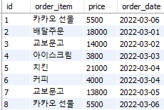
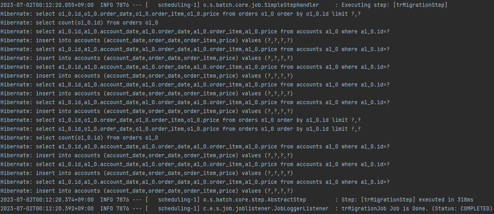
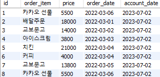
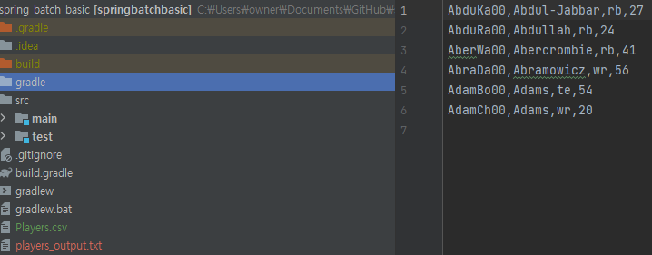
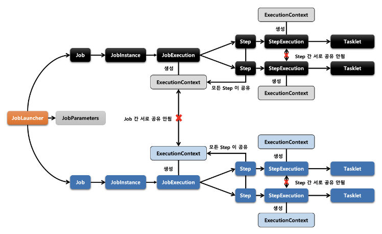
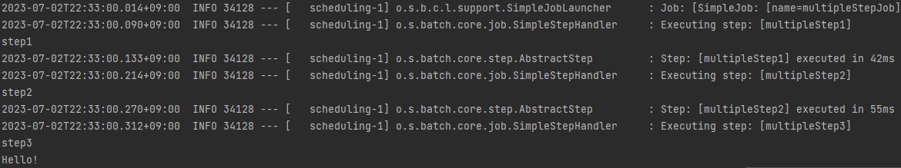
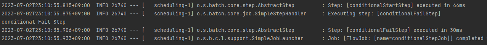
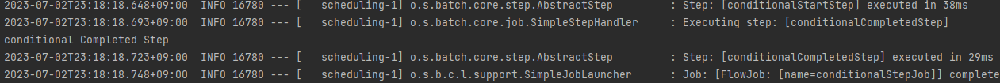

---
title: "[Spring Batch] Spring Batch 입문(2)"
excerpt: "Spring Batch를 실습을 통해 경험하고 알아보자."

categories:
  - Spring
tags:
  - [Spring Boot, Spring Batch]

published: true

permalink: /spring/batch-basic-second/

toc: true
toc_sticky: true

date: 2023-07-02
last_modified_at: 2023-07-03

--- 

저번 <a href="https://sbsun.github.io/spring/batch-basic-first/">스프링 배치 입문(1)</a>에 이어서 진행해보자.

<br><br>

## **DB 데이터 읽고 쓰기**
<hr />


이번에는 직접 데이터를 DB에서 읽고 쓰는 작업을 구현해 보도록 하겠다.<br>
이전까지는 Tasklet을 사용하여 단순히 로그 출력만 하는 Job을 구현했는데, 이번에는 데이터를 읽고 쓰는 작업이기 때문에 ItemReader, ItemProcessor, ItemWriter를 이용한다.

<br>

``` java
@Getter
@Entity
@NoArgsConstructor
public class Orders {

    @Id
    @GeneratedValue(strategy = GenerationType.IDENTITY)
    private Integer id;
    private String orderItem;
    private Integer price;
    private Date orderDate;
}

@Getter
@Entity
@NoArgsConstructor
public class Accounts {

    @Id
    @GeneratedValue(strategy = GenerationType.IDENTITY)
    private Integer id;
    private String orderItem;
    private Integer price;
    private Date orderDate;
    private Date accountDate;

    public Accounts(Orders orders){
        this.id = orders.getId();
        this.orderItem = orders.getOrderItem();
        this.price = orders.getPrice();
        this.orderDate = orders.getOrderDate();
        this.accountDate = new Date();
    }
}
```

이번 실습은 Orders와 Accounts 2개의 클래스를 사용하여 진행한다.<br>

<br>

위 사진은 Orders 테이블에 저장된 데이터들이다. Orders의 데이터들을 Accounts 테이블로 이관하는 기능을 구현해보자.

<br>

### **ItemReader**

첫 번째로 DB에서 데이터를 조회하는 ItemReader를 구현해보자.<br>

``` java
@StepScope
@Bean
public RepositoryItemReader<Orders> trOrdersReader(){
    return new RepositoryItemReaderBuilder<Orders>()
            .name("trOrdersReader")
            .repository(ordersRepository)
            .methodName("findAll")
            .pageSize(5)
            .arguments(Arrays.asList())
            .sorts(Collections.singletonMap("id", Sort.Direction.ASC))
            .build();
}
```

Repository를 통해 DB의 데이터를 조회할 것이기 때문에 **RepositoryItemReader**를 사용했고 조회할 데이터 타입을 **Orders**로 명시한다.<br>

* repository : 조회에 사용할 repository 할당
* methodName : repository에 구현되어 있는 메서드 이름, `findAll()` 메서드를 통해 전체 조회
* pageSize : 한 번에 조회할 데이터 개수, 보통 chunk size와 같게 설정한다.
* arguments : 메서드에 파라
* sorts : 정렬, id 기준으로 오름차순으로 설정

<br>

### **ItemProcessor**

Orders 타입의 데이터를 Accounts 타입으로 변경하여 DB에 저장시키는 것이 목적이기 때문에 ItemProcessor를 통해서 변경해준다.

``` java
@StepScope
@Bean
public ItemProcessor<Orders, Accounts> trOrdersProcessor(){
    return new ItemProcessor<Orders, Accounts>() {
        @Override
        public Accounts process(Orders item) throws Exception {
            return new Accounts(item);
        }
    };
}
```

**ItemProcessor<Orders, Accounts>**<br>
왼쪽 타입에서 오른쪽 타입으로 변경된다고 명시. Orders를 Accounts로 변경한 객체를 리턴한다.

<br>

### **ItemWriter**

ItemProcessor를 통해 변경된 데이터를 DB에 저장한다.

``` java
@StepScope
@Bean
public RepositoryItemWriter<Accounts> trOrdersWriter(){
    return new RepositoryItemWriterBuilder<Accounts>()
            .repository(accountsRepository)
            .methodName("save")
            .build();
}
```

마찬가지로 **RepositoryItemWriter**를 사용하여 **accountsRepository**의 `save()` 메서드를 통해 Accounts 데이터를 저장한다.

<br>

### **Step 구성**

``` java
@JobScope
@Bean
public Step trMigrationStep(JobRepository jobRepository, PlatformTransactionManager platformTransactionManager,
                            ItemReader trOrdersReader, ItemProcessor trOrdersProcessor, ItemWriter trOrdersWriter){
    return new StepBuilder("trMigrationStep", jobRepository)
            .<Orders, Accounts>chunk(5, platformTransactionManager)
            .reader(trOrdersReader)
            .processor(trOrdersProcessor)
            .writer(trOrdersWriter)
            .build();
}
```

위에서 구현한 Reader, Processor, Writer로 Step을 구성한다.<br>
chunk size를 5로 설정한다. 5로 설정했기 때문에 데이터들을 5개의 단위로 처리한 후에 데이터를 커밋한다.<br>

그리고 Spring Batch에서는 **chunk 단위로 트랜잭션을 수행**하기 때문에 **실패할 경우엔 해당 chunk 만큼만 롤백** 되고, 이전에 커밋된 트랜잭션 범위까지는 반영이 된다.

<br>

**실행 결과**<br>
<br>
<br>

데이터가 정상적으로 이관되었다.

<br><br>

## **파일 읽기와 쓰기**
<hr />

이번에는 아래의 데이터를 저장하고 있는 파일을 읽고 쓰는 Job을 구현해보자.<br>

``` 
ID,lastName,firstName,position,birthYear,debutYear
AbduKa00,Abdul-Jabbar,Karim,rb,1974,1996
AbduRa00,Abdullah,Rabih,rb,1975,1999
AberWa00,Abercrombie,Walter,rb,1959,1982
AbraDa00,Abramowicz,Danny,wr,1945,1967
AdamBo00,Adams,Bob,te,1946,1969
AdamCh00,Adams,Charlie,wr,1979,2003
```

파일의 데이터를 조회하여 Player 객체로 Mapping하고, Player를 PlayerYears로 가공한 데이터를 새로운 파일에 저장하는 기능이다.<br>

``` java
@Data
public class Player{

    private String ID;
    private String lastName;
    private String firstName;
    private String position;
    private int birthYear;
    private int debutYear;
}

@Data
public class PlayerYears {

    private String ID;
    private String lastName;
    private String firstName;
    private String position;
    private int birthYear;
    private int debutYear;
    private int yearsExperience;

    public PlayerYears(Player player){
        this.ID = player.getID();
        this.lastName = player.getLastName();
        this.firstName = player.getFirstName();
        this.position = player.getPosition();
        this.birthYear = player.getBirthYear();
        this.debutYear = player.getDebutYear();
        this.yearsExperience = Year.now().getValue() - player.getDebutYear();
    }
}
```

### **ItemReader**

파일에 존재하는 데이터를 조회하여 Mapper를 통해 객체로 변경한다.

``` java
@StepScope
@Bean
public FlatFileItemReader<Player> playerItemReader(){
    return new FlatFileItemReaderBuilder<Player>()
            .name("playerItemReader")
            .resource(new FileSystemResource("Players.csv")) // 파일 주소
            .lineTokenizer(new DelimitedLineTokenizer()) // 데이터가 , 단위로 나뉘게
            .fieldSetMapper(new PlayerFieldSetMapper()) // 읽어온 데이터를 객체로 변경할 수 있도록 Mapper
            .linesToSkip(1) // csv 파일의 첫 번째 행은 컬럼들의 이름이기 때문에 제외시킨다.
            .build();
}

public class PlayerFieldSetMapper implements FieldSetMapper<Player> {

    public Player mapFieldSet(FieldSet fieldSet) {
        Player player = new Player();

        player.setID(fieldSet.readString(0));
        player.setLastName(fieldSet.readString(1));
        player.setFirstName(fieldSet.readString(2));
        player.setPosition(fieldSet.readString(3));
        player.setBirthYear(fieldSet.readInt(4));
        player.setDebutYear(fieldSet.readInt(5));

        return player;
    }
}
```

저번에 DB 데이터를 조회할 때는 **RepositoryItemReader**를 사용했지만 이번에는 파일의 데이터를 조회하는 것이기 때문에 **FlatFileItemReader**를 사용한다.<br>

* resource : 파일이 위치한 주소
* lineTokenizer : 데이터를 구분자 기준으로 나누어 토큰화
* fieldSetMapper : 읽어온 데이터를 객체로 변경할 수 있도록 한다.
* linesToSkip : 파라미터로 들어온 i번째 라인은 스킵

<br>

### **ItemProcessor**

``` java
@StepScope
@Bean
public ItemProcessor<Player, PlayerYears> playersItemProcessor(){
    return new ItemProcessor<Player, PlayerYears>() {
        @Override
        public PlayerYears process(Player item) throws Exception {
            return new PlayerYears(item);
        }
    };
}
```

Player 타입의 데이터를 PlayerYears 타입으로 가공

<br>

### **ItemWriter**

``` java
@StepScope
@Bean
public FlatFileItemWriter<PlayerYears> playersItemWriter(){
    // FlatFileItemWriter에서는 어떤 필드를 사용할지에 대해서 명시해 줘야 한다.
    BeanWrapperFieldExtractor<PlayerYears> fieldExtractor = new BeanWrapperFieldExtractor<>();
    fieldExtractor.setNames(new String[]{"ID", "lastName", "position", "yearsExperience"});
    fieldExtractor.afterPropertiesSet();

    // 어떤 기준으로 파일을 만들어줄지
    DelimitedLineAggregator<PlayerYears> lineAggregator = new DelimitedLineAggregator<>();
    lineAggregator.setDelimiter(",");
    lineAggregator.setFieldExtractor(fieldExtractor);

    FileSystemResource outputResource = new FileSystemResource("players_output.txt");

    return new FlatFileItemWriterBuilder<PlayerYears>()
            .name("playersItemWriter")
            .resource(outputResource)
            .lineAggregator(lineAggregator)
            .build();
}
```

**FlatFileItemWriter**를 사용하여 파일에 데이터를 저장할 때는, 저장하고자 하는 객체의 어느 필드를 저장할지 명시해줘야한다.<br>

**BeanWrapperFieldExtractor**를 통해서 PlayerYears 객체의 `ID, lastName, position, yearsExperience` 필드들을 String 배열로 넘겨주면 해당 필드들에 대한 Getter를 호출하여 배열로 만들어 반환한다.<br>

그리고 각 필드의 데이터를 하나의 라인에 작성하기 위해 구분 값을 설정해 주어야 한다.<br>
이때 **DelimitedLineAggregator**를 사용하여 `,`로 필드들을 구분시킨다. 그리고 만들었던 fieldExtractor를 주입하여 매핑 설정을 마무리한다.<br>

마지막으로 `players_output.txt` 파일을 최상위 경로에 생성하면 끝이다.

<br>

**실행 결과**<br>


<br><br>

## **다중 Step 사용하기 및 Step 간의 데이터 전달**
<hr />

이전까지는 하나의 Step을 실행하는 Job을 구현해봤는데, 이번에는 여러개의 Step을 실행하고 Step 간에 데이터를 사용할 수 있도록 구현해보자.<br>

``` java
@Bean
public Job multipleStepJob(JobRepository jobRepository, Step multipleStep1, Step multipleStep2, Step multipleStep3){
    return new JobBuilder("multipleStepJob", jobRepository)
            .incrementer(new RunIdIncrementer())
            .start(multipleStep1)
            .next(multipleStep2)
            .next(multipleStep3)
            .build();
}

@JobScope
@Bean
public Step multipleStep1(JobRepository jobRepository, PlatformTransactionManager platformTransactionManager){
    return new StepBuilder("multipleStep1", jobRepository)
            .tasklet(new Tasklet() {
                @Override
                public RepeatStatus execute(StepContribution contribution, ChunkContext chunkContext) throws Exception {
                    System.out.println("step1");
                    return RepeatStatus.FINISHED;
                }
            }, platformTransactionManager)
            .build();
}

@JobScope
@Bean
public Step multipleStep2(JobRepository jobRepository, PlatformTransactionManager platformTransactionManager){
    return new StepBuilder("multipleStep2", jobRepository)
            .tasklet(new Tasklet() {
                @Override
                public RepeatStatus execute(StepContribution contribution, ChunkContext chunkContext) throws Exception {
                    System.out.println("step2");

                    ExecutionContext executionContext = chunkContext
                            .getStepContext()
                            .getStepExecution()
                            .getJobExecution()
                            .getExecutionContext();

                    executionContext.put("key", "Hello!");

                    return RepeatStatus.FINISHED;
                }
            }, platformTransactionManager)
            .build();


}

@JobScope
@Bean
public Step multipleStep3(JobRepository jobRepository, PlatformTransactionManager platformTransactionManager){
    return new StepBuilder("multipleStep3", jobRepository)
            .tasklet(new Tasklet() {
                @Override
                public RepeatStatus execute(StepContribution contribution, ChunkContext chunkContext) throws Exception {
                    System.out.println("step3");

                    ExecutionContext executionContext = chunkContext
                            .getStepContext()
                            .getStepExecution()
                            .getJobExecution()
                            .getExecutionContext();

                    System.out.println(executionContext.get("key"));

                    return RepeatStatus.FINISHED;
                }
            }, platformTransactionManager)
            .build();
}
```

여러 개의 Step으로 구성된 Job을 생성하는 것은 어렵지 않다. Step을 여러 개 생성하고 Job에서 개발자가 원하는 순서대로 Step을 주입시켜주기만 하면 된다.

<br>

### **ExecutionContext**

**ExecutionContext**는 Spring Batch에서 지원하는 **key/value 형식 공유 객체**로 Job을 실행하면서 필요한 데이터를 저장하는 공간이다.<br>

**공유 범위**<br>
* Job 범위 - 각 Job의 JobExecution에 저장되며 **서로 다른 Job 간에는 공유가 안되지만 동일한 Job 내의 서로 다른 Step 사이에서는 데이터 공유가 가능**하다.
* Step 범위 - 각 Step의 StepExecution에 저장되며 **Step 사이에서는 데이터 공유가 불가능**하다.

<br>

**ExecutionContext는 JobExecution 및 StepExecution의 필드에 존재**한다.<br>

``` java
public Step multipleStep2(){
    ...
ExecutionContext executionContext = chunkContext
        .getStepContext()
        .getStepExecution()
        .getJobExecution()
        .getExecutionContext();

executionContext.put("key", "Hello!");
    ...
}

public Step multipleStep3(){
    ...
ExecutionContext executionContext = chunkContext
        .getStepContext()
        .getStepExecution()
        .getJobExecution()
        .getExecutionContext();

System.out.println(executionContext.get("key"));
    ...
}

```

위와 같이 key/value로 데이터를 저장하고 다른 Step에서 `get()` 메서드로 key를 통해 value를 받아 사용할 수 있다.<br> 

**실행 결과**<br>
<br>

<br><br>

## **Step의 실행 결과에 따른 다음 Step 분기 처리**
<hr />

Step의 실행 상태에 따라 분기 처리가 가능하다.<br>

``` java
@Bean
public Job conditionalStepJob(JobRepository jobRepository, Step conditionalStartStep, Step conditionalAllStep,
                                Step conditionalFailStep, Step conditionalCompletedStep){
    return new JobBuilder("conditionalStepJob", jobRepository)
            .incrementer(new RunIdIncrementer())
            .start(conditionalStartStep)
                .on("FAILED").to(conditionalFailStep)
            .from(conditionalStartStep)
                .on("COMPLETED").to(conditionalCompletedStep)
            .from(conditionalStartStep)
                .on("*").to(conditionalAllStep)
            .end()
            .build();
}

@JobScope
@Bean
public Step conditionalStartStep(JobRepository jobRepository, PlatformTransactionManager platformTransactionManager){
    return new StepBuilder("conditionalStartStep", jobRepository)
            .tasklet(new Tasklet() {
                @Override
                public RepeatStatus execute(StepContribution contribution, ChunkContext chunkContext) throws Exception {
                    //return RepeatStatus.FINISHED;
                    throw new Exception("Exception!!");
                }
            }, platformTransactionManager)
            .build();
}

@JobScope
@Bean
public Step conditionalAllStep(JobRepository jobRepository, PlatformTransactionManager platformTransactionManager){
    return new StepBuilder("conditionalAllStep", jobRepository)
            ...
                    System.out.println("conditional All Step");
                    return RepeatStatus.FINISHED;
            ...
}

@JobScope
@Bean
public Step conditionalFailStep(JobRepository jobRepository, PlatformTransactionManager platformTransactionManager){
    return new StepBuilder("conditionalFailStep", jobRepository)
            ...
                    System.out.println("conditional Fail Step");
                    return RepeatStatus.FINISHED;
            ...
}

@JobScope
@Bean
public Step conditionalCompletedStep(JobRepository jobRepository, PlatformTransactionManager platformTransactionManager){
    return new StepBuilder("conditionalCompletedStep", jobRepository)
            ...
                    System.out.println("conditional Completed Step");
                    return RepeatStatus.FINISHED;
           ...
}
```

**conditionalStartStep**이 실패하면 **conditionalFailStep**, 성공하면 **conditionalCompletedStep**, 그 외에인 경우에는 **conditionalAllStep**가 실행되게 Step의 실행 상태에 따라 분기 처리를 할 수 있다.<br>


**실행 결과**<br>
실패<br>
<br>
성공<br>


<hr />
참고자료<br>
<a href="https://www.inflearn.com/course/%EC%98%88%EC%A0%9C%EB%A1%9C-%EB%B0%B0%EC%9A%B0%EB%8A%94-%ED%95%B5%EC%8B%AC-%EC%8A%A4%ED%94%84%EB%A7%81-%EB%B0%B0%EC%B9%98/dashboard">인프런 강의</a><br>
<a href="https://zzang9ha.tistory.com/429">https://zzang9ha.tistory.com/429</a><br>
