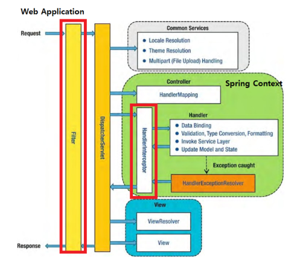
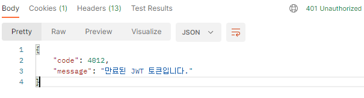

---
title: "[Spring Boot] JWT 예외 처리"
excerpt: "JWT 예외 처리"

categories:
  - Spring
tags:
  - [Spring Boot, JWT]

published: true

permalink: /spring/jwt-exception-handling/

toc: true
toc_sticky: true

date: 2023-09-19
last_modified_at: 2023-09-19

--- 

jwt를 이용하여 유저 관련 기능을 구현한 후에, 프론트 파트의 요청으로 jwt 관련된 예외의 종류를 세부적으로 나누어 예외 처리를 하게 되었다.<br>

기존에 사용했던 예외 처리와 이번에 새로 구현한 예외 처리 방법의 차이에 대해 알아보자.

<br><br>

## **기존 방식 - AuthenticationEntryPoint**
<hr />

**AuthenticationEntryPoint**는 인증 처리 과정에서 예외가 발생한 경우 예외를 핸들링하는 인터페이스입니다.

``` java
@Component
public class JwtAuthenticationEntryPoint implements AuthenticationEntryPoint {

    private ObjectMapper objectMapper;

    @PostConstruct
    void init() {
        objectMapper = new ObjectMapper();
    }

    @Override
    public void commence(HttpServletRequest request, HttpServletResponse response, AuthenticationException authException) throws IOException, ServletException {
        // 유효한 자격증명을 제공하지 않고 접근하려 할때 401(인증 실패)
        ErrorResponse errorResponse = ErrorResponse.of(HttpStatus.UNAUTHORIZED.value(), "UNAUTHORIZED");

        response.setContentType("application/json");
        response.setStatus(HttpServletResponse.SC_UNAUTHORIZED);
        response.getOutputStream().print(objectMapper.writeValueAsString(errorResponse));
    }
}
```

기존에는 위의 코드와 같이 인증 예외에서 단순히 UNAUTHORIZED(401) 예외를 그대로 프론트에 응답했기 때문에, Jwt 토큰이 만료되었는지, 형식이 일치하지 않았는지 등과 같이 왜 401 오류가 발생하는지 파악할 수 없었습니다.

<br><br>

## **수정한 방식 - JwtExceptionFilter**
<hr />

Jwt 예외들을 다른 예외들처럼 **Exception Handler**에서 처리하지 못하는 이유는 **JwtAuthenticationFilter**에서 예외를 던지기 때문입니다.<br>

<br>

Filter는 Dispatcher Servlet 보다 앞에 존재하고 Handler Intercepter는 뒤에 존재하기 때문에 Filter에서 보낸 예외는 Exception Handler로 처리하지 못합니다.<br>

따라서 현재 Jwt의 예외를 발생시키는 JwtAuthenticationFilter 앞에 예외 처리를 위한 필터를 추가하여, JwtAuthenticationFilter에서 던진 예외를 JwtExceptionFilter가 받아 처리하는 방식으로 구현했습니다.

<br>

``` java
public boolean validateToken(String token) {
    try {
        Jwts.parserBuilder().setSigningKey(key).build().parseClaimsJws(token).getBody();
        return true;
    } catch (SecurityException | MalformedJwtException e) {
        log.info("유효하지 않은 JWT 서명입니다.");
        throw new RestApiException(INVALID_TOKEN);
    } catch (ExpiredJwtException e) {
        log.info("만료된 JWT 토큰입니다.");
        throw new RestApiException(EXPIRED_TOKEN);
    } catch (UnsupportedJwtException e) {
        log.info("지원하지 않는 JWT 토큰입니다.");
        throw new RestApiException(UNSUPPORTED_TOKEN);
    } catch (IllegalArgumentException e) {
        log.info("잘못된 JWT 토큰입니다.");
        throw new RestApiException(ILLEGAL_ARGUMENT_TOKEN);
    }
}
```

기존에는 JwtAuthenticationFilter에서 validateToken 메서드로 토큰의 유효성 검사하여 예외가 발생해도 그냥 log를 출력하게만 설정하고 따로 예외 메세지를 응답해주지 않았습니다.<br>

JwtExceptionFilter로 예외를 넘기기 위해 예외를 발생시키고, Jwt 예외 종류에 맞는 code 및 message를 응답하기 위해 ErrorCode를 설정합니다.

<br>

``` java
@Component
public class JwtExceptionFilter extends OncePerRequestFilter {

    private ObjectMapper objectMapper;

    @PostConstruct
    void init() {
        objectMapper = new ObjectMapper();
    }

    @Override
    protected void doFilterInternal(HttpServletRequest request, HttpServletResponse response, FilterChain filterChain) throws ServletException, IOException {
        try{
            filterChain.doFilter(request, response);
        }catch (RestApiException e){
            AuthErrorCode authErrorCode = (AuthErrorCode) e.getErrorCode();
            setErrorResponse(response, authErrorCode);
        }
    }

    private void setErrorResponse(HttpServletResponse response, AuthErrorCode authErrorCode) throws IOException {
        ErrorResponse errorResponse = ErrorResponse.of(authErrorCode);

        response.setContentType("application/json;charset=UTF-8");
        response.setStatus(authErrorCode.getHttpStatus().value());
        response.getWriter().print(objectMapper.writeValueAsString(errorResponse));
    }
}
```

JwtAuthenticationFilter에서 넘어온 예외를 받아서 처리합니다.
<br>

### **JwtSecurityConfig 수정**

``` java
@RequiredArgsConstructor
public class JwtSecurityConfig extends SecurityConfigurerAdapter<DefaultSecurityFilterChain, HttpSecurity> {

    private final TokenProvider tokenProvider;
    private final UserRepository userRepository;
    private final JwtExceptionFilter jwtExceptionFilter;

    @Override
    public void configure(HttpSecurity http) throws Exception {
        // security 로직에 JwtFilter 등록
        http.addFilterBefore(
                new JwtAuthenticationFilter(tokenProvider, userRepository),
                UsernamePasswordAuthenticationFilter.class
        ).addFilterBefore(
                jwtExceptionFilter,
                JwtAuthenticationFilter.class
        );
    }
}
```

<br>

**결과**<br>
<br>

