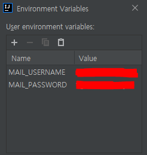
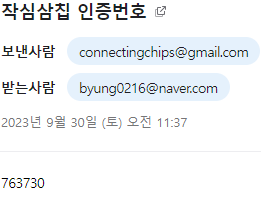
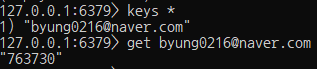
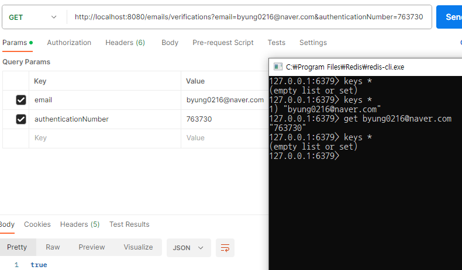

---
title: "[Spring Boot] 이메일 인증 기능 구현"
excerpt: "이메일 인증 기능을 구현해보자."

categories:
  - Spring
tags:
  - [Spring Boot, SMTP]

published: true

permalink: /spring/email-authentication/

toc: true
toc_sticky: true

date: 2023-09-30
last_modified_at: 2023-09-30

--- 

프로젝트의 회원가입 및 비밀번호 찾기 기능에서 이메일 인증 기능을 추가하기로 했습니다.<br>
이전 <a href="https://sbsun.github.io/network/smtp/">SMTP의 기본 개념 및 동작 방식 포스팅</a>에 이어서, 이번에는 직접 이메일 인증 기능을 구현해 보도록 하겠습니다.

<br>

Gmail SMTP 사용을 위한 세팅은 <a href="https://kincoding.com/entry/Google-Gmail-SMTP-%EC%82%AC%EC%9A%A9%EC%9D%84-%EC%9C%84%ED%95%9C-%EC%84%B8%ED%8C%85">링크</a>를 참고했습니다.

<br><br>

## **의존성 및 SMTP 데이터 설정**
<hr />

**build.gradle**<br>

``` gradle
implementation 'org.springframework.boot:spring-boot-starter-mail'
```

<br>

**application.yml**<br>

``` yml
spring:

  redis:
    host: localhost
    port: 6379

  mail:
    # SMTP 서버 호스트
    host: smtp.gmail.com
    # SMTP 서버 포트
    port: 587
    # SMTP 서버 로그인 아이디: 발신자 이메일
    username: ${MAIL_USERNAME}
    # SMTP 서버 로그인 패스워드: 앱 비밀번호
    password: ${MAIL_PASSWORD}
    properties:
      mail:
        smtp:
          # SMTP 서버에 인증 필요한 경우 true로 지정한다. Gmail SMTP 서버는 인증을 요구하기 때문에 true로 설정해야 한다.
          auth: true
          # 클라이언트가 SMTP 서버와의 연결을 설정하는 데 대기해야 하는 시간
          connectiontimeout: 5000
          # 클라이언트가 SMTP 서버로부터 응답을 대기해야 하는 시간. 서버에서 응답이 오지 않는 경우 대기 시간을 제한하기 위해 사용된다.
          timeout: 5000
          # 클라이언트가 작업을 완료하는데 대기해야 하는 시간. 이메일을 SMTP 서버로 전송하는 데 걸리는 시간을 제한하는데 사용된다.
          writetimeout: 5000
          starttls:
            # StartTLS 활성화 여부 (기본값 : false)
            enable: true
    auth-code-expiration-millis: 3600000  # 60 * 60 * 1000 == 60분
```

<br>

**환경 변수 설정**<br>



<br><br>

## **구현 과정**
<hr />

### **흐름**

1. 사용자는 이메일을 입력 후 이메일 인증 버튼 클릭
2. 서버에게 입력한 이메일로 인증 번호 전송 요청
3. 서버는 랜덤 인증 번호 생성. 인증 번호를 key-vaule 형식으로 이메일과 인증 번호를 Redis에 저장 후, 이메일로 인증 번호 전송
4. 사용자는 인증 번호를 확인하여 인증 번호 입력 후에 확인 버튼 클릭
5. 클라이언트는 서버에게 인증 번호 검증 요청
6. 서버는 전달받은 이메일과 인증 번호가 Redis에 저장된 정보와 동일한지 확인
   1. 동일하면 true 반환과 함께 데이터 삭제
   2. 동일하지 않다면 false 반환
7. 사용자가 인증 번호의 유효 시간 동안 인증을 완료하지 않으면 자동 삭제

<br>

### **RedisConfig**
``` java
@Configuration
public class RedisConfig {

    @Value("${spring.redis.host}")
    private String host;

    @Value("${spring.redis.port}")
    private int port;

    @Bean
    public RedisConnectionFactory redisConnectionFactory(){
        return new LettuceConnectionFactory(host, port);
    }

    @Bean
    public StringRedisTemplate stringRedisTemplate(){
        StringRedisTemplate stringRedisTemplate = new StringRedisTemplate();
        stringRedisTemplate.setConnectionFactory(redisConnectionFactory());
        stringRedisTemplate.setKeySerializer(new StringRedisSerializer());
        stringRedisTemplate.setValueSerializer(new StringRedisSerializer());

        return stringRedisTemplate;
    }
}
```

<span style="font-size:110%">**RedisConnectionFactory**</span><br>

* RedisConnection은 Redis 서버와의 통신 추상화를 제공하며, exception 발생시 Spring DataAccessException으로 전환
* RedisConnectionFactory 인터페이스를 통하여 LettuceConnectionFactory를 생성하여 반환
  * 설정에 따라서 새로운 RedisConnection 또는 이미 존재하는 RedisConnection을 반환
  * Jedis, Lettuce 등 Redis-client를 선택하여 연결 생성

<span style="font-size:110%">**StringRedisTemplate**</span><br>

* RedisTemplate: java Object를 redis에 저장하는 경우 사용
* StringRedisTemplate: 일반적인 String 값을 key, value로 사용하는 경우 사용
* 현재로서는 String 값만 저장할 것이기 때문에 StringRedisTemplate을 사용

<br>

### **RedisService**

``` java
@Service
@RequiredArgsConstructor
public class RedisService {

    private final StringRedisTemplate redisTemplate;

    public void setValues(String key, String value, long expiration){
        redisTemplate.opsForValue().set(key, value);
        redisTemplate.expire(key, expiration, TimeUnit.MILLISECONDS);
    }

    public Optional<String> findByKey(String key){
        ValueOperations<String, String> valueOperations = redisTemplate.opsForValue();
        String value = valueOperations.get(key);

        if(value == null){
            return Optional.empty();
        }
        return Optional.of(value);
    }

    public void deleteByKey(String key){
        redisTemplate.delete(key);
    }
}
```

**`setValues`**<br>
key, value, expiration을 매개변수로 받아 key-value를 저장하고, expiration 시간뒤에는 자동 삭제되도록 설정합니다.<br>

**`findByKey`**<br>
매개변수로 받은 key가 존재하면 value를 반환합니다.<br>

**`deleteByKey`**<br>
매개변수로 받은 key가 존재하면 데이터를 삭제합니다.<br>

<br>

### **EmailConfig**

JavaMailSender 인터페이스를 구현하는 클래스.<br>
JavaMailSender 인터페이스는 JavaMail API를 사용하여 이메일을 전송하는 데 사용됩니다.<br>

``` java
@Configuration
public class EmailConfig {

    @Value("${spring.mail.host}")
    private String host;

    @Value("${spring.mail.port}")
    private int port;

    @Value("${spring.mail.username}")
    private String username;

    @Value("${spring.mail.password}")
    private String password;

    @Value("${spring.mail.properties.mail.smtp.auth}")
    private boolean auth;

    @Value("${spring.mail.properties.mail.smtp.starttls.enable}")
    private boolean starttlsEnable;

    @Value("${spring.mail.properties.mail.smtp.connectiontimeout}")
    private int connectionTimeout;

    @Value("${spring.mail.properties.mail.smtp.timeout}")
    private int timeout;

    @Value("${spring.mail.properties.mail.smtp.writetimeout}")
    private int writeTimeout;

    @Bean
    public JavaMailSender javaMailSender() {
        JavaMailSenderImpl mailSender = new JavaMailSenderImpl();
        mailSender.setHost(host);
        mailSender.setPort(port);
        mailSender.setUsername(username);
        mailSender.setPassword(password);
        mailSender.setDefaultEncoding("UTF-8");
        mailSender.setJavaMailProperties(getMailProperties());

        return mailSender;
    }

    private Properties getMailProperties() {
        Properties properties = new Properties();
        properties.put("mail.smtp.auth", auth);
        properties.put("mail.smtp.starttls.enable", starttlsEnable);
        properties.put("mail.smtp.connectiontimeout", connectionTimeout);
        properties.put("mail.smtp.timeout", timeout);
        properties.put("mail.smtp.writetimeout", writeTimeout);

        return properties;
    }
}
```

<br>

### **EmailService**

``` java
@Service
@RequiredArgsConstructor
public class EmailService {

    @Value("${spring.mail.auth-code-expiration-millis}")
    private long authCodeExpirationMillis;

    private final JavaMailSender emailSender;
    private final RedisService redisService;

    @Transactional
    public void sendEmail(String toEmail){
        SimpleMailMessage emailForm = createEmailForm(toEmail);

        emailSender.send(emailForm);
    }

    private SimpleMailMessage createEmailForm(String toEmail){
        SimpleMailMessage message = new SimpleMailMessage();
        message.setTo(toEmail);
        message.setSubject("작심삼칩 인증번호");
        message.setText(createAuthenticationNumber(toEmail));

        return message;
    }

    private String createAuthenticationNumber(String email){
        Random random = new Random();
        StringBuffer number = new StringBuffer();

        for(int i = 0; i < 6; i++){
            // 10 미만의 랜덤 정수
            int randomNum = random.nextInt(10);
            number.append(randomNum);
        }

        redisService.setValues(email, number.toString(), authCodeExpirationMillis);

        return number.toString();
    }

    @Transactional
    public boolean verificationsAuthenticationNumber(String email, String authenticationNumber){
        String findAuthenticationNumber = redisService.findByKey(email)
                .orElseThrow(() -> new IllegalArgumentException("존재하지 않는 이메일입니다."));

        if(findAuthenticationNumber.equals(authenticationNumber)){
            redisService.deleteByKey(email);
            return  true;
        }else{
            return false;
        }
    }
}
```

<br>

## **EmailController**

``` java
@RestController
@RequestMapping("/emails")
@RequiredArgsConstructor
public class EmailController {

    private final EmailService emailService;

    @PostMapping
    public ResponseEntity sendEmail(@RequestParam String email){
        emailService.sendEmail(email);

        return new ResponseEntity<>(HttpStatus.OK);
    }

    @GetMapping("/verifications")
    public ResponseEntity<Boolean> verificationsEmail(@RequestParam String email, @RequestParam String authenticationNumber){
        boolean isVerified = emailService.verificationsAuthenticationNumber(email, authenticationNumber);

        return ResponseEntity.ok(isVerified);
    }
}
```

<br><br>

## **결과**
<hr />

인증 번호가 수신자에게 성공적으로 전송되었습니다.<br>
<br>

Redis에도 이메일-인증 번호 형식으로 데이터가 저장되었습니다.<br>
<br>

인증 번호를 알맞게 입력하고 버튼을 누르면 Redis에 저장된 인증 번호와 비교하여 맞으면 true를 반환하고 데이터를 삭제합니다.
<br>

<br>

이메일 인증 기능을 JavaMailSender와 Redis를 활용하여 구현해보았습니다.<br>
기능 구현에 있어서는 어렵지 않았지만 JavaMailSender와 Redis에 대해서는 더 자세히 학습을 해야겠다고 생각이 들었습니다.<br>

<hr />
참고자료<br>
<a href="https://green-bin.tistory.com/83#%ED%-D%--%EB%A-%--">https://green-bin.tistory.com/83#%ED%-D%--%EB%A-%--</a><br>
<a href="https://ssoco.tistory.com/19">https://ssoco.tistory.com/19</a>
