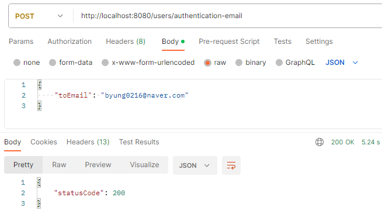
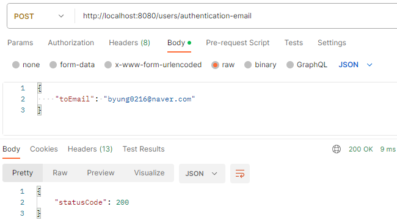

---
title: "[Spring Boot] 비동기 이메일 전송 구현"
excerpt: "비동기 이메일 전송 기능을 구현해보자."

categories:
  - Spring
tags:
  - [Spring Boot, Asynchronous]

published: true

permalink: /spring/asynchronous-of-email-sending/

toc: true
toc_sticky: true

date: 2023-10-26
last_modified_at: 2023-10-26

--- 

## **배경**
<hr />

이전 <a href="https://sbsun.github.io/spring/email-authentication/">포스팅</a>에서 이메일 인증 기능을 구현했었습니다.<br>

회원가입을 할 때 이메일을 통해서 인증 과정을 거칩니다. 하지만 인증 이메일을 전송하는 과정이 평균 5초 정도 소요되었습니다.<br>
<br>

이메일 전송은 외부의 서버를 통해 실행되는데, 이 작업을 처리하는데 약 5초가 소요되면 애플리케이션은 해당 요청이 완료될 때까지 대기해야 합니다.<br>

그렇기 때문에 외부에서 실행하는 로직은 비동기적으로 실행하는 것이 바람직하다고 생각했습니다.<br>

<br><br>

## **이메일 전송 비동기 처리**
<hr />

Spring에서는 `@Async` 어노테이션으로 로직의 비동기 처리를 지원합니다.<br>

아래와 같이 이메일 전송 메서드에 `@Async`를 추가함으로써 해당 메서드는 비동기로 동작하게 됩니다.<br>
메서드에 어노테이션을 추가해 주기만 하면 되기 때문에 개발자는 기능에만 집중할 수 있습니다.<br>

``` java
@Async
public void sendTemplateEmail(String toEmail, String subject, String template, HashMap<String, String> values) throws MessagingException {
    MimeMessage message = mailSender.createMimeMessage();
    MimeMessageHelper helper = new MimeMessageHelper(message, true);

    helper.setTo(toEmail);
    helper.setSubject(subject);

    Context context = new Context();
    values.forEach((key, value)->{
        context.setVariable(key, value);
    });

    String html = templateEngine.process(template, context);
    helper.setText(html, true);

    mailSender.send(message);
}
```
<br>

### **@Async의 원리**

@Async는 기본적으로 스프링 AOP에 의해 동작하는데, @Async 어노테이션이 선언된 메서드는 비동기 메서드로 동작하게 됩니다.<br>

실행 과정은 다음과 같습니다.<br>
1. @Async 어노테이션이 선언된 메서드가 호출되면, 스프링은 해당 호출을 가로채서 비동기 실행을 처리하기 위한 프록시 객체를 생성합니다.
2. 해당 메서드는 TaskExecutor에 의해 스레드풀에 작업으로 등록합니다.
3. 해당 메서드는 호출자와 별도의 스레드에서 작업이 진행되며, 호출자 메서드는 블러킹되지 않고 즉시 리턴됩니다.

<br>

@Async 어노테이션을 사용하기 위해서는 아래와 같이 설정 클래스에 @Async 어노테이션을 감지하는 `@EnableAsync` 어노테이션을 추가해주어야 합니다.<br>

``` java
@EnableAsync
@Configuration
public class AsyncConfig implements AsyncConfigurer {
}
```

<br>

또한 EnableAsync의 기본 AdviceMode가 PROXY 모드로 설정되어 있어서 @Async가 올바르게 동작하기 위한 두 가지 조건이 존재합니다.<br>

* public 메서드에서만 적용 가능하다.
* self-invocation은 불가하다. (같은 클래스의 메서드를 호출할 수 없다.)

``` java
@Import(AsyncConfigurationSelector.class)
public @interface EnableAsync {

    Class<? extends Annotation> annotation() default Annotation.class;
    
    AdviceMode mode() default AdviceMode.PROXY;
    
    boolean proxyTargetClass() default false;
}
```

<br><br>

## **결과**
<hr />

<br>

이메일 전송 기능을 비동기로 처리하게 구현한 후의 테스트 결과입니다.<br>

이메일 전송 API 처리 시간<br>
동기 처리 → 5s<br>
비동기 처리 → 10ms

<br>

이번에 처음으로 이메일 전송 메서드를 비동기로 처리되게 구현해보면서 @Async에 대해 알아보았습니다.<br>

<hr />
참고자료<br>
<a href="https://brunch.co.kr/@springboot/401">https://brunch.co.kr/@springboot/401</a><br>
<a href="https://xxeol.tistory.com/44#%EB%A7%88%EB%AC%B4%EB%A6%AC-1">https://xxeol.tistory.com/44#%EB%A7%88%EB%AC%B4%EB%A6%AC-1</a>
