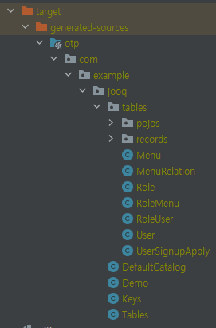

---
title: "[Spring Boot] jOOQ 적용기"
excerpt: "Spring Boot에서의 jOOQ 적용기입니다."

categories:
  - Spring
tags:
  - [Spring Boot, jOOQ]

published: true

permalink: /spring/jooq/

toc: true
toc_sticky: true

date: 2024-02-04
last_modified_at: 2024-02-04

--- 

이번 프로젝트에서 기존에 사용해왔던 QueryDSL이 아닌 jOOQ를 사용하게 되었습니다.<br>
때문에 이번 포스팅에서는 jOOQ를 사용하여 실습해 보면서 사용 방법을 익히고, QueryDSL과의 차이점을 알아보겠습니다.

<br><br>

## jOOQ란?
<hr>
<br>

**Java Object Oriented Querying** <br>

`jOOQ`는 데이터베이스의 스키마 정보를 기반으로 자동으로 자바 클래스를 생성하여 사용자가 SQL을 직접 작성하지 않고도 쉽게 데이터베이스와 상호작용할 수 있도록 지원합니다.<br>

`QueryDSL`과 같이 **Type-Safe**한 SQL 작성 또한 지원합니다.<br>

<a href="https://www.jooq.org/doc/3.20/manual-single-page/">공식 문서</a>가 워낙 잘 되어 있고, 계속 기능들이 확장되어 참고할 만한 레퍼런스가 늘어나 더욱더 매력적인 라이브러리가 되어가고 있습니다.

<br>

## 세팅
<hr>

``` xml
<dependencies>
  <dependency>
    <groupId>org.springframework.boot</groupId>
    <artifactId>spring-boot-starter-jooq</artifactId>
  </dependency>
  <dependency>
    <groupId>com.mysql</groupId>
    <artifactId>mysql-connector-j</artifactId>
    <version>8.2.0</version>
  </dependency>
</dependencies>
```

기본적으로 spring에서 jooq를 사용하기 위해서는 `starter-jooq`와 프로젝트에서 사용하는 DB의 드라이버가 필요합니다.

<br>

``` xml
<build>
  <plugins>
    <!-- jooq -->
    <plugin>
      <groupId>org.jooq</groupId>
      <artifactId>jooq-codegen-maven</artifactId>
      <configuration>
        <jdbc>
          <driver>com.mysql.cj.jdbc.Driver</driver>
          <url>jdbc:mysql://localhost:3306/demo</url>
          <user>root</user>
          <password>1234</password>
        </jdbc>
        <generator>
          <database>
            <name>org.jooq.meta.mysql.MySQLDatabase</name>
            <includes>.*</includes>
            <excludes></excludes>
            <inputSchema>demo</inputSchema>
          </database>
          <generate>
            <pojos>true</pojos>
            <pojosEqualsAndHashCode>true</pojosEqualsAndHashCode>
            <javaTimeTypes>true</javaTimeTypes>
            <fluentSetters>true</fluentSetters>
          </generate>
          <target>
            <packageName>com.example.jooq</packageName>
            <directory>target/generated-sources/jooq</directory>
          </target>
        </generator>
      </configuration>
      <executions>
        <execution>
          <id>jooq-codegen</id>
          <phase>generate-sources</phase>
          <goals>
            <goal>generate</goal>
          </goals>
        </execution>
      </executions>
    </plugin>
  </plugins>
</build>
```

위의 코드들은 QueryDSL의 QClass를 생성하기 위한 과정과 동일합니다.<br>
QueryDSL은 QClass를 생성하기 위해 `@Entity` 어노테이션을 선언한 클래스를 탐색하여 QClass를 생성하지만, jOOQ는 데이터베이스의 스키마 정보를 기반으로 자바 클래스를 생성하기 때문에 위 코드와 같이 데이터베이스의 정보들을 작성해주어야 합니다.<br>

작성 후 Maven `Plugins` -> `jooq-codegen` -> `jooq-codegen:generate`를 실행하면 아래와 같이 데이터베이스 스키마를 기반으로한 자바 클래스가 생성됩니다.<br>



<br>

사용할 테이블은 아래의 user 테이블을 사용하도록 하겠습니다.

``` sql
CREATE TABLE `user` (
  `user_id` bigint NOT NULL AUTO_INCREMENT,
  `account_id` varchar(255) DEFAULT NULL,
  `auth_key` varchar(255) DEFAULT NULL,
  `password` varchar(255) DEFAULT NULL,
  `created_at` datetime(6) DEFAULT NULL,
  `updated_at` datetime(6) DEFAULT NULL,
  `email` varchar(255) DEFAULT NULL,
  `name` varchar(255) DEFAULT NULL,
  `phone` varchar(255) DEFAULT NULL,
  `user_type` char(1) NOT NULL,
  PRIMARY KEY (`user_id`)
);
```

<br><br>

## 실습
<hr>

사용법은 jOOQ에는 `DSLContext` 인터페이스가 존재하는데 해당 인터페이스의 구현체를 spring boot에서 빈으로 등록해주기 때문에 해당 클래스를 주입받아 사용하면 됩니다.

``` java
@Repository
@RequiredArgsConstructor
public class UserJooqRepository {

  private final DSLContext dsl;

  /**
   * 이름 or 전화번호에 해당하는 사용자 정보 반환
   * 매개변수내에 값이 존재하지 않으면 모든 사용자 반환
   * @param name
   * @param phone
   * @return
   */
  public List<UserResponseDto.Info> select(String name, String phone) {
      return dsl
              .select(
                      USER.USER_ID.as("id"),
                      USER.NAME,
                      USER.PHONE,
                      USER.CREATED_AT
              )
              .from(USER)
              .where(
                  eqIfNotEmpty(USER.NAME, name)
                          .and(eqIfNotEmpty(USER.PHONE, phone))
              )
              .fetchInto(UserResponseDto.Info.class);
  }

  private Condition eqIfNotEmpty(Field field, Object param) {
    if (Objects.isNull(param)) {
        return DSL.noCondition();
    }

    if (param instanceof String && StringUtils.isBlank(param.toString())) {
        return DSL.noCondition();
    }

    return field.eq(param);
  }
}
```

위의 `select()` 메서드는 user의 `name`, `phone` 컬럼을 파라미터로 받은 값과 비교하여 같은 데이터만을 조회하는 간단한 메서드입니다.<br>

코드를 보면 일반 SQL 문법과 차이점이 없기 때문에 익숙하게 코드를 작성할 수 있었습니다.<br>
또한 `eqIfNotEmpty()` 같은 메서드를 구현하여 동적 쿼리도 적용할 수 있습니다.  

<br>

``` java
public List<UserResponseDto.Info> select(String accountId, String email, String name, String phone) {
      return dslContext
              .select(
                      USER.USER_ID.as("id"),
                      USER.NAME,
                      USER.PHONE,
                      USER.CREATED_AT
              )
              .from(USER)
              .where(getConditionList(accountId, email, name, phone))
              .fetchInto(UserResponseDto.Info.class);
  }

private List<Condition> getConditionList(String accountId, String email, String name, String phone) {
    List<Condition> conditionList = new ArrayList<>();

    // accountId가 빈 값이 아니라면 비교 조건 추가
    if (!StringUtils.isBlank(accountId)) {
        conditionList.add(DSL.condition(USER.ACCOUNT_ID.eq(accountId)));
    }
    if (!StringUtils.isBlank(email)) {
        conditionList.add(DSL.condition(USER.EMAIL.eq(email)));
    }
    if (!StringUtils.isBlank(name)) {
        conditionList.add(DSL.condition(USER.NAME.eq(name)));
    }
    if (!StringUtils.isBlank(phone)) {
        conditionList.add(DSL.condition(USER.PHONE.eq(phone)));
    }

    return conditionList;
}
```

만약 위처럼 파라미터 수나 조건이 많다면 `getConditionList()` 메서드처럼 쿼리에 필요한 조건들을 하나의 메서드에 모아서 반환하게 작성하여, where 절에 여러 라인에 걸쳐서 조건문들을 작성하는 것보다 훨씬 가독성 있게 코드를 작성할 수 있습니다.<br>

만약 위의 4개의 파라미터가 모두 `isBlank`에 해당한다면 빈 Condition List 값을 반환하게 되고, where 절에는 아무 조건도 적용되지 않아 모든 user의 데이터를 조회하게 됩니다.<br>

또한 jOOQ는 QueryDSL에서 지원하지 않는 `insert()` 메서드도 지원하기 때문에 데이터 삽입도 가능합니다.<br>

다음 포스팅에서는 jOOQ를 더 학습하여 다양한 기능들을 사용해보고, jOOQ을 사용하면서 느꼈던 장점 및 단점에 대해서 작성해보도록 하겠습니다.<br>