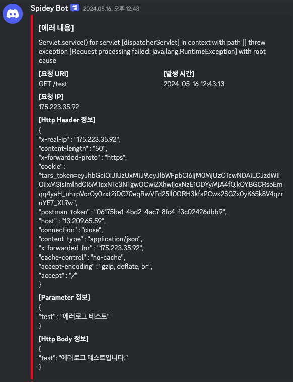

---
title: "[Spring Boot] Logback을 이용한 ErrorLog 디스코드 알림 기능 구현기"
excerpt: "Logback을 이용한 ErrorLog 디스코드 알림 기능 구현기"

categories:
  - Spring
tags:
  - [Spring Boot, Logback]

published: true

permalink: /spring/logback-discord/

toc: true
toc_sticky: true

date: 2024-05-24
last_modified_at: 2024-05-24

--- 

팀 프로젝트를 진행하면서, 서버에 에러가 발생했을 경우 매번 EC2에 접속하여 로그 파일을 확인해보는 과정이 매우 비효율적이라고 생각했습니다. 현재 팀 커뮤니케이션 도구로 디스코드(Discord)를 사용하고 있어서, 서버 에러 발생 시 에러에 대한 내용이 담긴 데이터를 디스코드로 전송하는 알림 기능을 구현했습니다.

<br><br>

## Logback 적용

첫 번째로 아래처럼 logback.xml 파일을 작성했습니다.

``` xml
<?xml version="1.0" encoding="UTF-8" ?>
<configuration>
  <appender class="ch.qos.logback.core.ConsoleAppender" name="CONSOLE">
    <encoder>
      <pattern>%d{yyyy-MM-dd HH:mm:ss.SSS} [%thread] %clr(%5level) %cyan(%logger) - %msg%n</pattern>
    </encoder>
  </appender>
  <appender class="connectingstar.tars.common.logback.DiscordLogbackAppender"
    name="DISCORD">
    <discordWebhookUrl>${DISCORD_WEBHOOK_URI}</discordWebhookUrl>
  </appender>

  <conversionRule conversionWord="clr" converterClass="org.springframework.boot.logging.logback.ColorConverter" />

  <logger level="DEBUG" name="connectingstar.tars" />

  <springProfile name="local">
    <root level="INFO">
      <appender-ref ref="CONSOLE" />
    </root>
  </springProfile>
  <springProfile name="dev">
    <property resource="application-dev.yml"/>
    <root level="ERROR">
      <appender-ref ref="CONSOLE" />
      <appender-ref ref="DISCORD" />
    </root>
  </springProfile>

  <springProperty name="DISCORD_WEBHOOK_URI" source="logback.discord.webhook-uri"/>
</configuration>
```

<br>

여기서 주의 깊게 봐야하는 것은 **DiscordLogbackAppender**입니다.

``` xml
<appender class="connectingstar.tars.common.logback.DiscordLogbackAppender"
  name="DISCORD">
  <discordWebhookUrl>${DISCORD_WEBHOOK_URI}</discordWebhookUrl>
</appender>

<springProperty name="DISCORD_WEBHOOK_URI" source="logback.discord.webhook-uri"/>
```

DiscordLogbackAppender 클래스를 통해 Discord에 애러 로그를 전송해주는 역할을 할 수 있도록 설정하고, application-dev.yml 파일에 설정해둔 디스코드 웹훅 URI를 불러와 **DISCORD_WEBHOOK_URI**를 지정해줍니다.

<br>


개발 환경에서만 에러로그 알림 기능이 작동하도록 profile을 설정하고, root level을 **ERROR** 단계로 설정하여 에러 로그만 전송하도록 설정했습니다.
``` xml
<springProfile name="local">
  <root level="INFO">
    <appender-ref ref="CONSOLE" />
  </root>
</springProfile>
<springProfile name="dev">
  <property resource="application-dev.yml"/>
  <root level="ERROR">
    <appender-ref ref="CONSOLE" />
    <appender-ref ref="DISCORD" />
  </root>
</springProfile>
```

<br><br>

## 구현과정

**DiscordLogbackAppender**는 Logback Library를 사용하여 에러로그를 디스코드 웹훅으로 전송하는 역할을 하는 클래스입니다.

``` java
@Slf4j
@Setter
public class DiscordLogbackAppender extends UnsynchronizedAppenderBase<ILoggingEvent> {

  private String discordWebhookUrl;

  /**
   * 에러 로그 전송
   *
   * @param event 로깅 이벤트
   */
  @Override
  protected void append(ILoggingEvent event) {
    if (event.getLevel().isGreaterOrEqual(Level.ERROR)) {
      toDiscord(event);
    }
  }

  private void toDiscord(ILoggingEvent event) {
    DiscordWebHook discordWebhook = new DiscordWebHook(discordWebhookUrl);
    Map<String, String> mdcPropertyMap = event.getMDCPropertyMap();
    Color messageColor = Color.red;

    discordWebhook.addEmbed(new EmbedObject()
        .setTitle("[에러 내용]")
        .setColor(messageColor)
        .setDescription(event.getFormattedMessage())
        .addField(MDCUtils.REQUEST_URI_MDC, mdcPropertyMap.get(MDCUtils.REQUEST_URI_MDC), true)
        .addField("[발생 시간]", LocalDateTime.now().format(DateTimeFormatter.ofPattern("yyyy-MM-dd HH:mm:ss")), true)
        .addField(MDCUtils.USER_IP_MDC, mdcPropertyMap.get(MDCUtils.USER_IP_MDC), false)
        .addField(MDCUtils.HEADER_MAP_MDC, mdcPropertyMap.get(MDCUtils.HEADER_MAP_MDC), false)
        .addField(MDCUtils.PARAMETER_MAP_MDC, mdcPropertyMap.get(MDCUtils.PARAMETER_MAP_MDC), false)
        .addField(MDCUtils.BODY_MDC, mdcPropertyMap.get(MDCUtils.BODY_MDC), false));

    IThrowableProxy throwable = event.getThrowableProxy();
    if (Objects.nonNull(throwable)) {
      String exception = ThrowableProxyUtil.asString(throwable).substring(0, 2000);
      discordWebhook.addEmbed(
          new EmbedObject()
              .setTitle("[Exception 상세 내용]")
              .setColor(messageColor)
              .setDescription(escapeJsonInternal(exception))
      );
    }

    try {
      discordWebhook.execute();
    } catch (Exception e) {
      log.info("에러: " + e.getMessage());
    }
  }
}
```

**UnsynchronizedAppenderBase<ILoggingEvent>** 클래스를 상속받아 ILggingEvent에서 에러로그 정보를 추출 및 가공하여 디스코드로 전송하는 메커니즘입니다. <br>

하지만 **ILoggingEvent** 인터페이스에서는 로그 메세지만 존재하기 때문에 에러가 어떤 이유로 발생했는지 파악하기 어렵습니다. <br>
저의 목표는 개발자가 디스코드에 전송된 에러로그를 보고, 에러의 원인을 바로 파악할 수 있게 하는 것이 목표였기 때문에 에러로그에 사용자가 요청한 API, 요청 데이터, 에러 발생 시간 등을 에러에 대한 부가 정보들을 추가하였습니다.

API 요청에 대한 정보는 **MDCFilter**를 구현하여 가져올 수 있도록 했습니다.<br>

``` java
@Component
public class MDCFilter implements Filter {

  @Override
  public void doFilter(ServletRequest request, ServletResponse response, FilterChain chain) throws IOException, ServletException {
    RequestWrapper requestWrapper = new RequestWrapper((HttpServletRequest) request);

    MDCUtils.set(MDCUtils.REQUEST_URI_MDC,
        HttpRequestUtils.getRequestMethod(requestWrapper) + " " + HttpRequestUtils.getRequestUri(requestWrapper));
    MDCUtils.set(MDCUtils.USER_IP_MDC, HttpRequestUtils.getUserIP(Objects.requireNonNull(requestWrapper)));
    MDCUtils.setJsonValue(MDCUtils.HEADER_MAP_MDC, HttpRequestUtils.getHeaderMap(requestWrapper));
    MDCUtils.setJsonValue(MDCUtils.PARAMETER_MAP_MDC, HttpRequestUtils.getParamMap(requestWrapper));
    MDCUtils.setJsonValue(MDCUtils.BODY_MDC, requestWrapper.getBody());

    chain.doFilter(requestWrapper, response);
  }
}
```

<br>

디스코드에 보낼 에러로그 정보까지 세팅을 맞췄으니 **DiscordWebHook**을 통해서 디스코드 웹훅 요청을 보냅니다.

``` java
@Slf4j
@Setter
public class DiscordWebHook {

  private final String urlString;
  private final List<EmbedObject> embeds = new ArrayList<>();
  private String content;
  private String username;
  private String avatarUrl;
  private boolean tts;

  public DiscordWebHook(String urlString) {
    this.urlString = urlString;
  }

  public void addEmbed(EmbedObject embed) {
    this.embeds.add(embed);
  }

  /**
   * Discrod LogBack 메세지 전송
   */
  public void execute() {
    if (this.embeds.isEmpty()) {
      throw new IllegalArgumentException("embedobject를 추가해야 합니다.");
    }

    try {
      WebClient.create(urlString)
          .post()
          .header("Content-Type", "application/json")
          .bodyValue(createDiscordEmbedObject(this.embeds, initializerDiscordSendForJsonObject(new JsonObject())).toString().getBytes(
              StandardCharsets.UTF_8))
          .retrieve()
          .toBodilessEntity()
          .subscribe((e) -> {
          }, (error) -> {
            log.info("에러 메세지: " + error.getMessage());
          });

    } catch (Exception e) {
      log.error("에러 메세지: " + e.getMessage());
    }
  }
}
```

해당 클래스의 필드들은 <a href="https://discord.com/developers/docs/resources/webhook#execute-webhook">디스코드 웹훅 문서</a>를 참조하여 구성했습니다. <br>

문서를 참조하여 필수 파라미터들을 포함해서 웹훅 요청을 보내면 아래와 같이 디스코드에서 에러에 대한 상세 정보들을 확인할 수 있습니다.

<br>



<br>

물론 에러가 발생하면 안되지만.. 막상 구현하고나니까 너무 편해서 뿌듯했고,<br>
앞으로 프로젝트에서 배포를 구현할 때 에러로그 알림 기능을 무조건 같이 구현하도록 하겠습니다!