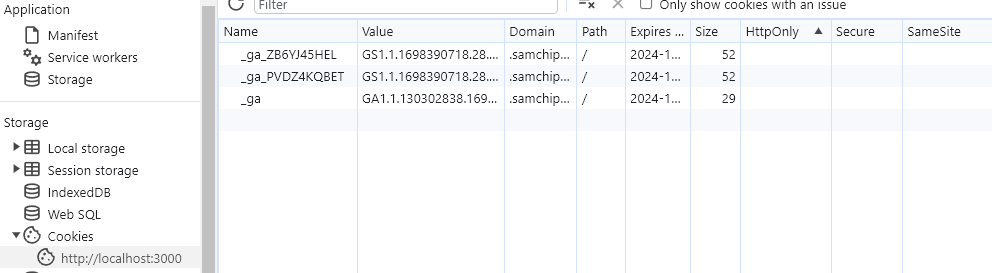
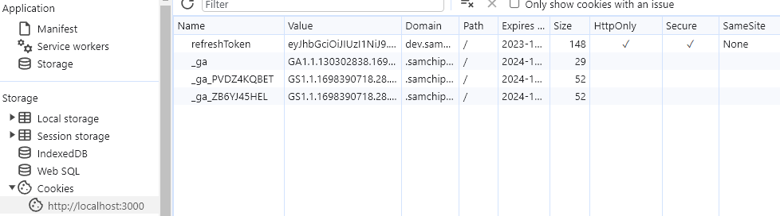

---
title: "[Cookie] SameSite 설정"
excerpt: "Cookie SameSite 설정"

categories:
  - Trouble Shooting
tags:
  - [Trouble Shooting, Cookie]

published: true

permalink: /troubleshooting/cookie-samesite/

toc: true
toc_sticky: true

date: 2023-10-28
last_modified_at: 2023-10-28

--- 

## **문제**
<hr />

백엔드 서버에서 로그인을 진행하면 정상적으로 리프레시 토큰이 쿠키에 담겨 저장되지만, 프론트 서버에서 로그인 시에는 쿠키에 저장되지 않는 상황이 발생했습니다.<br>



<br><br>

## **해결 과정**
<hr />

백엔드에서 응답으로 보낸 **쿠키가 서드 파티 쿠키였기 때문에 발생하는 문제**였습니다.<br>

### **퍼스트 파티 쿠키**

퍼스트 파티 쿠키는 **방문한 사이트에서 발행한 쿠키**를 의미합니다.<br>
현재 A.com에 사용자가 방문해 있고, A.com에서 쿠키를 발행한다면 퍼스트 파티 쿠키가 됩니다.<br>
즉, Referer 헤더와 쿠키가 발행된 곳이 동일하다면 퍼스트 파티 쿠키가 됩니다.<br>

### **서드 파티 쿠키**

A.com에 사용자가 방문해 있지만, 백엔드(B.com)에서 쿠키를 발행하면 Referer 헤더는 A.com, 백엔드는 B.com이니, 헤더와 쿠키가 발행된 곳이 다르기에, 서드 파티 쿠키가 됩니다.<br>

### **SameSite**
HTTP response header의 Set-Cookie에 작성하는 SameSite 속성은 특정 쿠키가 퍼스트 파티 혹은 같은 사이트 컨텍스트 내에서만 접근되도록 제한할 수 있게 해줍니다.<br>
SameSite의 종류는 3가지가 있습니다.<br>

**1. None**
* SameSite 옵션이 나오기 전 행위와 동일한 역할을 합니다.
* 모든 요청에 서드 파티 쿠키와, 퍼스트 파티 쿠키가 전송됩니다.
* SameSite=None일 때에는 **Secure 속성이 반드시 설정**되어야 하며 그렇지 않으면 해당 쿠키는 차단되어 사용 할 수 없습니다.

**2. Lax**
* SameSite 속성이 명시적으로 작성되지 않은 경우 최신 브라우저들에서는 기본 값으로 설정되는 속성입니다.
* 해당 속성에서는 Strict 설정에서 일부 예외를 허용해 안전한 HTTP 메서드 하에서 top-level 네비게이션 일 때만 쿠키가 전송됩니다.
* 안전한 HTTP 메서드는 서버의 상태를 바꾸지 않는 GET등을 말합니다. POST 혹은 DELETE 등의 경우에는 안전하지 않다고 여겨집니다.

**3. Strict**
* 가장 강력한 제한 설정 입니다.
* 모든 요청에 서드 파티 쿠키는 전송되지 않고 퍼스트 파티 쿠키만 전송됩니다.

<br>

**SameSite 옵션 선택**<br>

A.com에 접속해 있고, 백엔드(B.com)에서 응답으로 전송한 쿠키가 저장되고, 백엔드로 요청을 보낼 때 쿠키가 포함되기를 원하는 것이니, SameSite None을 사용해야 합니다.

만약 A.com이라는 하나의 도메인을 두고, api.A.com 같은 형태의 서브 도메인을 통해 만들게 된다면, 쿠키의 도메인 속성을 변경해 두게 되면 퍼스트 파티 쿠키처럼 공유할 수 있다고 합니다.

현재 저희 프로젝트에도 백엔드 서버가 서브 도메인으로 설정되어 있지만 우선 None으로 설정하여 해결하고 추후에 퍼스트 파티 쿠키로 전송되게 설정해보겠습니다.

<br>

### **코드**

``` java
ResponseCookie cookie = ResponseCookie.from("refreshToken", token.getRefreshToken())
        .path("/")
        .sameSite("None")
        .httpOnly(true)
        .secure(true)
        .maxAge(24 * 60 * 60)
        .build();

response.addHeader("Set-Cookie", cookie.toString());
```

<br><br>

## **결과**
<hr />



<hr />
참고자료<br>
<a href="https://shanepark.tistory.com/349">https://shanepark.tistory.com/349</a><br>
<a href="https://be-student.tistory.com/72">https://be-student.tistory.com/72</a>
